# Week 2 - Day 3: IAM Roles and STS

## Name
Sanket Dangat

## Tasks Completed
- [x] Watched/read the weekly content
- [x] Completed hands-on labs
- [x] Added screenshots or proof
- [x] Posted on LinkedIn
- [x] Cleaned up AWS resources

## Architecture Diagram

The following diagram illustrates how an Amazon EC2 instance securely accesses an Amazon S3 bucket using an IAM role. AWS STS issues temporary security credentials through the instance profile, allowing read-only access without storing long-term AWS access keys.

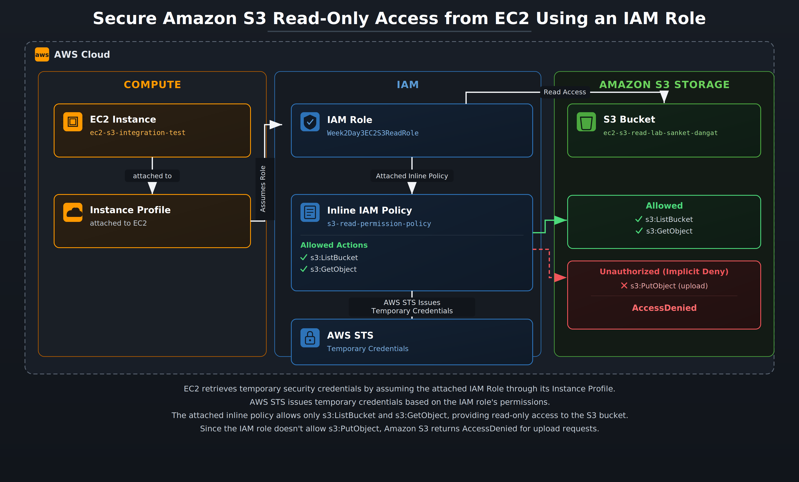

## Topics Practiced
- Trust policy vs permission policy
- STS AssumeRole
- EC2 role and instance profile
- Cross-service role assumption
- Temporary credentials
- Least-privilege S3 access

## What I Built

I built a secure AWS solution that enables an Amazon EC2 instance to access an Amazon S3 bucket using an IAM role instead of long-term AWS access keys.

First, I created an IAM role named **Week2Day3EC2S3ReadRole** with a trust policy that allows the Amazon EC2 service (`ec2.amazonaws.com`) to assume the role. Next, I attached an inline IAM permission policy named **s3-read-permission-policy**, which grants only the required read permissions (`s3:ListBucket` and `s3:GetObject`) on the S3 bucket **ec2-s3-read-lab-sanket-dangat**, following the principle of least privilege.

Finally, I attached the IAM role to the Amazon EC2 instance **ec2-s3-integration-test** through an instance profile. The EC2 instance automatically obtained temporary AWS credentials from AWS Security Token Service (AWS STS) via the EC2 Instance Metadata Service (IMDS), allowing it to securely access Amazon S3 without storing long-term AWS access keys.

## Allowed Test

I verified that the Amazon EC2 instance **ec2-s3-integration-test** could securely access the Amazon S3 bucket **ec2-s3-read-lab-sanket-dangat** using the attached IAM role **Week2Day3EC2S3ReadRole**.

The EC2 instance successfully listed the bucket contents and downloaded the object **day3-test.txt** without manually configuring AWS access keys. The AWS CLI automatically used temporary credentials obtained through the attached IAM role.

This verified the following:

### 1. Trust Policy

The trust policy allowed the Amazon EC2 service (`ec2.amazonaws.com`) to assume the IAM role **Week2Day3EC2S3ReadRole**.

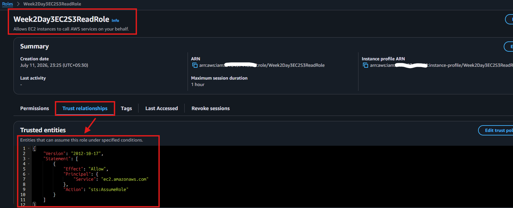

### 2. Inline IAM Permission Policy

The inline IAM permission policy **s3-read-permission-policy** granted only the required read permissions (`s3:ListBucket` and `s3:GetObject`) on the S3 bucket **ec2-s3-read-lab-sanket-dangat**.

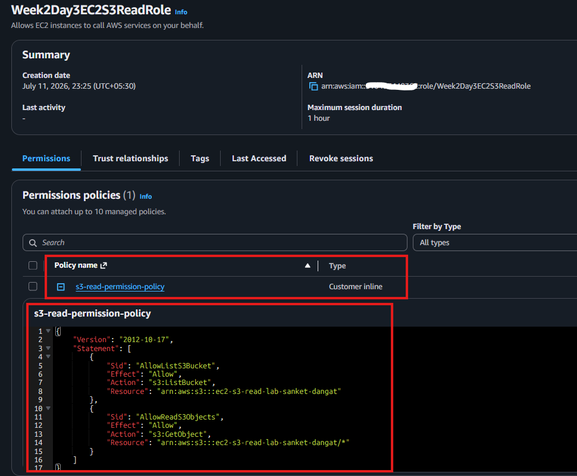

### 3. IAM Role Attached to EC2

The IAM role **Week2Day3EC2S3ReadRole** was successfully attached to the Amazon EC2 instance **ec2-s3-integration-test** through its instance profile.

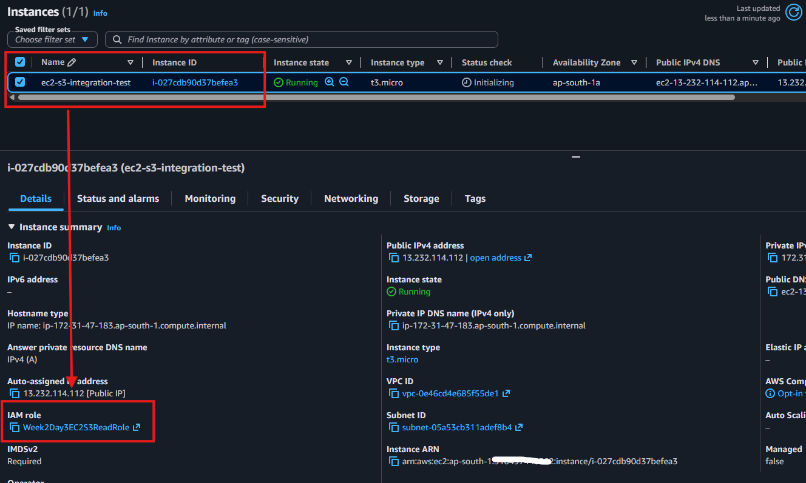

### 4. Temporary Credentials Verification

Temporary AWS credentials were automatically issued by AWS Security Token Service (AWS STS) and made available to the EC2 instance through the EC2 Instance Metadata Service (IMDS). This was verified using the `aws sts get-caller-identity` and `aws configure list` commands.

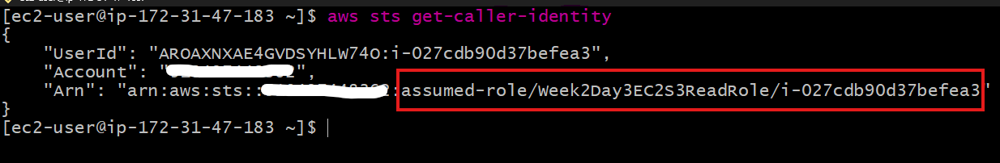

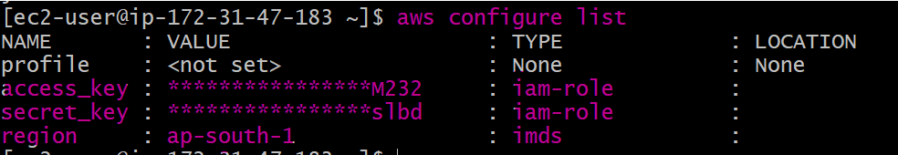

### 5. Read Access Verification

The EC2 instance successfully listed the contents of the S3 bucket and downloaded the object **day3-test.txt**, confirming that the IAM role provided the expected read-only access to Amazon S3.

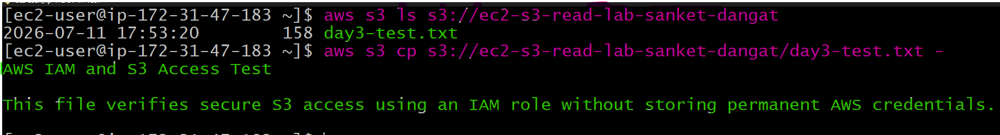

## Denied Test

I verified that the IAM role enforced the principle of least privilege by attempting to upload **write-test.txt** from the Amazon EC2 instance **ec2-s3-integration-test** to the Amazon S3 bucket **ec2-s3-read-lab-sanket-dangat**.

The upload operation failed with an `AccessDenied` error because the inline IAM permission policy **s3-read-permission-policy** granted only read permissions (`s3:ListBucket` and `s3:GetObject`). The policy did not allow the `s3:PutObject` action required to upload objects to the S3 bucket.

This verified that:

- The IAM permission policy correctly enforced the principle of least privilege.
- The IAM role **Week2Day3EC2S3ReadRole** allowed only the explicitly permitted read operations.
- Unauthorized write operations (`s3:PutObject`) were denied with an `AccessDenied` error.
- The EC2 instance could access only the Amazon S3 actions granted by the attached IAM policy.

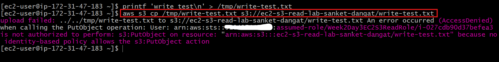

## What I Learned

This lab helped me understand how AWS IAM roles provide secure, temporary access to AWS services without requiring long-term AWS access keys.

I learned that AWS IAM uses two different types of policies, each with a distinct purpose:

- A **trust policy** defines **who can assume an IAM role**. In this lab, the trust policy allowed the Amazon EC2 service (`ec2.amazonaws.com`) to assume the IAM role **Week2Day3EC2S3ReadRole**.

- A **permission policy** defines **what actions an assumed IAM role is allowed to perform**. In this lab, the inline IAM permission policy **s3-read-permission-policy** granted only `s3:ListBucket` and `s3:GetObject` permissions on the S3 bucket **ec2-s3-read-lab-sanket-dangat**.

I also learned that:

- IAM roles eliminate the need to store long-term AWS access keys on Amazon EC2 instances by providing temporary security credentials automatically.
- AWS Security Token Service (AWS STS) issues temporary security credentials when Amazon EC2 assumes the attached IAM role.
- An **instance profile** is the mechanism that associates an IAM role with an Amazon EC2 instance, enabling the AWS CLI and SDKs to automatically retrieve temporary credentials through the EC2 Instance Metadata Service (IMDS).
- Following the **principle of least privilege** improves security by granting only the permissions required. In this lab, the IAM role was limited to `s3:ListBucket` and `s3:GetObject`, preventing unauthorized write operations such as `s3:PutObject`.
- Commands such as `aws sts get-caller-identity` and `aws configure list` are useful for verifying the IAM identity and confirming that temporary credentials are being obtained from the attached IAM role.

### Key Concepts

- **Trust Policy** → Defines **who can assume an IAM role**.
- **Permission Policy** → Defines **what actions the IAM role can perform** after it has been assumed.
- **IAM Role** → Provides temporary AWS security credentials to trusted AWS services.
- **AWS STS** → Issues temporary security credentials for assumed IAM roles.
- **Instance Profile** → Makes an IAM role available to an Amazon EC2 instance.
- **Principle of Least Privilege** → Grants only the permissions required to perform a specific task.

## Where I Got Stuck

- No blockers.

## Cleanup

After completing the lab, I deleted all resources created during the exercise to avoid unnecessary AWS charges and maintain a clean AWS environment.

### 1. Amazon EC2

Terminated the Amazon EC2 instance **ec2-s3-integration-test** and verified that no unnecessary Amazon EBS volumes remained.

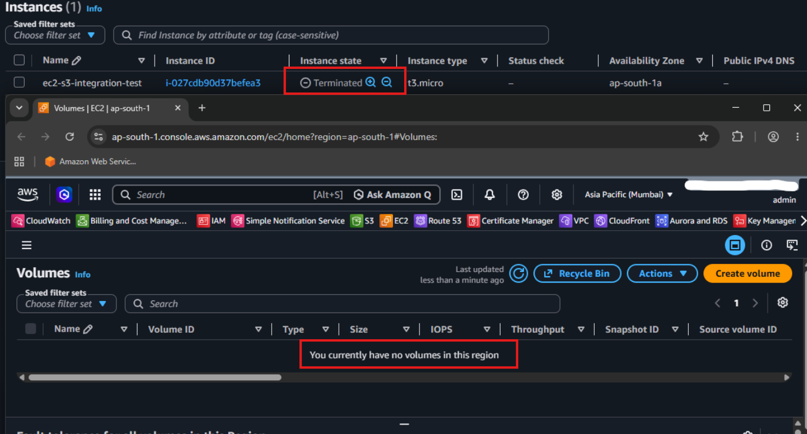

### 2. IAM Resources

Deleted the IAM role **Week2Day3EC2S3ReadRole** along with its attached inline IAM permission policy **s3-read-permission-policy**.

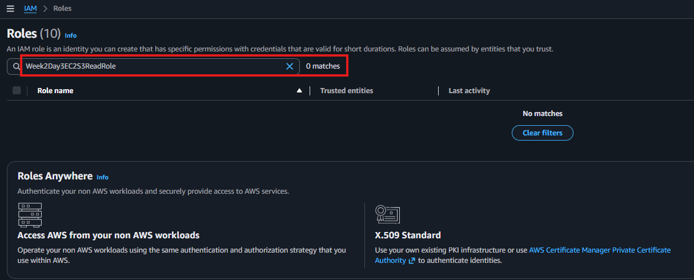

### 3. Amazon S3

Deleted the Amazon S3 bucket **ec2-s3-read-lab-sanket-dangat** after removing all test objects stored in the bucket.

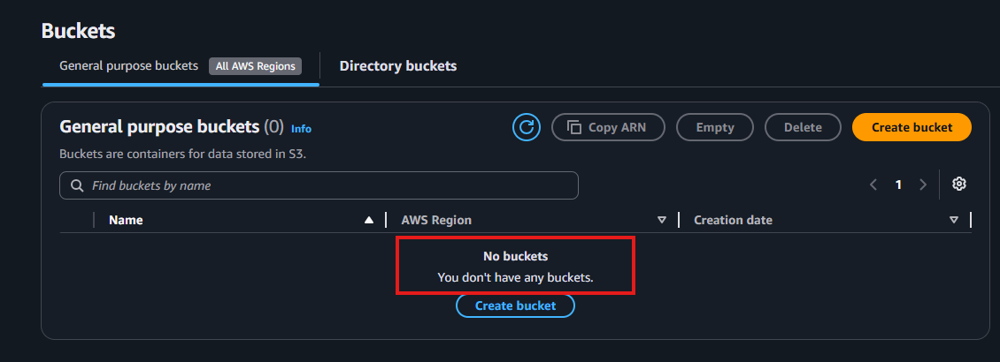

All resources created during the lab were successfully removed, ensuring no ongoing charges or unused resources remained in the AWS account.

## LinkedIn Post
[LinkedIn Link](https://www.linkedin.com/posts/sanket-dangat-6462b8271_10weeksofaws-10weeksofaws-aws10weekchallenge-ugcPost-7482338579109756928-s-Mi/?utm_source=share&utm_medium=member_desktop&rcm=ACoAAEJuHJYBII9imgLntyUMaz684Imwl2w4XOM)