# Week 3 - Day 6: Amazon VPC Part 2

## Name

Sanket Dangat

## Tasks Completed

- [x] Watched/read the weekly content
- [x] Extended the VPC
- [x] Completed hands-on labs
- [x] Added screenshots or proof
- [ ] Posted on LinkedIn
- [x] Cleaned up AWS resources

---

## Architecture

---

## Architecture Decisions

## Why NAT Gateway per Availability Zone (AZ)?

- Improves **high availability** by avoiding a single point of failure.
- Keeps traffic within the **same Availability Zone**, helping reduce cross-AZ data transfer costs.
- Ensures private instances in each AZ can continue accessing the internet even if another AZ becomes unavailable.
- Follows **AWS best practices** for production workloads.

---

## Why use an S3 Gateway Endpoint?

- Enables private instances to access **Amazon S3** without using the public internet.
- Reduces **NAT Gateway data processing costs** by routing S3 traffic through the Gateway Endpoint.
- Keeps S3 traffic on the **AWS network**, improving security.
- Supports **endpoint policies** to control access to specific S3 buckets.

---

## Result

Extended the Day 5 VPC by adding secure outbound internet access, private AWS service connectivity, subnet-level filtering, and network traffic monitoring.

**Resources created:**

* NAT Gateway **`cloudadhar-day6-nat-a`**
* Elastic IP
* Private Route Table **`cloudadhar-private-a-rt`**
* Amazon Linux 2023 Private EC2 instance
* Public EC2 web server
* Custom Network ACL
* Amazon S3 Gateway Endpoint
* Amazon EC2 Interface Endpoint
* VPC Flow Logs

**Validation:**

* Private EC2 has no public IPv4 address
* Session Manager access successful
* Internet connectivity verified through NAT Gateway
* AWS CLI authentication successful
* HTTP allowed by Security Group
* Temporary NACL deny blocked HTTP traffic
* Removing deny restored connectivity
* Amazon S3 traffic routed through Gateway Endpoint
* EC2 API resolved through Interface Endpoint using Private DNS
* Flow Logs recorded both ACCEPT and REJECT traffic

---

### 1. NAT Gateway Available

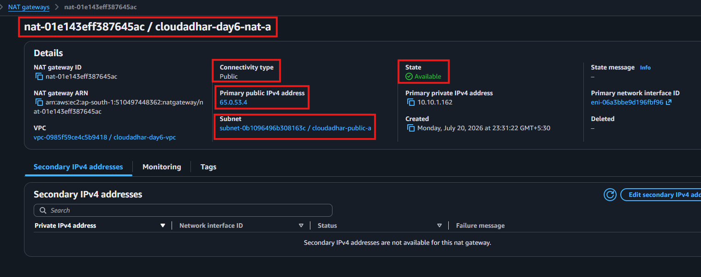

---

### 2. Private-A Route Table

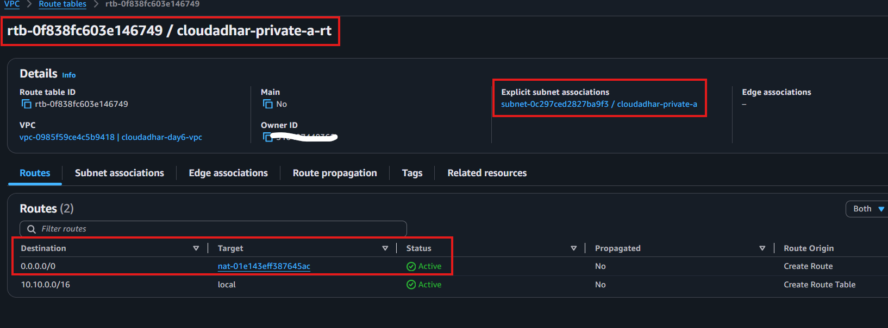

---

### 3. Public Route Table

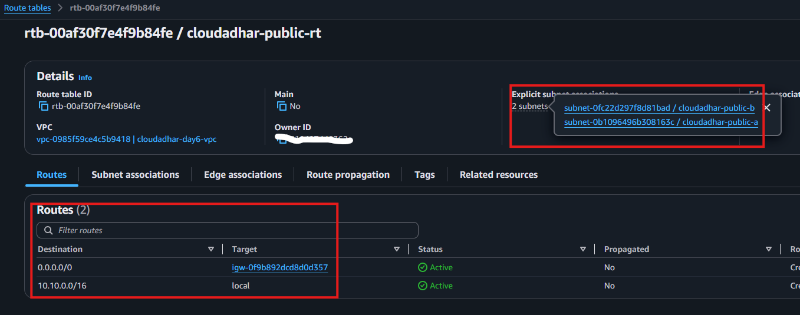

---

### 4. Private EC2 Instance

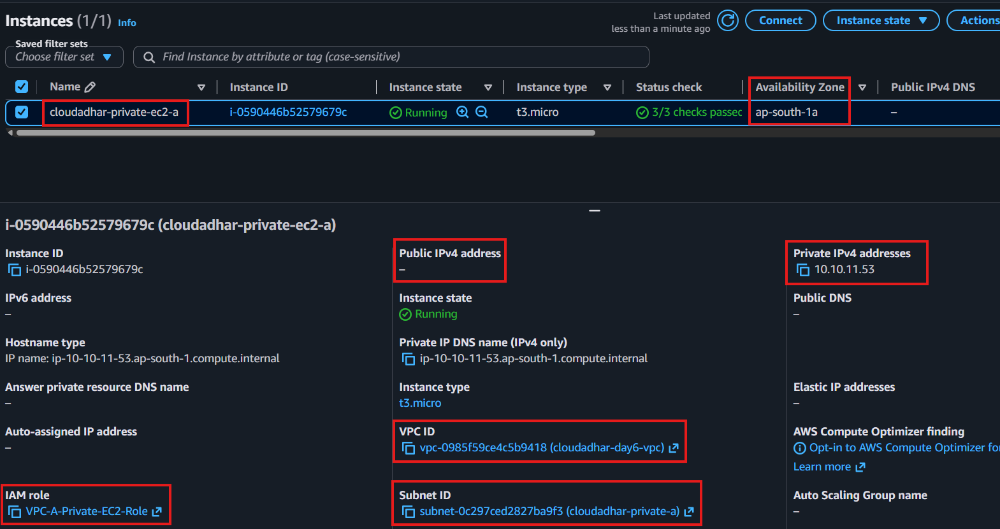

---

### 5. Session Manager Connection

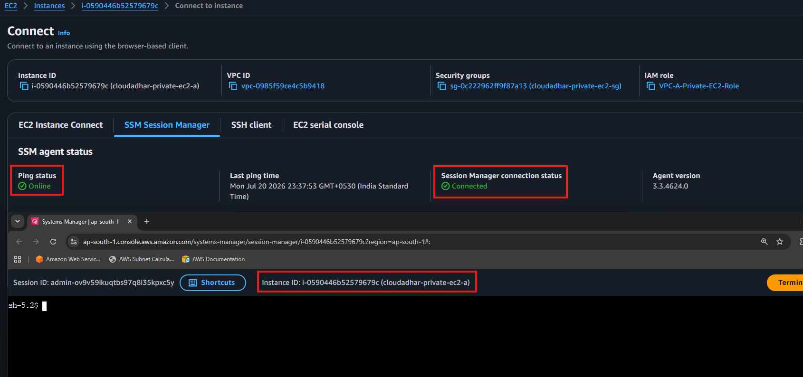

---

### 6. Internet Connectivity Validation

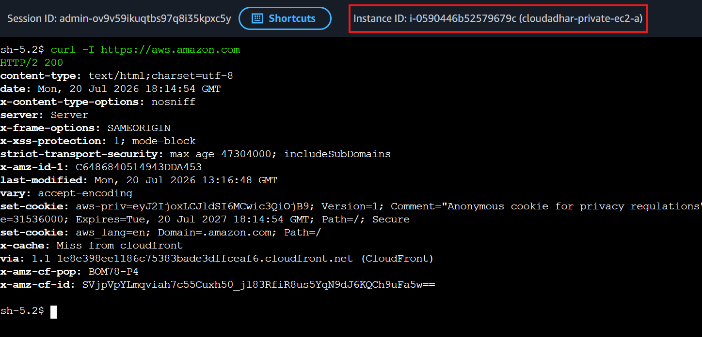

---

### 7. AWS CLI Identity Validation

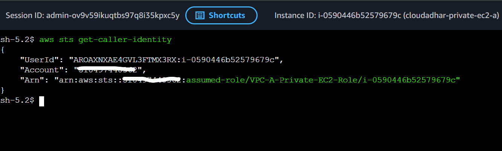

---

### 8. Web Server Security Group

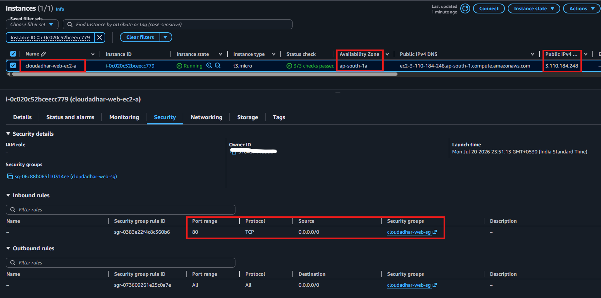

---

### 9. Web Server Running

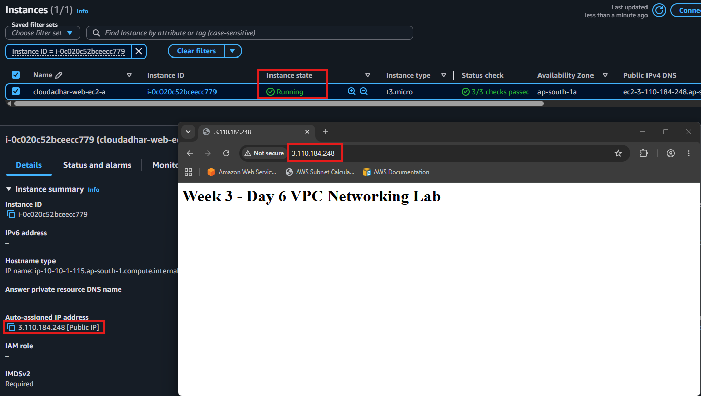

---

### 10. Custom Network ACL

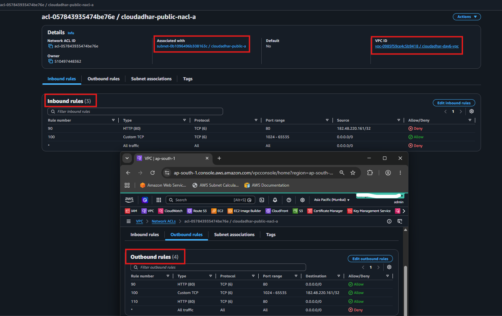

---

### 11. HTTP Blocked by Network ACL

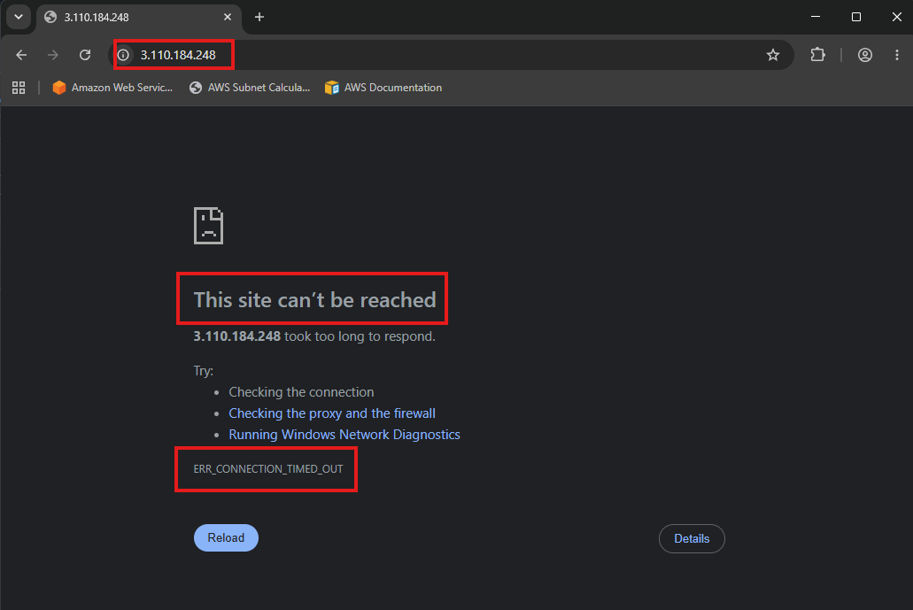

---

### 12. HTTP Restored

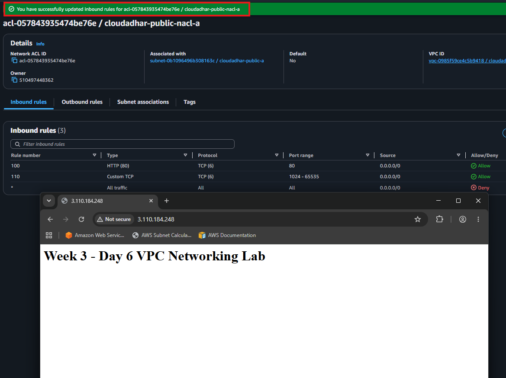

---

### 13. Amazon S3 Gateway Endpoint

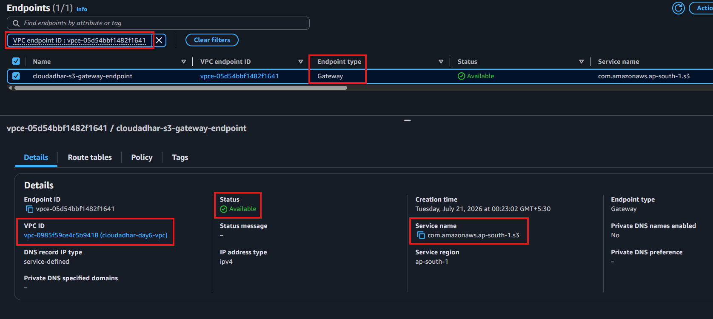

---

### 14. S3 Prefix List Route

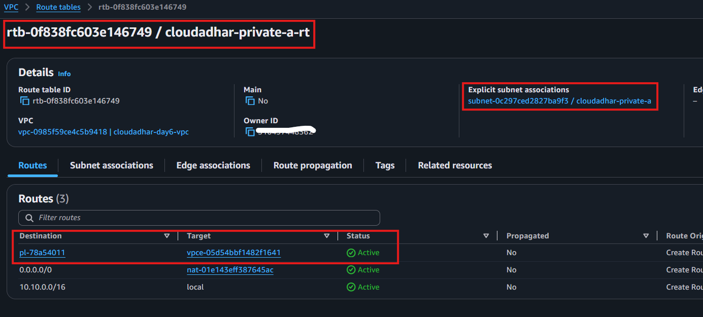

---

### 15. Amazon S3 Validation

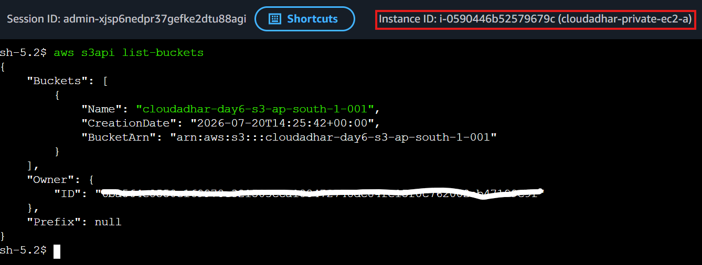

---

### 16. EC2 Interface Endpoint

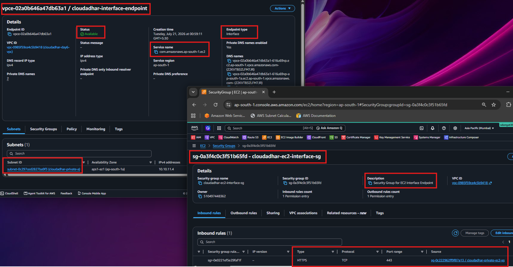

---

### 17. Private DNS Resolution

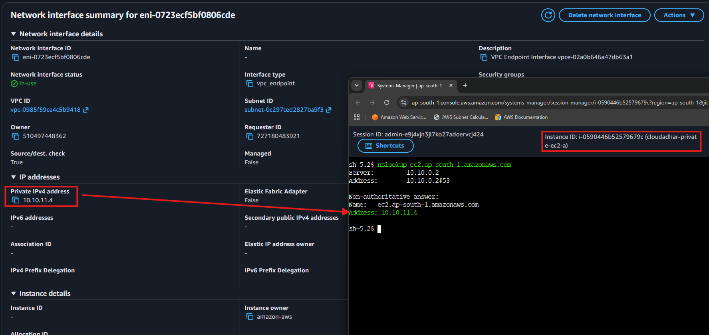

---

### 18. VPC Flow Logs Configuration

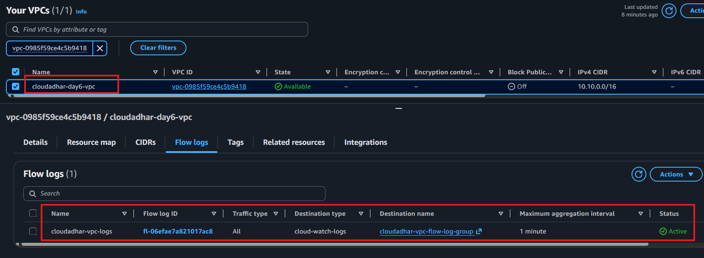

---

### 19. Flow Logs – REJECT Traffic

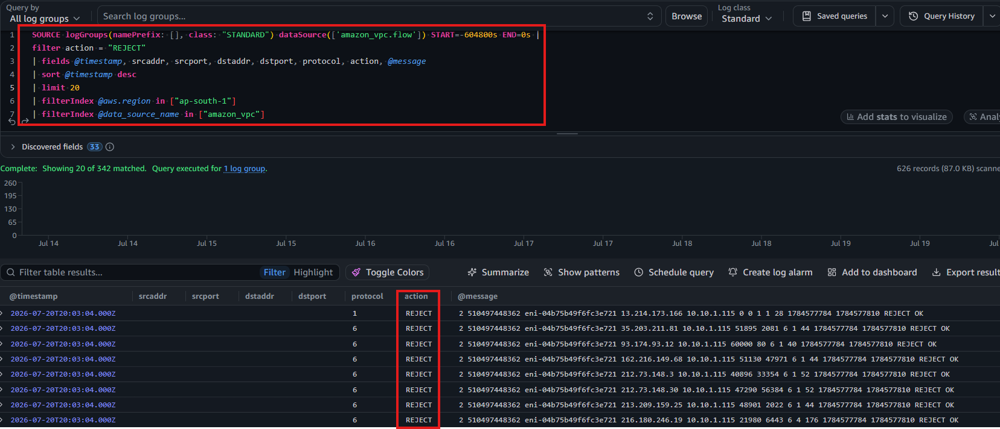

---

### 20. Flow Logs – ACCEPT Traffic

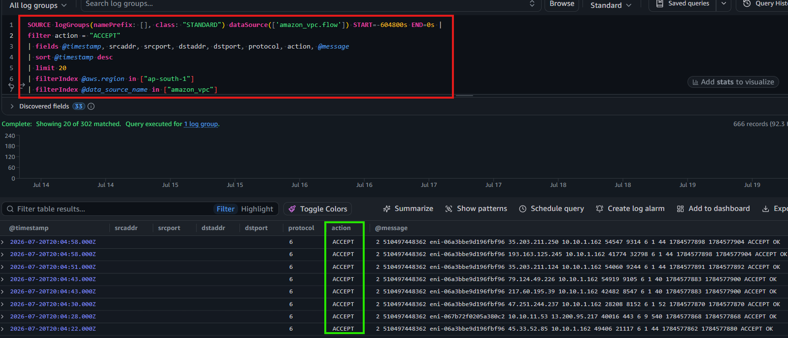

---

### 21. AWS VPC Resource Map

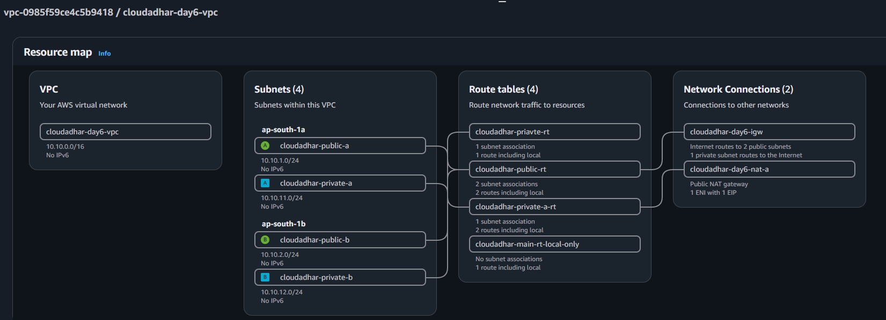

---

## Where I Got Stuck

`No blocker`

---

## Cleanup

**Cleanup (in order):**

1. Terminate the Day 6 EC2 instances.
2. Delete the Interface Endpoint.
3. Delete NAT-A and wait for deletion.
4. Release the Elastic IP.
5. Delete the S3 Gateway Endpoint if not needed.
6. Delete the VPC Flow Log.
7. Delete the dedicated CloudWatch log group if not needed.
8. Restore the original NACL association.
9. Delete the custom NACL.
10. Remove temporary route tables and Security Groups.