# Week 4 - Day 7: Secure NGINX Golden AMI – Manual Build & EC2 Image Builder Automation

## Name
Sanket Dangat

## Tasks Completed
- [x] Watched/read the weekly content
- [x] Completed hands-on labs
- [x] Added screenshots or proof
- [ ] Posted on LinkedIn
- [x] Cleaned up AWS resources

## Architecture

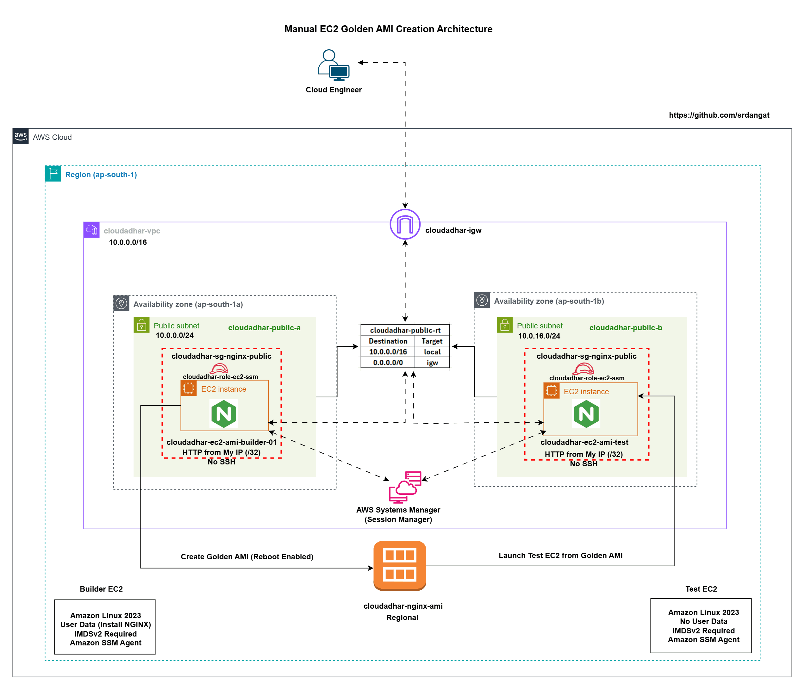

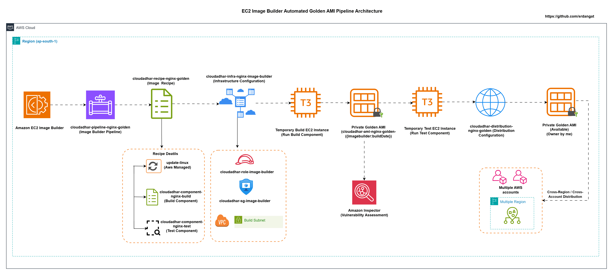

## Result

Successfully completed the manual Golden AMI creation and the automated EC2 Image Builder workflow.

---

# Part 1: Manual EC2 Golden AMI Creation

**Resources created:**

- Builder EC2 **`cloudadhar-ec2-ami-builder-01`**
- Security Group **`cloudadhar-sg-nginx-public`**
- IAM Role **`cloudadhar-role-ec2-ssm`**
- Golden AMI v1 **`cloudadhar-ami-nginx-golden-v1-20260725`**
- Test EC2 **`cloudadhar-ec2-ami-test-v1-01`**

**Validation:** Successfully verified NGINX installation, IMDSv2 enforcement, Session Manager access, created a Golden AMI, and launched a test EC2 instance from the AMI without using User Data.

### 1. Builder EC2 Configuration

---

### 2. NGINX Bootstrap Validation

---

### 3. IMDSv2 Validation

---

### 4. Golden AMI v1 Available

---

### 5. Golden AMI Validation on Test EC2

---

# Part 2: EC2 Image Builder Automation

**Resources created:**

- Image Builder Role **`cloudadhar-role-image-builder`**
- Build Component **`cloudadhar-component-nginx-build`**
- Test Component **`cloudadhar-component-nginx-test`**
- Image Recipe **`cloudadhar-recipe-nginx-golden`**
- Infrastructure Configuration **`cloudadhar-infra-nginx-image-builder`**
- Distribution Configuration **`cloudadhar-distribution-nginx-golden`**
- Image Pipeline **`cloudadhar-pipeline-nginx-golden`**

**Validation:** Successfully created Image Builder components, automated the image creation pipeline, completed build and test workflows, generated a Golden AMI, and validated it by launching a test EC2 instance.

### 6. Image Builder Build and Test Components

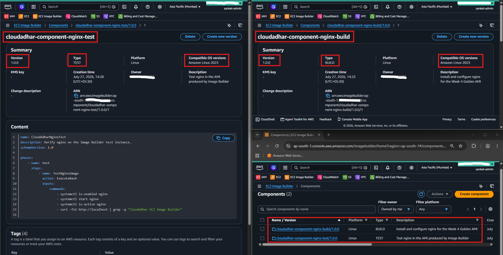

---

### 7. Image Recipe

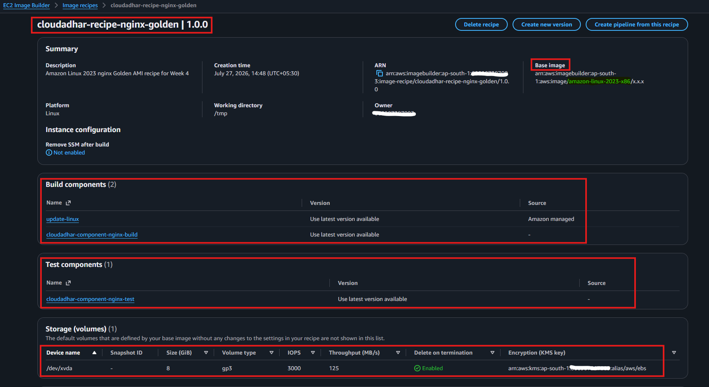

---

### 8. Infrastructure Configuration

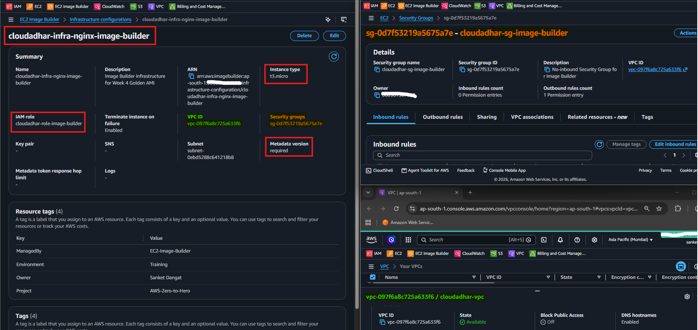

---

### 9. Distribution Configuration

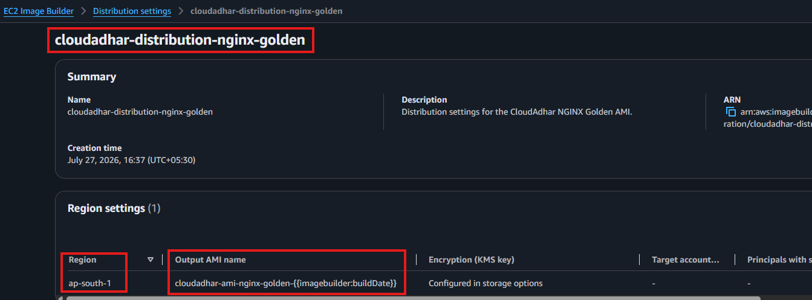

---

### 10. Image Pipeline

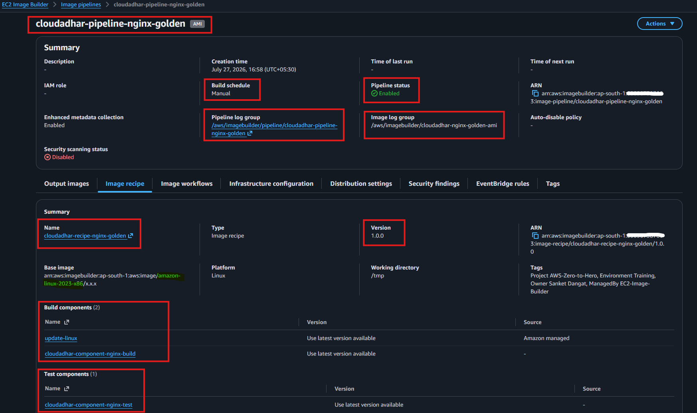

---

### 11. Build Workflow Completed

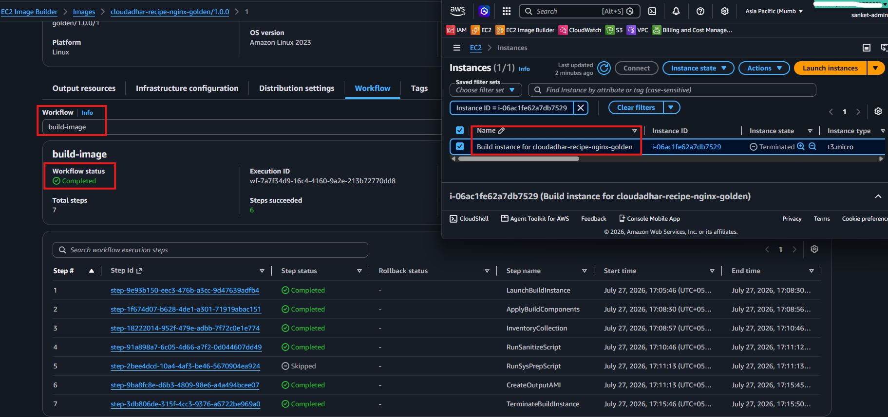

---

### 12. Test Workflow Completed

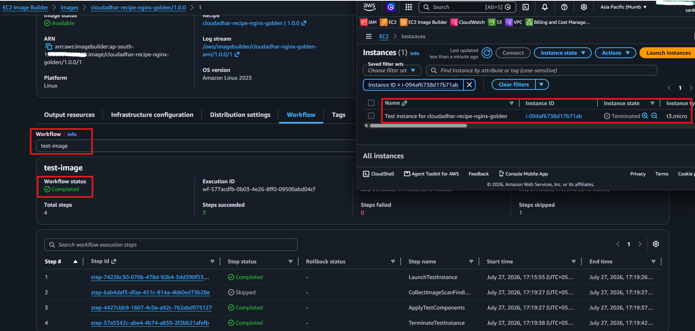

---

### 13. Output AMI Available

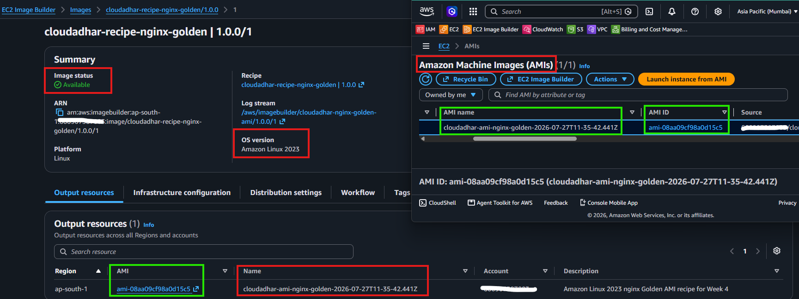

---

### 14. Image Builder AMI Validation on Test EC2

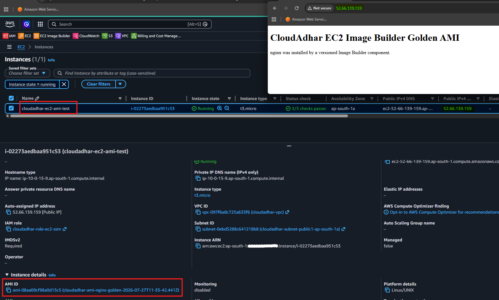

---

## Where I Got Stuck

`No blocker`

---

## Cleanup

## Cleanup

**Manual Golden AMI cleanup (in order):**
1. Terminated `cloudadhar-ec2-ami-test-v1-01`
2. Deregistered `cloudadhar-ami-nginx-golden-v1-20260725`
3. Deleted associated EBS snapshot created with the AMI
4. Terminated `cloudadhar-ec2-ami-builder-01`
5. Deleted `cloudadhar-sg-nginx-public`
6. Deleted IAM role `cloudadhar-role-ec2-ssm`

**EC2 Image Builder cleanup (in order):**
1. Deleted `cloudadhar-pipeline-nginx-golden`
2. Deleted `cloudadhar-distribution-nginx-golden`
3. Deleted `cloudadhar-infra-nginx-image-builder`
4. Deleted `cloudadhar-recipe-nginx-golden`
5. Deleted `cloudadhar-component-nginx-test`
6. Deleted `cloudadhar-component-nginx-build`
7. Deregistered the Image Builder output AMI
8. Deleted the associated EBS snapshot created by Image Builder
9. Deleted IAM role `cloudadhar-role-image-builder`

---

## LinkedIn Post
[LinkedIn Link]()