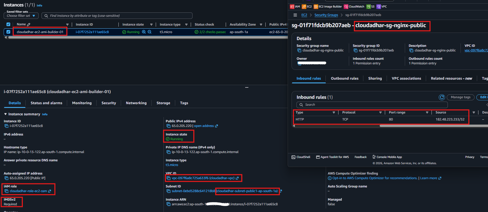
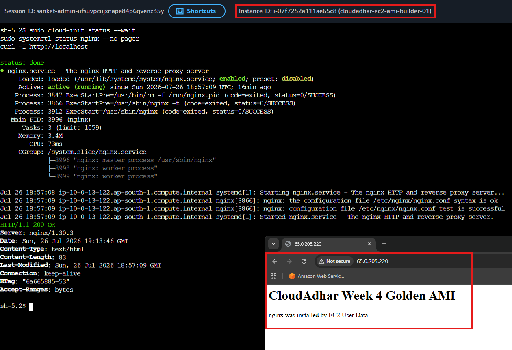
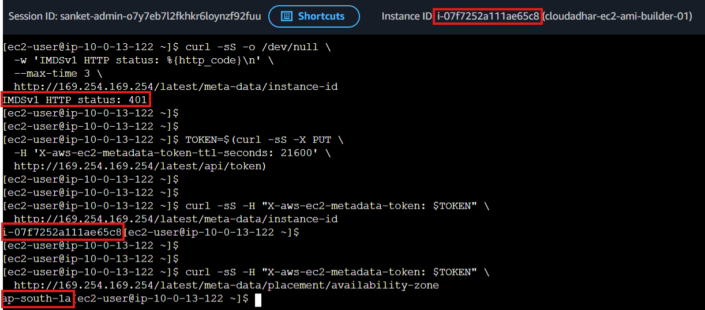
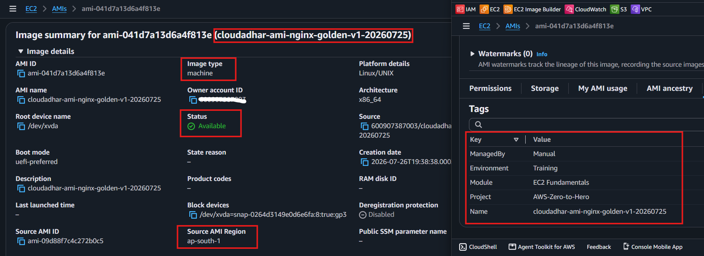
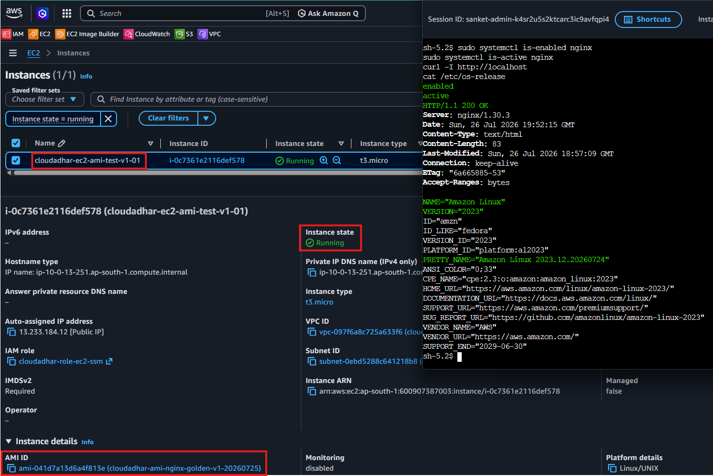

# Week 4 - Day 7: Secure NGINX Golden AMI – Manual Build & EC2 Image Builder Automation

## Name
Sanket Dangat

## Tasks Completed
- [ ] Watched/read the weekly content
- [ ] Completed hands-on labs
- [ ] Added screenshots or proof
- [ ] Posted on LinkedIn
- [ ] Cleaned up AWS resources

## Architecture

## Result

Successfully completed the manual Golden AMI creation

---

# Part 1: Manual EC2 Golden AMI Creation

**Resources created:**

- Builder EC2 **`cloudadhar-ec2-ami-builder-01`**
- Security Group **`cloudadhar-sg-nginx-public`**
- IAM Role **`cloudadhar-role-ec2-ssm`**
- Golden AMI v1 **`cloudadhar-ami-nginx-golden-v1-20260725`**
- Test EC2 **`cloudadhar-ec2-ami-test-v1-01`**

**Validation:** Successfully verified NGINX installation, IMDSv2 enforcement, Session Manager access, created a patched Golden AMI, and launched a test EC2 instance from the AMI without using User Data.

### 1. Builder EC2 Configuration

---

### 2. NGINX Bootstrap Validation

---

### 3. IMDSv2 Validation

---

### 4. Golden AMI v1 Available

---

### 5. Golden AMI Validation on Test EC2

---