# Week 4 - Day 8: EBS Persistence, EFS, and Storage Recovery

## Name
Sanket Dangat

## Tasks Completed
- [x] Watched/read the weekly content
- [x] Completed hands-on labs
- [x] Added screenshots or proof
- [x] Posted on LinkedIn
- [x] Cleaned up AWS resources

## Architecture

**`Amazon EBS Persistence & Disaster Recovery Architecture`**

## Architecture Overview

- Amazon EC2 uses an encrypted **Amazon EBS gp3 volume** for persistent block storage.
- **Amazon EBS volumes are Availability Zone (AZ) scoped** and can only be attached to EC2 instances within the same AZ.
- **Amazon Data Lifecycle Manager (DLM)** automatically creates scheduled snapshots for EBS volumes tagged with **`Backup=Daily`**.
- **Amazon EBS snapshots are Regional resources** and can be copied across AWS Regions.
- The snapshot is copied from **ap-south-1 (Mumbai)** to **ap-southeast-2 (Sydney)** for disaster recovery.
- A new encrypted **Amazon EBS volume** is created from the copied snapshot and attached to a **Recovery EC2** instance.
- This architecture provides **persistent storage, automated backups, and cross-region disaster recovery**.

---

**`Amazon EFS Shared Storage Architecture`**

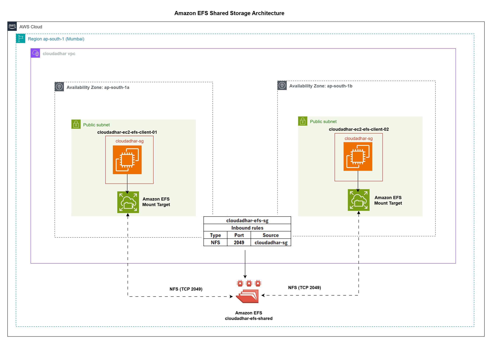

## Architecture Overview

- Amazon EC2 instances in two Availability Zones mount a shared **Amazon EFS file system** for persistent file storage.
- **Amazon EFS** is a Regional service that automatically stores data redundantly across multiple Availability Zones for high availability and durability.
- An **Amazon EFS Mount Target** is created in each Availability Zone to provide low-latency access for EC2 instances within the same AZ.
- EC2 instances mount Amazon EFS over **NFS (TCP 2049)** through their local mount target.
- **Security Groups** allow inbound **NFS (TCP 2049)** traffic from the EC2 instances to the Amazon EFS mount targets.
- Both EC2 instances can simultaneously read from and write to the same shared Amazon EFS file system.
- This architecture provides **shared storage, high availability, and scalable file access** across multiple Availability Zones.

---

## Decision Table

| Requirement | Choice | Reason |
|---|---|---|
| Persistent block storage for EC2 | Amazon EBS gp3 | Provides durable, high-performance SSD block storage for general-purpose workloads. |
| Secure data at rest | EBS Encryption | Encrypts EBS volumes and snapshots using AWS KMS to protect data. |
| Automated backup scheduling | Amazon Data Lifecycle Manager (DLM) | Automatically creates scheduled EBS snapshots based on lifecycle policies. |
| Point-in-time recovery | Amazon EBS Snapshot | Captures point-in-time backups of EBS volumes for data protection and recovery. |
| Cross-Region disaster recovery | Cross-Region Snapshot Copy | Copies EBS snapshots to another AWS Region for disaster recovery. |
| Recovery after Regional failure | Create EBS Volume from Snapshot | Restores a new EBS volume from the copied snapshot in the destination Region and Availability Zone. |
| Compute recovery | Recovery EC2 Instance | Attaches the restored EBS volume to a new EC2 instance to resume workloads. |
| Availability Zone storage | Amazon EBS | EBS volumes are Availability Zone-scoped and can only be attached to EC2 instances in the same AZ. |
| Regional backup storage | Amazon EBS Snapshots | Snapshots are Regional resources and can be used to create new EBS volumes when required. |

---
## Result

Successfully completed hands-on labs covering Amazon EBS persistence, snapshot-based disaster recovery, cross-Region backup, Data Lifecycle Manager (DLM) policy review, Placement Groups, and Amazon EFS shared storage. Additionally completed the optional demonstrations for Fast Snapshot Restore, io2 Multi-Attach, and Instance Store validation.

---

# Part 1: Amazon EBS Persistence

**Resources created:**

- Storage EC2 **`cloudadhar-ec2-storage-lab-01`**
- Security Group **`cloudadhar-sg-storage-lab`**
- gp3 Volume **`cloudadhar-ebs-gp3-data-01`**

**Validation:** Successfully created and attached an encrypted gp3 volume, configured persistent mounting using UUID, verified data persistence after reboot and stop/start, and expanded the volume from 2 GiB to 4 GiB.

### 1. Storage EC2 Running

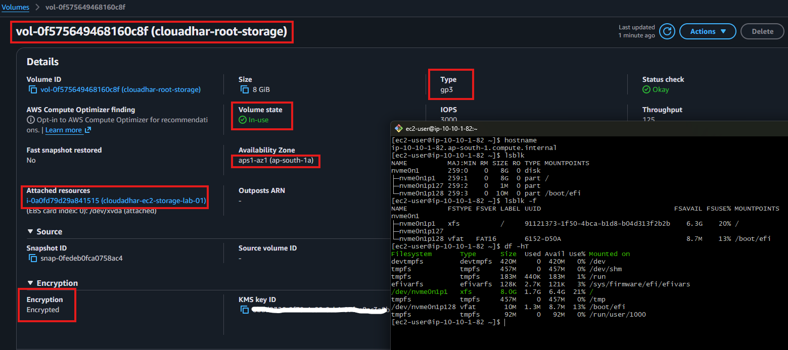

---

### 2. gp3 Volume Attached

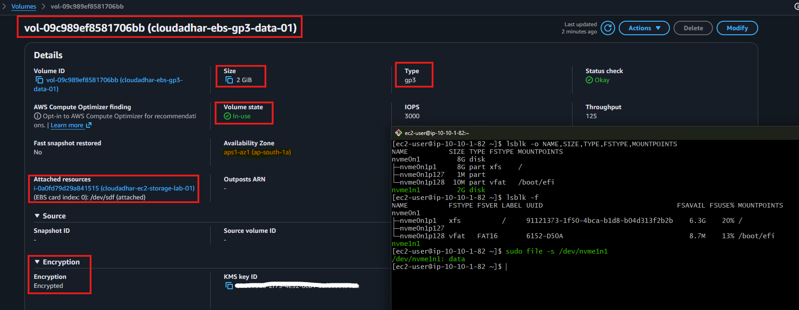

---

### 3. XFS Filesystem Mounted using UUID

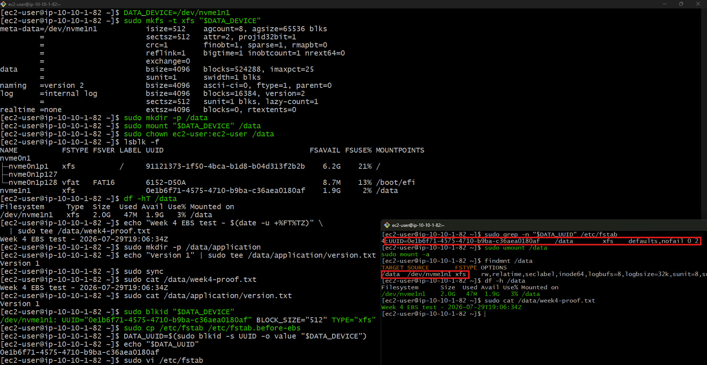

---

### 4. Data Persistence Validation

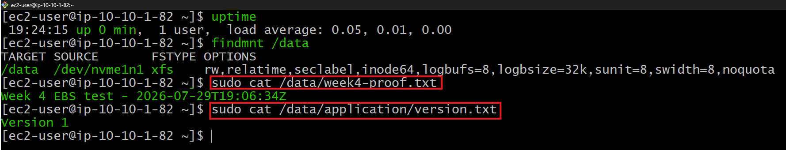

---

### 5. Volume Expansion (2 GiB → 4 GiB)

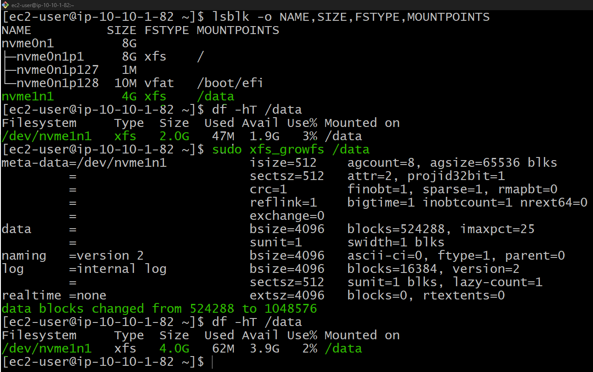

---

# Part 2: Snapshot & Disaster Recovery

**Resources created:**

- Snapshot **`cloudadhar-snap-gp3-data-01`**
- Restored Volume **`cloudadhar-ebs-gp3-restored-01`**
- Sydney DR Snapshot **`cloudadhar-snap-dr-sydney-01`**

**Validation:** Successfully restored an encrypted EBS volume from a snapshot, verified point-in-time recovery, copied the encrypted snapshot from Mumbai to Sydney, and validated encryption across all resources.

### 6. Snapshot Completed

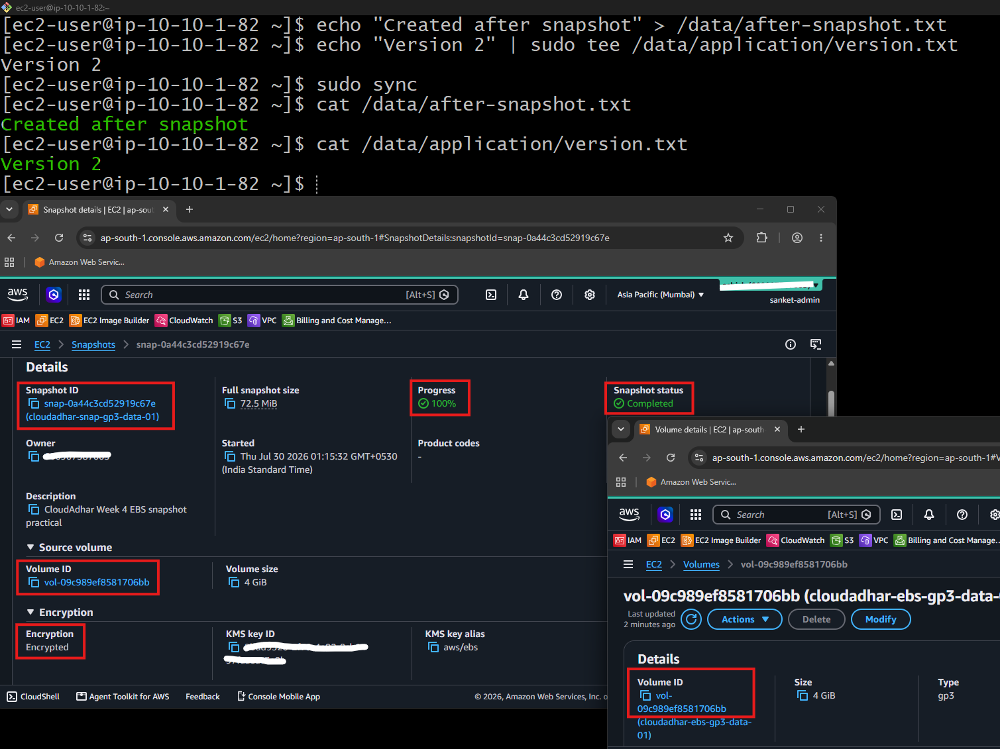

---

### 7. Restored Volume Validation

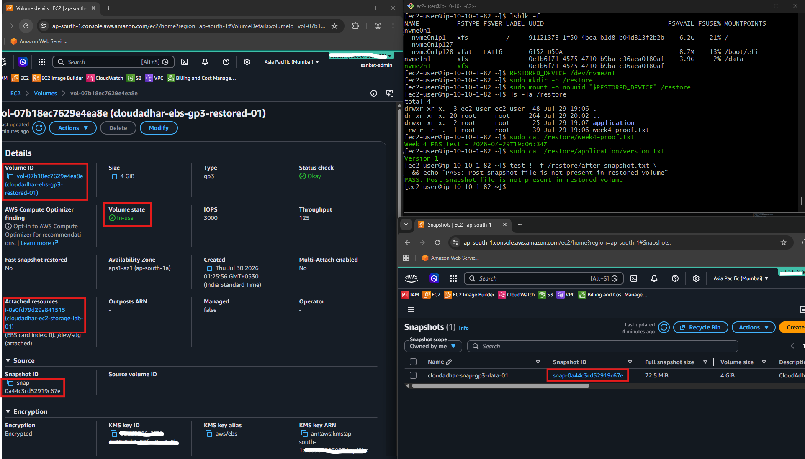

---

### 8. Cross-Region Snapshot Copy & Encryption Validation

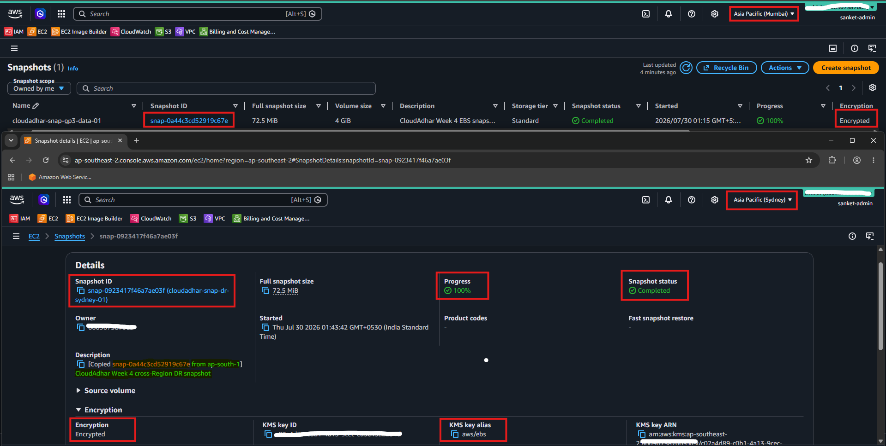

---

# Part 3: Backup Automation

**Resources created:**

- DLM Policy **`cloudadhar-dlm-daily-ebs-snapshots`**

**Validation:** Successfully reviewed the DLM policy and verified that only volumes tagged with **`Backup=Daily`** are targeted.

### 9. Data Lifecycle Manager Policy

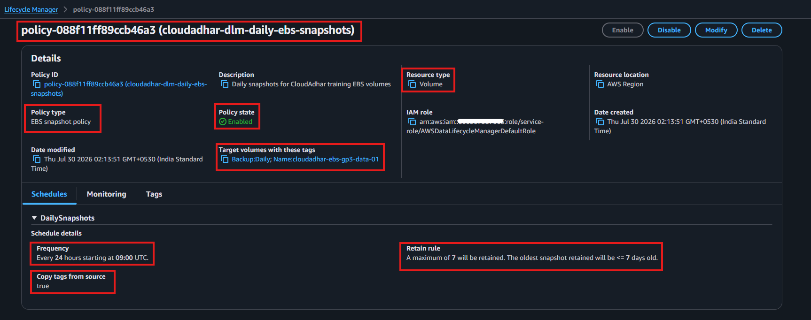

---

# Part 4: Placement Groups

**Resources created:**

- **`cloudadhar-pg-cluster-demo`**
- **`cloudadhar-pg-spread-demo`**
- **`cloudadhar-pg-partition-demo`**

**Validation:** Successfully created and reviewed Cluster, Spread, and Partition placement groups.

### 10. Placement Groups

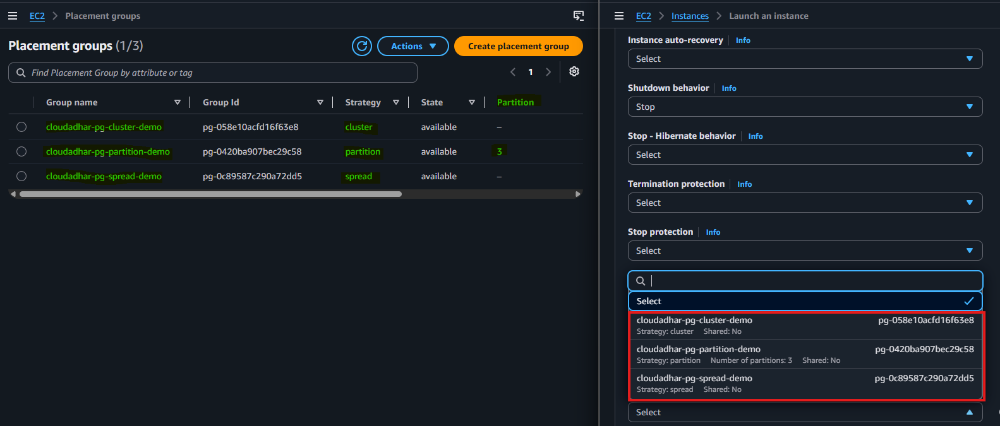

---

# Part 5: Amazon EFS Shared Storage

**Resources created:**

- EFS **`cloudadhar-efs-shared-01`**
- Security Group **`cloudadhar-sg-storage-lab`**, **`cloudadhar-sg-efs-nfs`**
- Client 1 **`cloudadhar-ec2-efs-client-01`**
- Client 2 **`cloudadhar-ec2-efs-client-02`**

**Validation:** Successfully mounted the same Amazon EFS file system on two EC2 instances, verified shared file access between both clients, and configured persistent mounting using `/etc/fstab`.

### 11. Amazon EFS File System

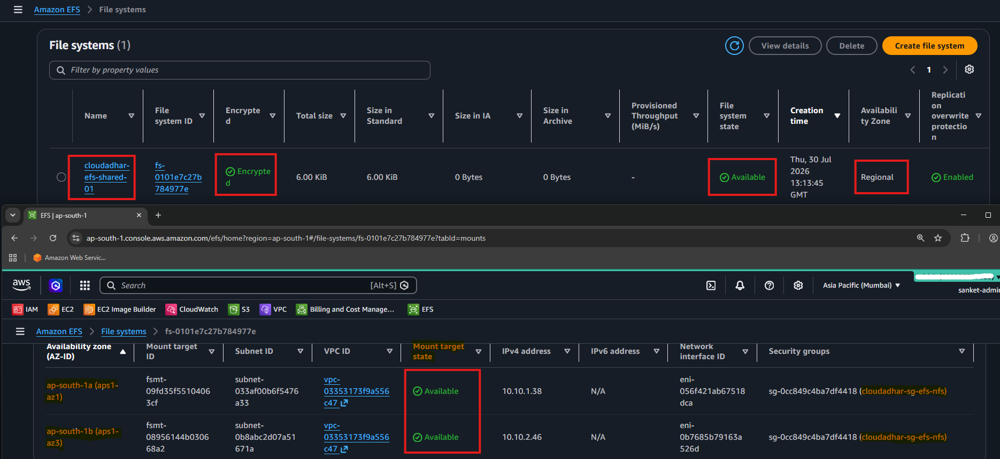

---

### 12. Client 1 Mounted Amazon EFS

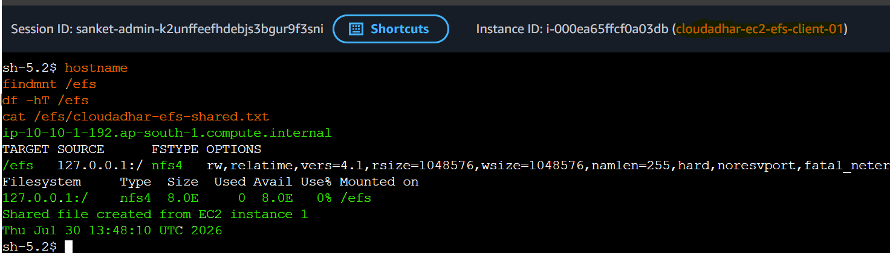

---

### 13. Client 2 Shared Access Validation

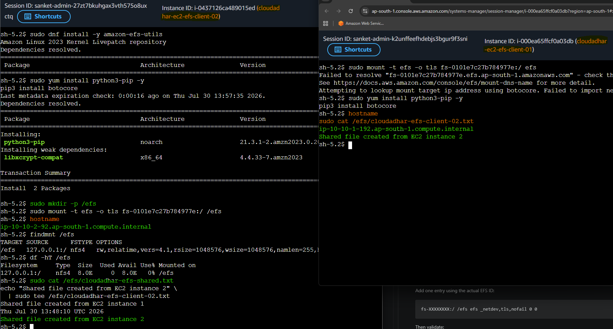

---

### 14. Persistent Amazon EFS Mount Validation

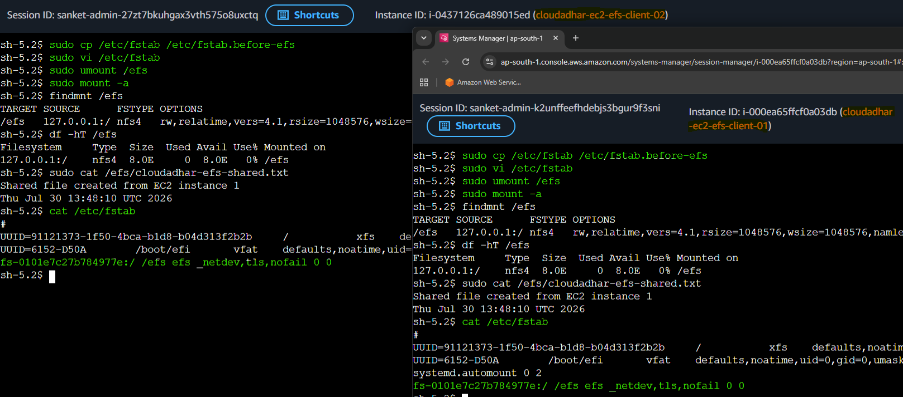

---

# Part 6: Enable & Disable Fast Snapshot Restore

**Resources used:**

- Snapshot **`cloudadhar-snap-gp3-data-01`**

**Validation:** Successfully enabled Fast Snapshot Restore for the Mumbai snapshot in the target Availability Zone, verified the snapshot status as Enabled, then disabled Fast Snapshot Restore and confirmed it was no longer enabled.

### 15. Fast Snapshot Restore Enable & Disable

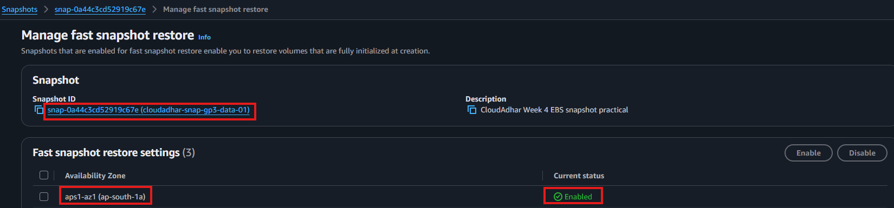

---

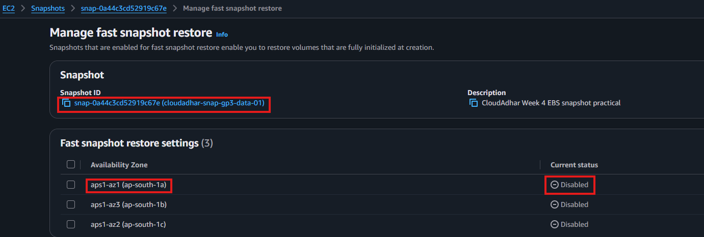

---

# Part 7: io2 Multi-Attach

**Resources created:**

- io2 Multi-Attach Volume **`cloudadhar-ebs-io2-multiattach-01`**
- EC2 Instance **`cloudadhar-ec2-multiattach-01`**, **`cloudadhar-ec2-multiattach-02`**(`t3.large`)

**Validation:** Successfully created an encrypted io2 Multi-Attach volume, attached it simultaneously to both EC2 instances in the same Availability Zone, verified that both instances detected the shared block device using `lsblk`, and cleaned up all demonstration resources after validation.

### 17. Create io2 Multi-Attach Volume

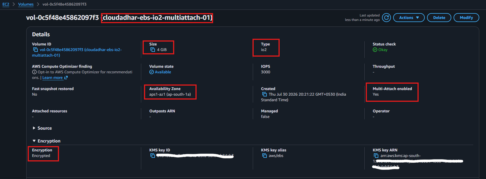

---

### 18. Attach Volume to Both EC2 Instances

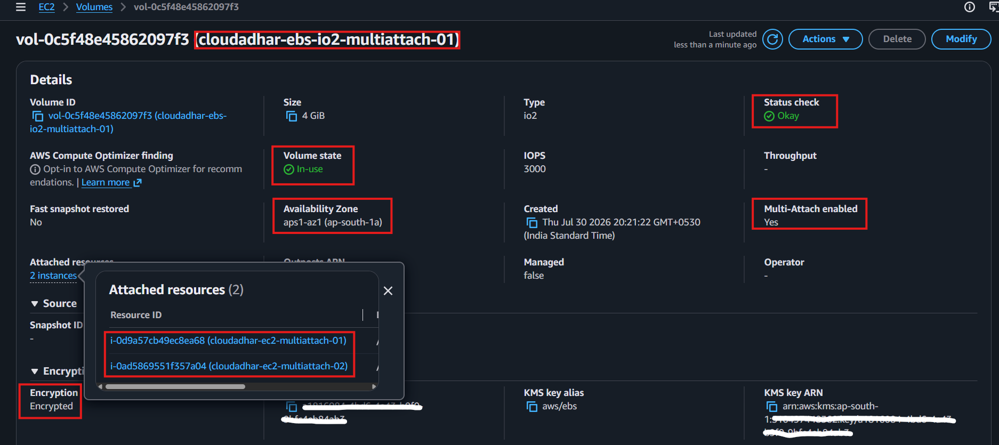

---

### 19. Verify Multi-Attach on Primary EC2

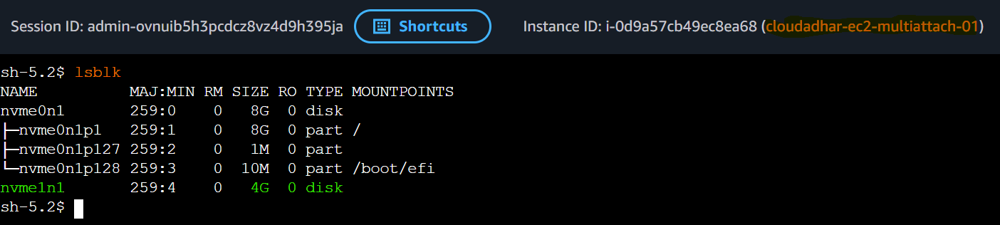

---

### 20. Verify Multi-Attach on Secondary EC2

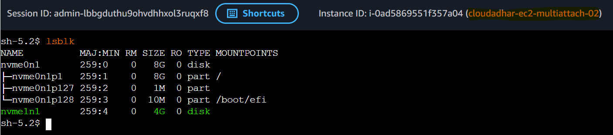

---

# Part 8: Instance Store

**Resources created:**

- EC2 Instance **`cloudadhar-ec2-instance-store-01`** (`i3.large`)

**Validation:** Successfully verified the local NVMe Instance Store, formatted and mounted the volume with XFS, confirmed read/write access using `temporary.txt`, verified that the file persisted after a reboot, and demonstrated that the filesystem and `temporary.txt` were unavailable after a stop/start cycle, confirming the ephemeral nature of Instance Store storage.

### 21. Launch & Verify Instance Store

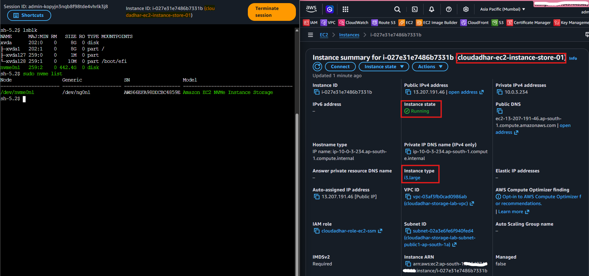

---

### 22. Mount and Configure Instance Store

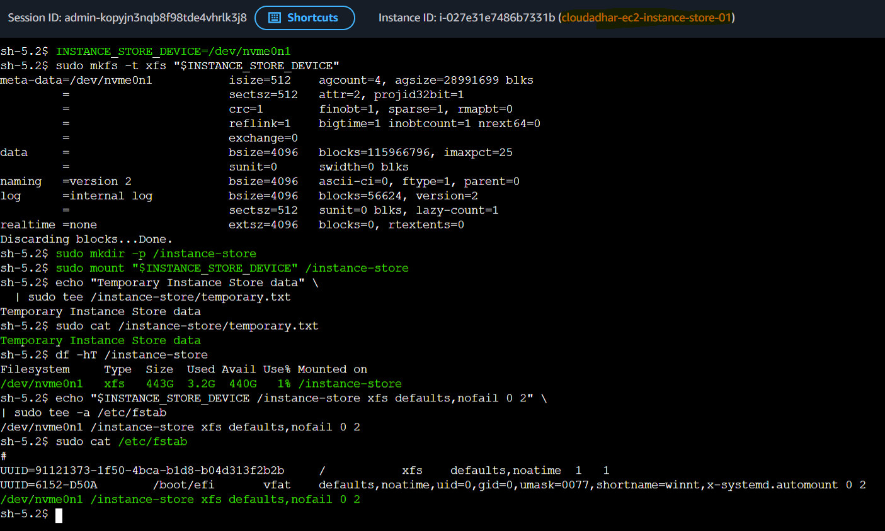

---

### 23. Verify After Reboot

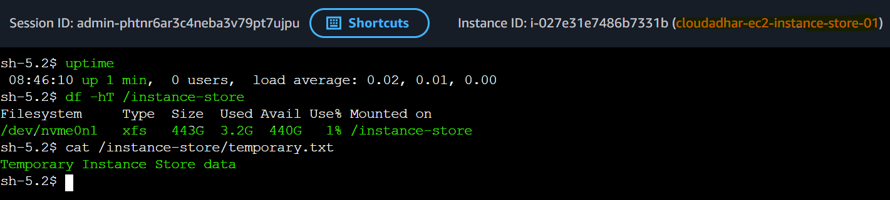

---

### 24. Verify After Stop & Start

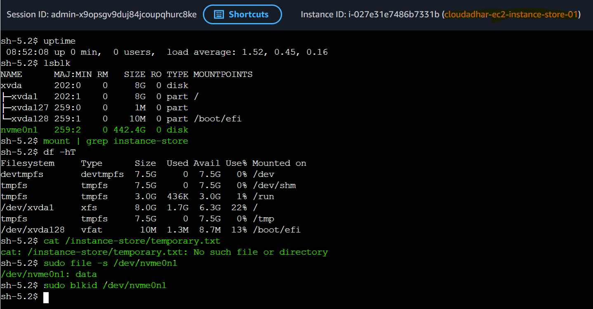

## Where I Got Stuck

`No blocker`

---

## Cleanup

### Amazon EBS Cleanup

1. Unmounted and deleted **`cloudadhar-ebs-gp3-restored-01`**.
2. Deleted **`cloudadhar-snap-gp3-data-01`**.
3. Deleted **`cloudadhar-snap-dr-sydney-01`**.
4. Deleted **`cloudadhar-ebs-gp3-data-01`**.
5. Deleted **`cloudadhar-dlm-daily-ebs-snapshots`**.
6. Terminated **`cloudadhar-ec2-storage-lab-01`**.
7. Deleted **`cloudadhar-sg-storage-lab`**.

### Amazon EFS Cleanup

1. Unmounted Amazon EFS from both EC2 instances.
2. Deleted **`cloudadhar-efs-shared-01`**.
3. Deleted **`cloudadhar-sg-efs-nfs`**.
4. Terminated **`cloudadhar-ec2-efs-client-01`**.
5. Terminated **`cloudadhar-ec2-efs-client-02`**.

### Placement Groups Cleanup

1. Deleted **`cloudadhar-pg-cluster-demo`**.
2. Deleted **`cloudadhar-pg-spread-demo`**.
3. Deleted **`cloudadhar-pg-partition-demo`**.

### Optional Demonstrations Cleanup

1. Deleted **`cloudadhar-ebs-io2-multiattach-01`**.
2. Terminated **`cloudadhar-ec2-multiattach-01`**.
3. Terminated **`cloudadhar-ec2-multiattach-02`**.
4. Terminated **`cloudadhar-ec2-instance-store-01`**.

---

## LinkedIn Post

[LinkedIn Link](https://www.linkedin.com/posts/activity-7488975384567492608-_EGy?utm_source=share&utm_medium=member_android&rcm=ACoAAEJuHJYBII9imgLntyUMaz684Imwl2w4XOM) 
