# Week 5 - Day 10: ALB Blue/Green Routing and NLB

## Name
Sanket Dangat

## Tasks Completed
- [x] Watched/read the weekly content
- [x] Completed hands-on labs
- [x] Added screenshots or proof
- [ ] Posted on LinkedIn
- [x] Cleaned up AWS resources


## Architecture

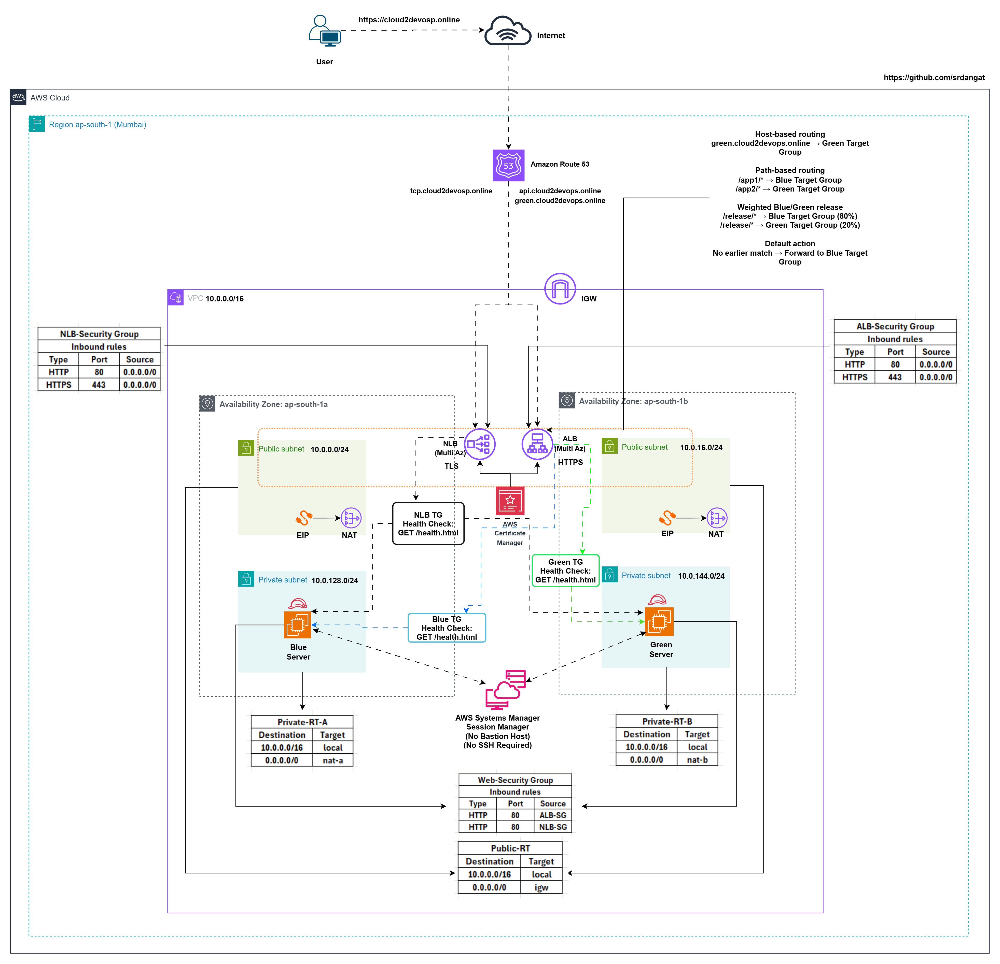


## Architecture Overview

- **Amazon VPC:** Deployed a dedicated Amazon VPC in the **ap-south-1 (Mumbai)** Region spanning **two Availability Zones (AZs)** with public and private subnets to provide a highly available and fault-tolerant network architecture.

- **Networking:** Configured public subnets for the internet-facing **Application Load Balancer (ALB)**, **Network Load Balancer (NLB)**, and **NAT Gateway**, while hosting Blue and Green Amazon EC2 instances in private subnets for secure application deployment.

- **Application Load Balancer (ALB):** Deployed an internet-facing ALB with **HTTPS** enabled using an **AWS Certificate Manager (ACM)** wildcard certificate. Configured **host-based routing**, **path-based routing**, **weighted Blue/Green traffic distribution**, **target group stickiness**, **health checks**, and **connection draining** to demonstrate advanced Layer 7 traffic management.

- **Network Load Balancer (NLB):** Deployed an internet-facing NLB with a **TLS listener** using the same ACM wildcard certificate to provide secure **Layer 4 TCP/TLS** load balancing for backend EC2 instances.

- **Amazon EC2:** Deployed Blue and Green NGINX web servers in private subnets across two Availability Zones and registered them with dedicated ALB and NLB target groups for high availability and traffic distribution.

- **DNS & Certificates:** Configured **Amazon Route 53 Alias records** for the ALB (`api.cloud2devops.online`, `green.cloud2devops.online`) and the NLB (`tcp.cloud2devops.online`) using an ACM wildcard certificate to enable secure HTTPS and TLS access.

- **Connectivity & Security:** Used an **Internet Gateway (IGW)**, **NAT Gateway**, route tables, and **Security Groups** to provide secure internet connectivity for public resources while keeping backend EC2 instances isolated in private subnets.

- **Administration:** Enabled secure instance management using **AWS Systems Manager Session Manager**, eliminating the need for a bastion host or inbound SSH access.

- **Architecture Benefits:** Delivers a secure, highly available, fault-tolerant, and production-ready load balancing architecture demonstrating advanced **Layer 7 routing**, **Layer 4 load balancing**, **Blue/Green deployment**, **traffic shifting**, **target group stickiness**, **health monitoring**, **connection draining**, and **secure application delivery** aligned with AWS Well-Architected Framework principles.

> **Note:** The architecture diagram illustrates a production-ready deployment using **one NAT Gateway per Availability Zone** for high availability. The hands-on implementation used a **single NAT Gateway** to optimize AWS Learner Lab costs while demonstrating the same core networking and load balancing concepts.

---

## Result

Successfully implemented an Application Load Balancer (ALB) with advanced Layer 7 routing and a Network Load Balancer (NLB) for Layer 4 traffic distribution. Configured HTTPS on the ALB and TLS on the NLB using an ACM wildcard certificate and Route 53 alias records. Verified host-based routing, path-based routing, weighted Blue/Green traffic distribution, target group stickiness, health checks, connection draining, and secure load balancing across two EC2 instances.

**Resources created:**

- VPC `cloudadhar-day10-vpc`
- Public Subnets (for ALB, NLB, and NAT Gateway)
- Private Subnets (for Blue and Green EC2 instances)
- Internet Gateway
- NAT Gateway
- Elastic IP associated with NAT Gateway
- Blue EC2 `cloudadhar-day10-blue-ec2`
- Green EC2 `cloudadhar-day10-green-ec2`
- Blue Target Group `cloudadhar-day10-blue-tg`
- Green Target Group `cloudadhar-day10-green-tg`
- Application Load Balancer `cloudadhar-day10-alb`
- NLB Target Group `cloudadhar-day10-nlb-tg`
- Network Load Balancer `cloudadhar-day10-nlb`
- ACM Wildcard Certificate `*.cloud2devops.online`
- Route 53 Alias Record `api.cloud2devops.online`
- Route 53 Alias Record `green.cloud2devops.online`
- Route 53 Alias Record `tcp.cloud2devops.online`
- ALB Security Group `cloudadhar-day10-alb-sg`
- NLB Security Group `cloudadhar-day10-nlb-sg`
- Web Security Group `cloudadhar-day10-web-sg`

**Validation:** Successfully verified HTTPS access through the Application Load Balancer using `https://api.cloud2devops.online`, host-based routing using `https://green.cloud2devops.online`, TLS access through the Network Load Balancer using `https://tcp.cloud2devops.online`, Route 53 DNS resolution, healthy Blue and Green target registration, path-based routing, weighted Blue/Green release, target group stickiness, unhealthy target detection and recovery, connection draining, and Layer 4 TLS load balancing through the Network Load Balancer.

---

### 1. Blue and Green EC2 Instances

Launched the Blue and Green EC2 instances in different Availability Zones using Amazon Linux 2023 with IMDSv2 enforcement and User Data to automatically install and configure NGINX.

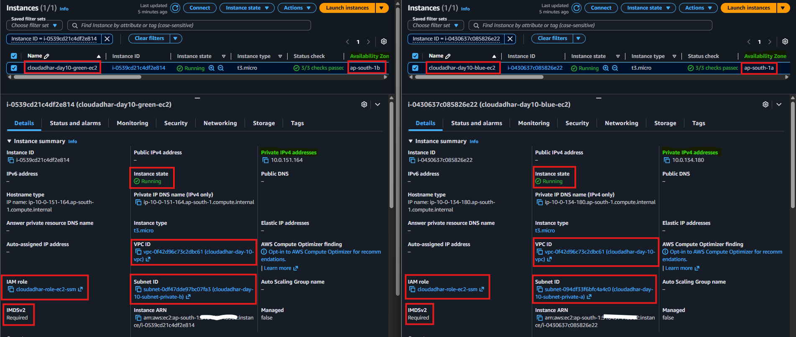

---

### 2. Target Group Configuration

Created the Blue and Green Target Groups with HTTP health checks configured on `/health.html` and registered the corresponding EC2 instances.

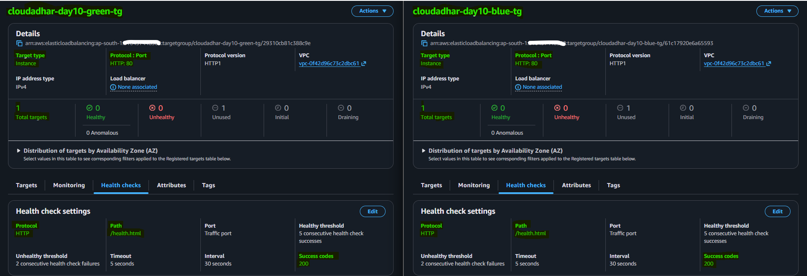

---

### 3. Application Load Balancer

Created the internet-facing Application Load Balancer across two Availability Zones and configured HTTP (80) and HTTPS (443) listeners for secure application access.

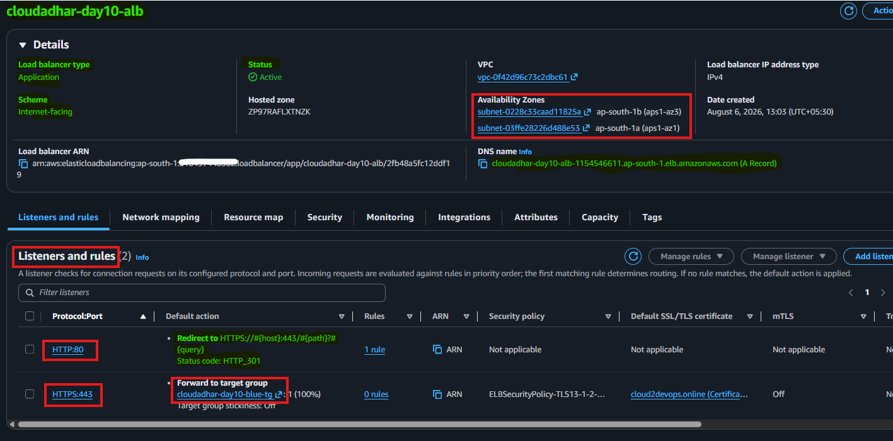

---

### 4. ALB HTTPS Listener with ACM Certificate

Configured an HTTPS (443) listener using the ACM wildcard certificate `*.cloud2devops.online` and redirected all HTTP traffic to HTTPS.

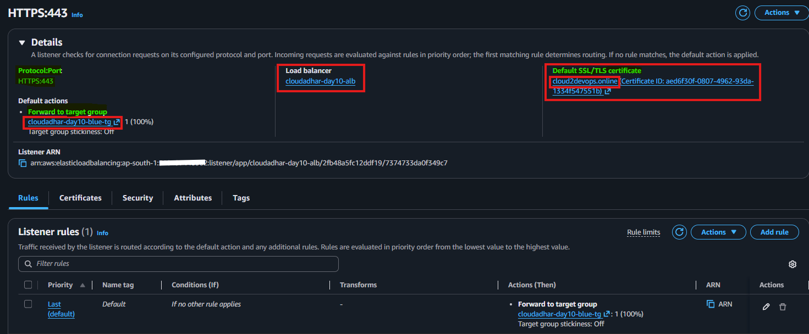

---

### 5. Route 53 DNS Records

Created Route 53 Alias records for:

- `api.cloud2devops.online` → Application Load Balancer
- `green.cloud2devops.online` → Application Load Balancer

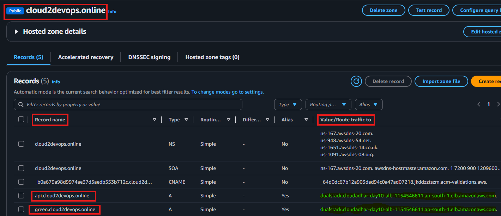

---

### 6. ALB Listener Rules

Configured the HTTPS listener with the following routing rules:

- **Host-based routing**
  - `green.cloud2devops.online` → Green Target Group

- **Path-based routing**
  - `/app1/*` → Blue Target Group
  - `/app2/*` → Green Target Group

- **Weighted Blue/Green release**
  - `/release/*` → Blue Target Group (80%)
  - `/release/*` → Green Target Group (20%)

- **Default action**
  - No earlier match → Forward to Blue Target Group

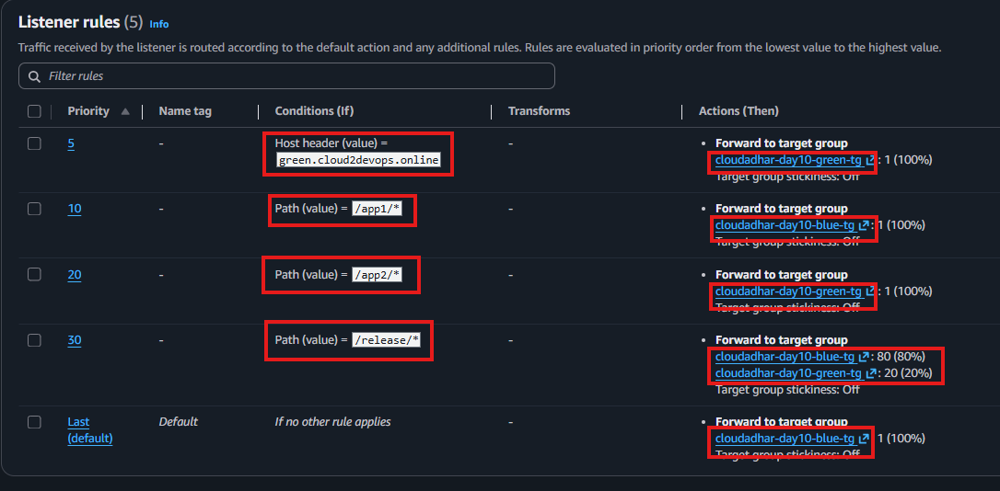

---

### 7. Healthy Target Registration

Verified that both Blue and Green EC2 instances successfully passed the configured health checks and reached the **Healthy** state.

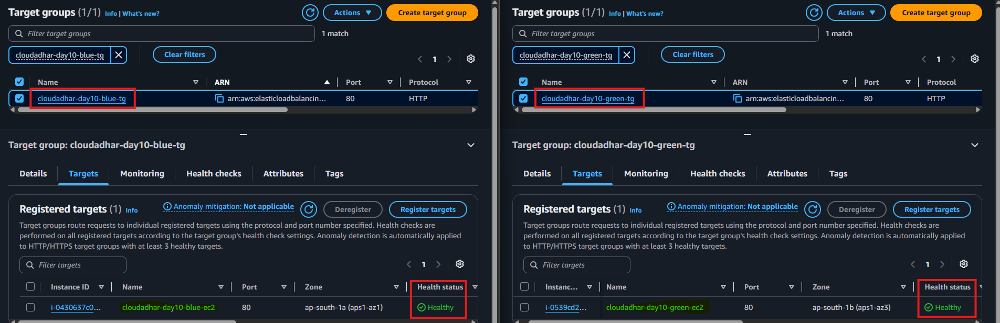

---

### 8. Default HTTPS Validation

Verified secure HTTPS access through `https://api.cloud2devops.online` and confirmed that the default listener served the **Blue** application with a valid ACM SSL/TLS certificate.

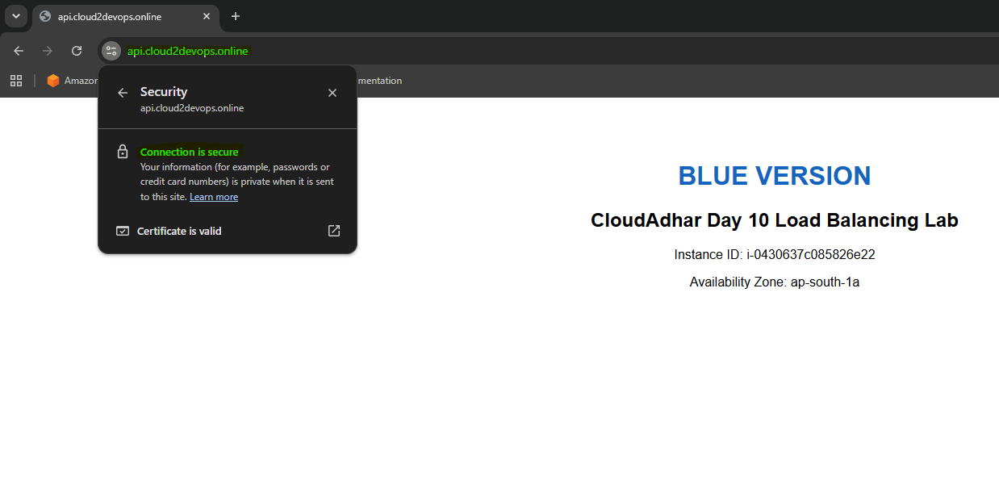

---

### 9. Host-Based Routing

Verified that requests to `https://green.cloud2devops.online` matched the host-based routing rule and were forwarded to the Green Target Group. The valid ACM certificate confirmed secure HTTPS access.

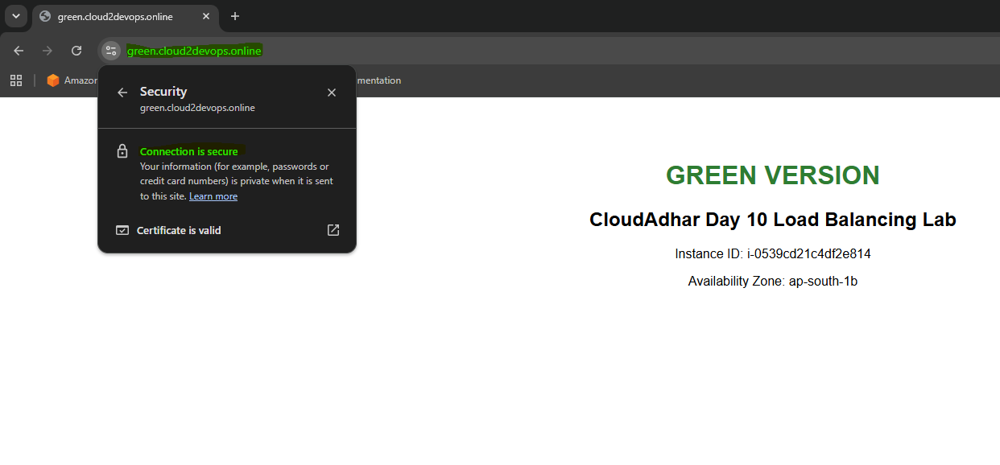

---

### 10. Path-Based Routing

Validated the configured path-based routing rules:

- `https://api.cloud2devops.online/app1/` → Blue Target Group (Blue Version)
- `https://api.cloud2devops.online/app2/` → Green Target Group (Green Version)

Verified that requests were routed to the correct target group based on the requested URL path while using the same HTTPS endpoint.

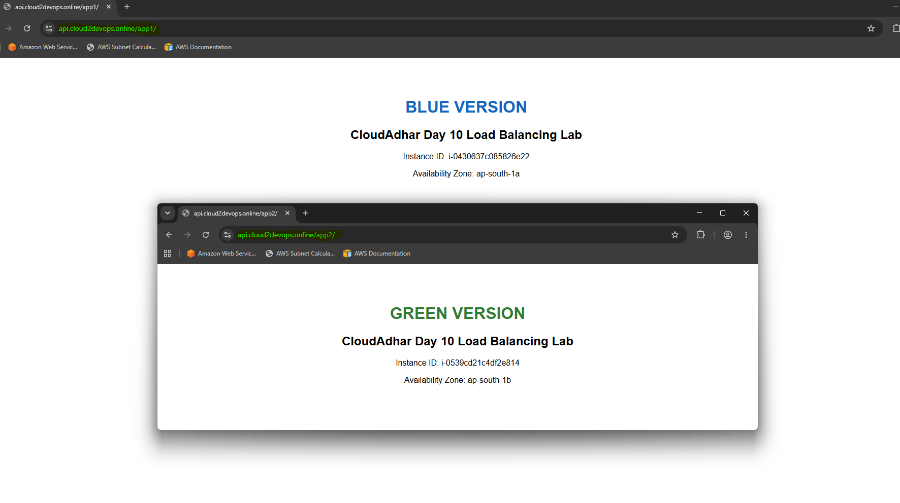

---

### 11. Weighted Blue/Green Release

Executed **500 independent HTTPS requests** against the `/release/` endpoint and verified the configured weighted routing.

**Command:**

```bash
for i in $(seq 1 500); do
  curl -sk https://api.cloud2devops.online/release/ \
    | grep -oE "BLUE VERSION|GREEN VERSION"
done | sort | uniq -c
```

**Observed Result:**

```text
403 BLUE VERSION
 97 GREEN VERSION
```

The observed distribution (~80.6% Blue and ~19.4% Green) closely matched the configured **80:20** weighted forwarding rule, demonstrating successful Blue/Green traffic distribution.

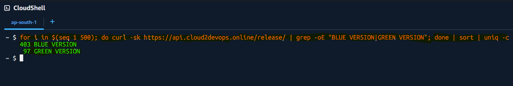

---

### 12. Target Group Stickiness

Enabled **Target Group Stickiness (300 seconds)** for the weighted forwarding rule and verified that repeated requests from the same client consistently reached the same backend target group by reusing the ALB stickiness cookie.

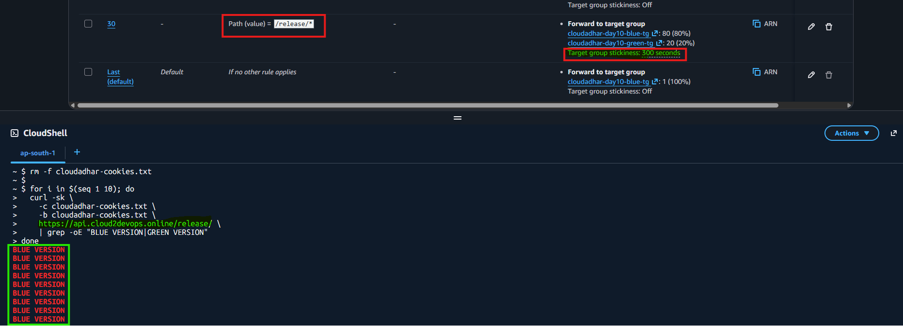

---

### 13. Green Target Unhealthy

Stopped the NGINX service on the Green EC2 instance and verified that the Green Target Group marked the registered target as **Unhealthy**. Confirmed that requests to `https://api.cloud2devops.online/app2/` returned **502 Bad Gateway** because the matched target group had no healthy targets.

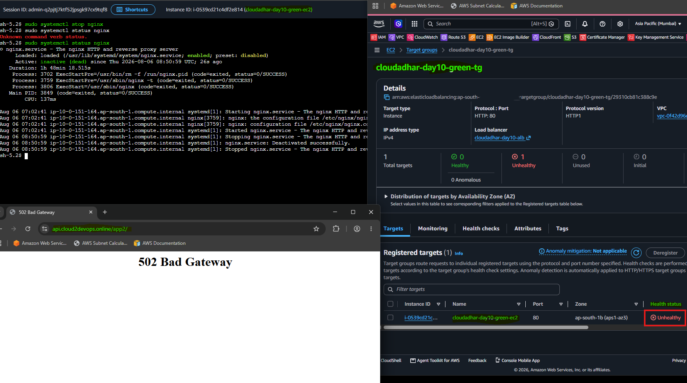

---

### 14. Green Target Recovery

Restarted the NGINX service on the Green EC2 instance and confirmed that the target successfully returned to the **Healthy** state after passing the configured health checks. Verified that requests to `https://api.cloud2devops.online/app2/` were once again routed to the Green Target Group and served the **Green** application.

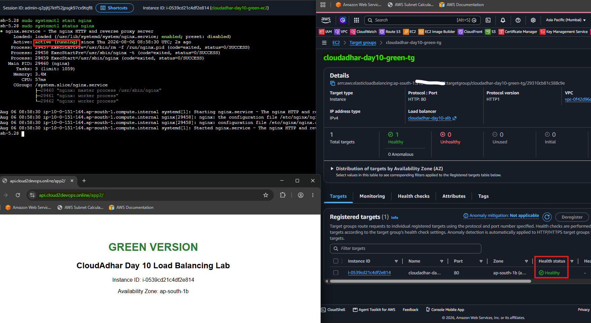

---


### 15. Connection Draining

Configured a **30-second** deregistration delay, initiated a slow download, deregistered the Blue target, and observed the target transition through the **Healthy → Draining → Unused** states before re-registering it successfully.

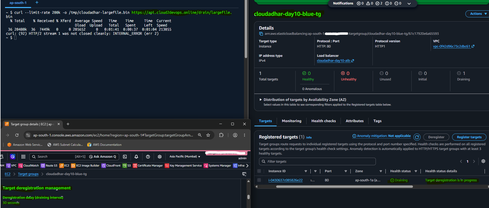

---

### 16. NLB Target Group

Created the Network Load Balancer Target Group and registered the Blue and Green EC2 instances.

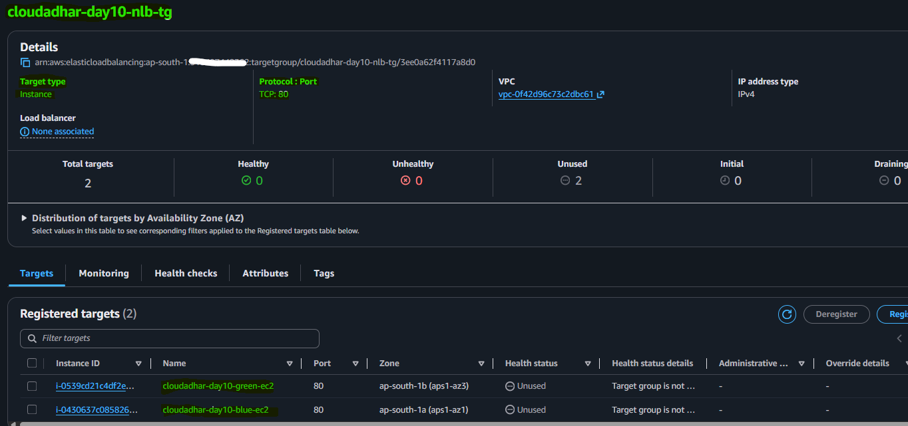

---

### 17. Network Load Balancer

Created the internet-facing Network Load Balancer with two Layer 4 listeners:

- TCP (80) listener for TCP traffic forwarding
- TLS (443) listener using ACM certificate for secure encrypted traffic

Both listeners were associated with the NLB Target Group containing the Blue and Green EC2 instances.

> **Note:** The NLB was configured with both TCP (80) and TLS (443) listeners to demonstrate Layer 4 load balancing capabilities. Validation was performed using the TLS (443) listener with the ACM certificate.

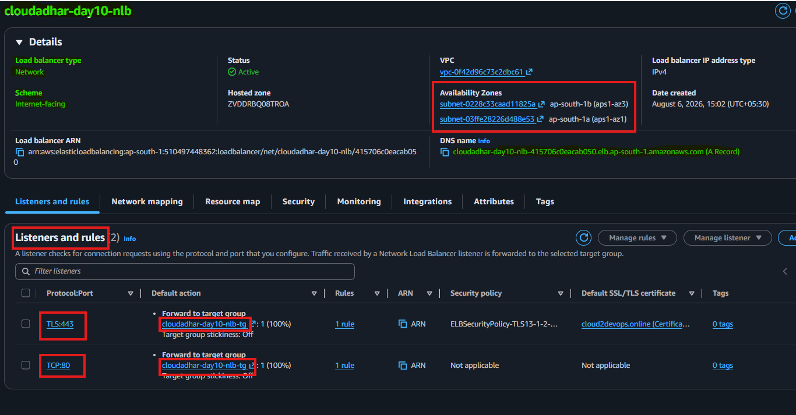

---

### 18. NLB TLS Listener with ACM Certificate and Route 53 Alias Record

Configured a **TLS (443)** listener using the ACM wildcard certificate `*.cloud2devops.online`.

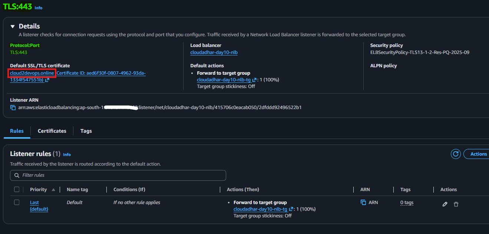

Created Route 53 Alias record:

- `tcp.cloud2devops.online` → Network Load Balancer

Verified successful Route 53 DNS resolution.

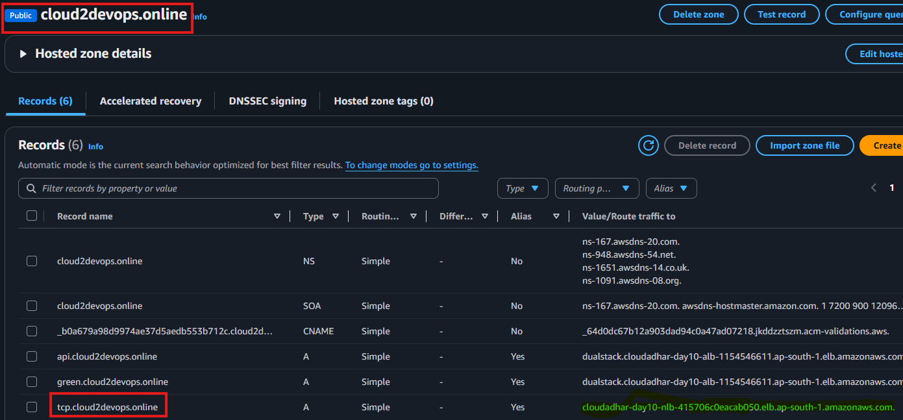

---

### 19. Healthy NLB Targets

Verified that both Blue and Green EC2 instances successfully passed the configured NLB health checks and reached the **Healthy** state.

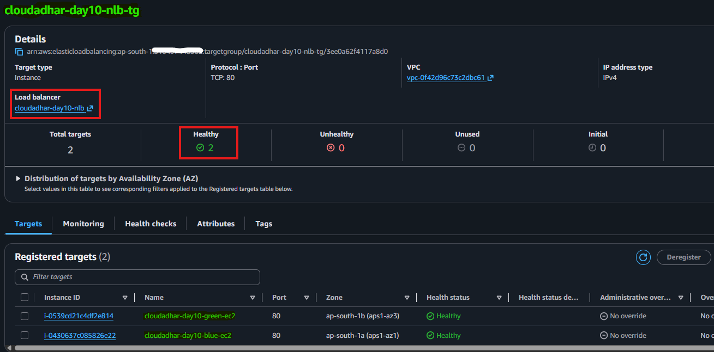

---

### 20. Secure NLB Validation

Verified secure TLS access through `https://tcp.cloud2devops.online` and confirmed successful TLS termination by the Network Load Balancer.

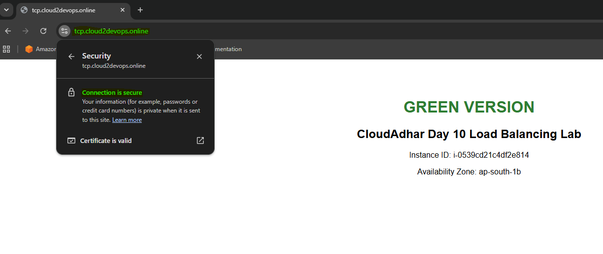

---

### 21. NLB Traffic Distribution

Verified successful Layer 4 TLS load balancing through `https://tcp.cloud2devops.online` using the NLB TLS (443) listener.

Repeated HTTPS requests from AWS CloudShell confirmed traffic distribution across both registered backend instances (Blue and Green). Browser validation also confirmed the application was reachable through the NLB endpoint.

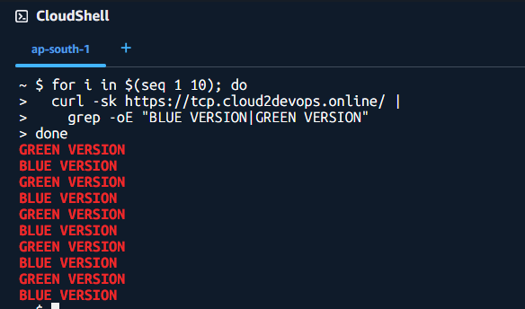

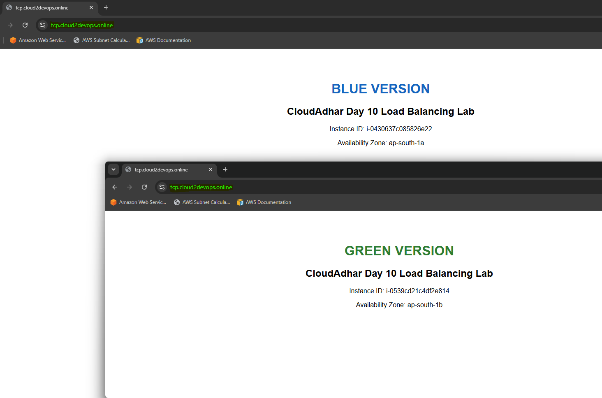

---

## Where I Got Stuck

`No blocker`

---

## Cleanup

Resources deleted during cleanup (in order):

- Deregistered Blue and Green EC2 instances from Target Groups
- Terminated EC2 instances:
  - `cloudadhar-day10-blue-ec2`
  - `cloudadhar-day10-green-ec2`
- Deleted Application Load Balancer `cloudadhar-day10-alb`
- Deleted Network Load Balancer `cloudadhar-day10-nlb`
- Deleted ALB Target Groups:
  - `cloudadhar-day10-blue-tg`
  - `cloudadhar-day10-green-tg`
- Deleted NLB Target Group `cloudadhar-day10-nlb-tg`
- Deleted ALB and NLB Security Groups:
  - `cloudadhar-day10-alb-sg`
  - `cloudadhar-day10-nlb-sg`
  - `cloudadhar-day10-web-sg`
- Deleted Route 53 Alias records:
  - `api.cloud2devops.online`
  - `green.cloud2devops.online`
  - `tcp.cloud2devops.online`
- Deleted NAT Gateway and released the associated Elastic IP
- Detached and deleted the Internet Gateway
- Deleted Route Tables and Subnets
- Deleted VPC `cloudadhar-day10-vpc`