# Week 5 - Day 9: ALB-Backed Auto Scaling

## Name
Sanket Dangat

## Tasks Completed
- [x] Watched/read the weekly content
- [x] Completed hands-on labs
- [x] Added screenshots or proof
- [x] Posted on LinkedIn
- [x] Cleaned up AWS resources

## Architecture

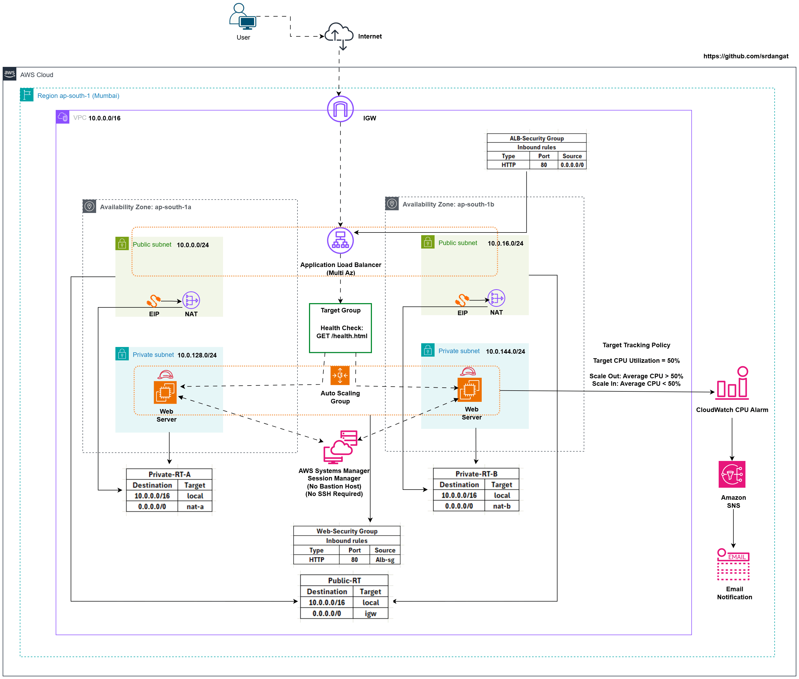

## Architecture Overview

- **Amazon VPC:** Deployed a dedicated Amazon VPC (`10.0.0.0/16`) in the **ap-south-1 (Mumbai)** Region across **two Availability Zones (AZs)**.

- **Networking:** Created public subnets for the internet-facing Application Load Balancer (ALB) and NAT Gateways, and private subnets for Amazon EC2 web servers.

- **Application Load Balancer (ALB):** Deployed an internet-facing ALB to distribute HTTP requests across healthy EC2 instances using Target Group health checks on **`/health.html`**.

- **Amazon EC2 Auto Scaling:** Managed NGINX web servers using an Auto Scaling Group and Launch Template, enabling automatic scale-out, scale-in, and self-healing.

- **Connectivity & Security:** Used an Internet Gateway, NAT Gateway, route tables, and Security Groups to provide secure internet access while keeping web servers isolated in private subnets.

- **Monitoring & Notifications:** Used Amazon CloudWatch to monitor CPU utilization and drive Target Tracking Auto Scaling, with Amazon SNS providing email notifications for CloudWatch alarms.

- **Administration:** Enabled secure instance management using AWS Systems Manager Session Manager without requiring a bastion host or inbound SSH access.

- **Architecture Benefits:** Delivers a **secure, highly available, fault-tolerant, self-healing, and automatically scalable** web application architecture aligned with **AWS Well-Architected Framework principles**.

> **Note:** The architecture diagram illustrates a production-ready deployment with **one NAT Gateway per Availability Zone** for high availability. The hands-on implementation used **a single NAT Gateway** to optimize cost while demonstrating the same core concepts.

---

## Result

Successfully implemented an Application Load Balancer (ALB) with an Auto Scaling Group (ASG). Verified load balancing across multiple EC2 instances, automatic scale-out and scale-in based on CPU utilization, and self-healing through automatic replacement of unhealthy instances.

**Resources created:**

- VPC `cloudadhar-day9-vpc`
- Public Subnets (for ALB and NAT Gateway)
- Private Subnets (for EC2 web servers)
- Internet Gateway
- NAT Gateway
- Elastic IP associated with NAT Gateway
- Launch Template `cloudadhar-day9-lt`
- Application Load Balancer `cloudadhar-day9-alb`
- Target Group `cloudadhar-day9-tg`
- Auto Scaling Group `cloudadhar-day9-asg`
- Target Tracking Policy `cloudadhar-day9-cpu50-policy`
- ALB Security Group `cloudadhar-day9-alb-sg`
- Web Security Group `cloudadhar-day9-web-sg`

**Validation:** Successfully verified healthy target registration, Application Load Balancer (ALB) traffic routing, automatic scale-out under high CPU load, automatic scale-in after workload removal, and Auto Scaling self-healing through automatic replacement of an unhealthy EC2 instance.

### 1. Launch Template Configuration

Created the Launch Template **`cloudadhar-day9-lt`** using Amazon Linux 2023, `t3.micro`, IMDSv2 enforcement, encrypted gp3 root volume, detailed monitoring, and User Data to automatically install and configure NGINX.

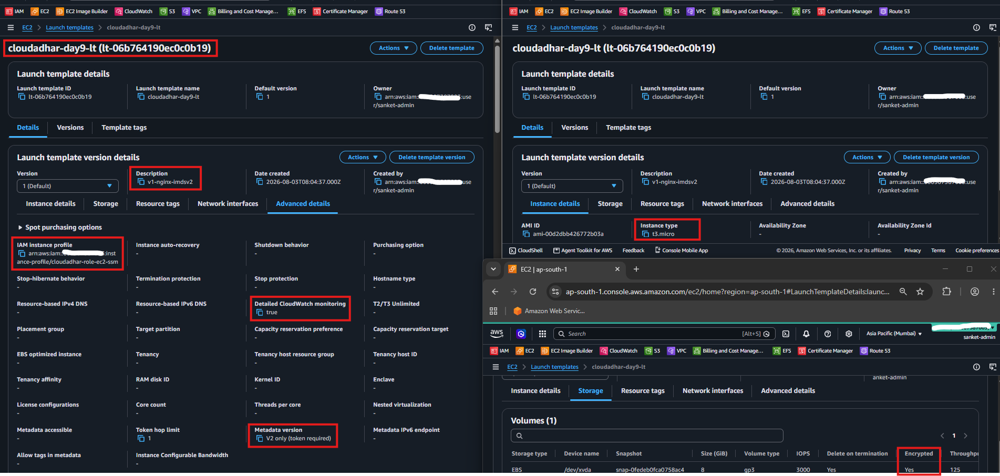

---

### 2. Target Group Configuration

Created the Target Group `cloudadhar-day9-tg` with HTTP health checks configured on `/health.html` to monitor instance health.

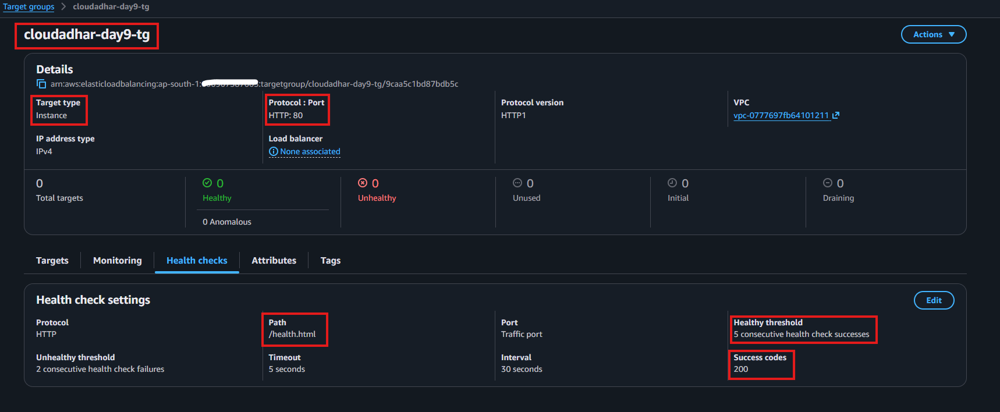

---

### 3. Application Load Balancer

Created the internet-facing Application Load Balancer `cloudadhar-day9-alb` with an HTTP listener configured to forward incoming requests to the Target Group across multiple Availability Zones.

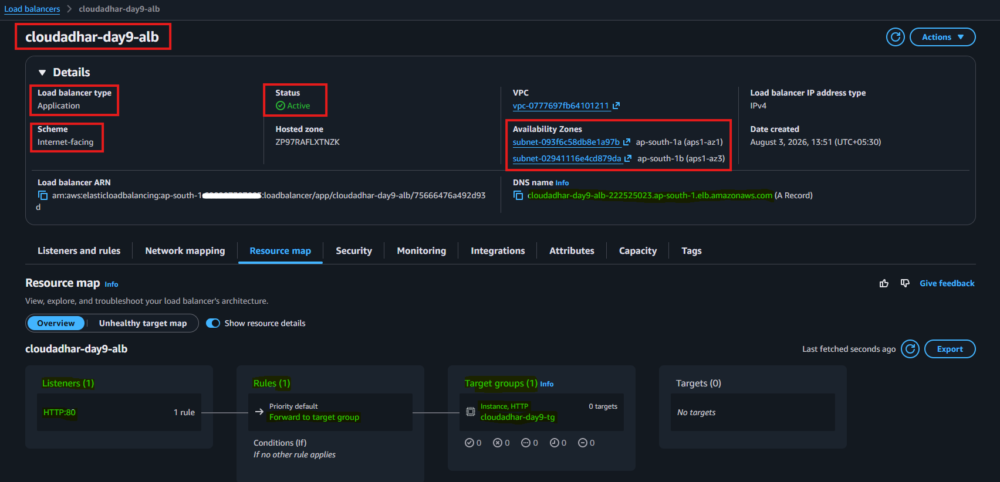

---

### 4. Auto Scaling Group

Created the Auto Scaling Group `cloudadhar-day9-asg` using the Launch Template with a `minimum capacity of 1`, `desired capacity of 1`, and `maximum capacity of 2` instances.

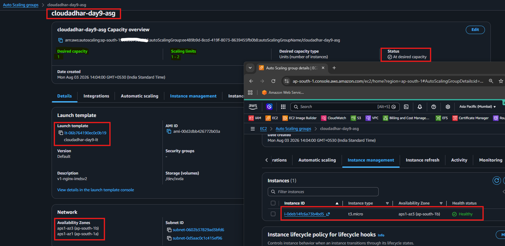

---

### 5. Healthy Target Registration

Verified that the EC2 instance was successfully registered with the Target Group and passed all Application Load Balancer health checks, reaching the Healthy state

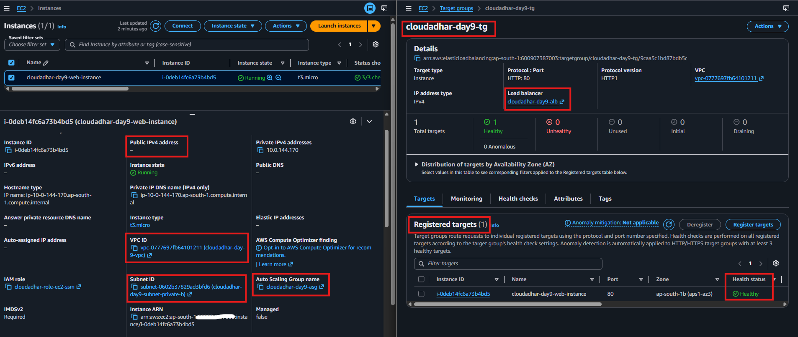

---

### 6. ALB Validation

Verified that the Application Load Balancer successfully routed HTTP requests to the healthy EC2 instance hosting the NGINX web application.

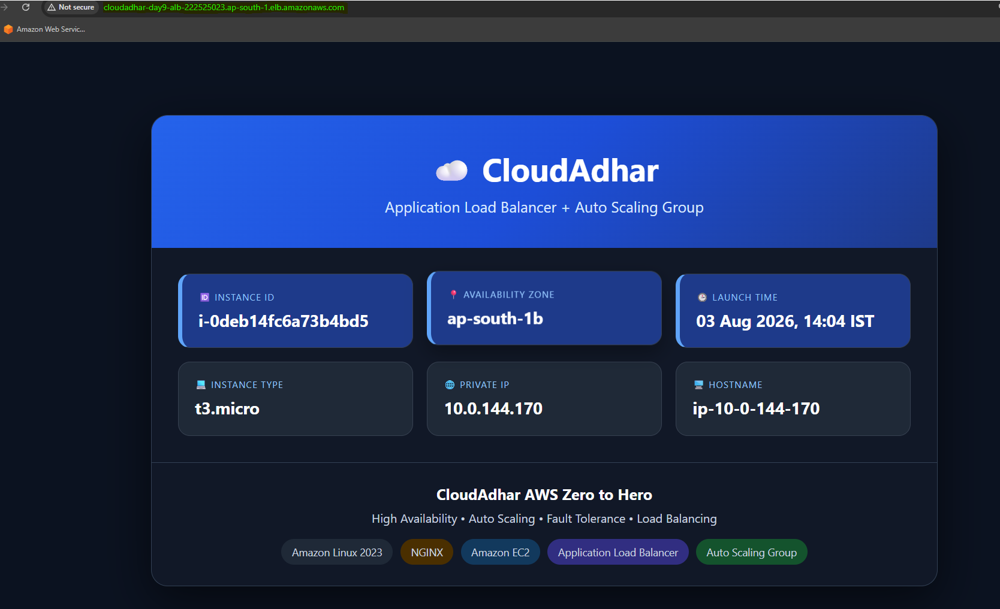

---

### 7. Target Tracking Scaling Policy

Configured the Target Tracking Scaling Policy `cloudadhar-day9-cpu50-policy` to automatically maintain the Auto Scaling Group's average `CPU utilization at 50%.`

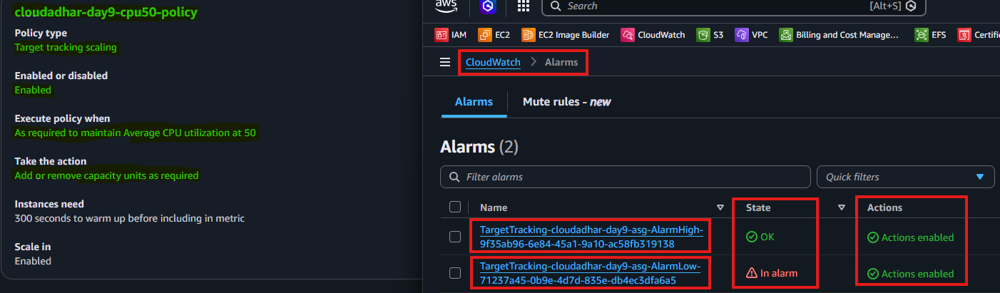

---

### 8. High CPU Alarm Triggered

Generated CPU load using **stress-ng** and verified that the CloudWatch High CPU alarm entered the **ALARM** state, initiating the Auto Scaling scale-out process.

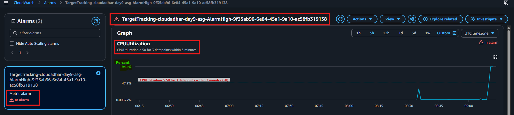

---

### 9. Scale-Out Activity

Verified that the Auto Scaling Group automatically increased the `desired capacity from 1 to 2` instances after the Target Tracking scaling policy was triggered.

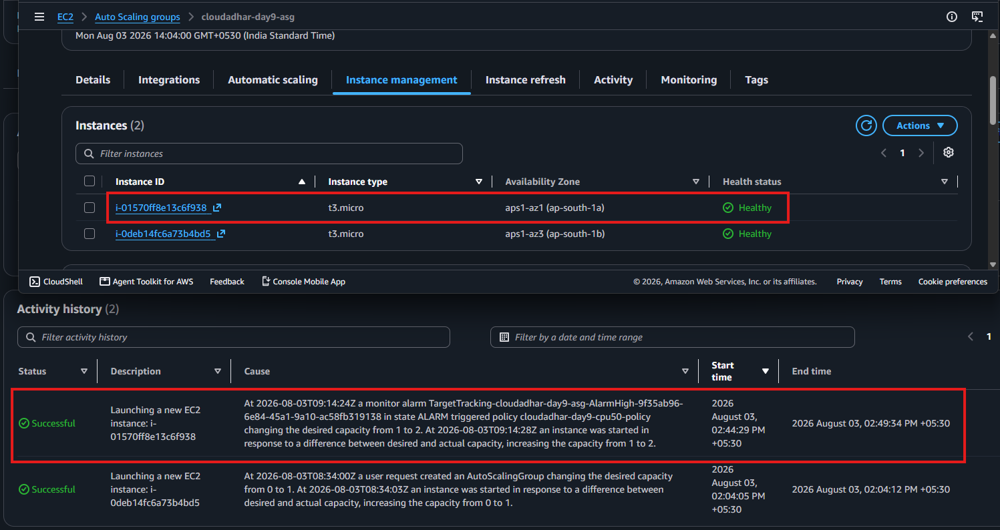

---

### 10. Two Healthy EC2 Instances

Confirmed that both EC2 instances were running successfully, registered with the Target Group, and reported as Healthy behind the Application Load Balancer.

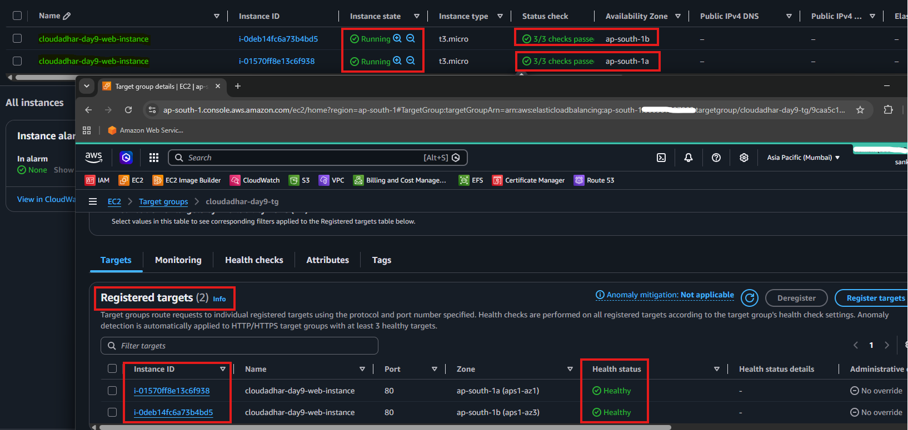

---

### 11. Load Balancer Serving Multiple Instances

Verified that repeated requests to the Application Load Balancer were distributed across both healthy EC2 instances, confirming successful traffic load balancing.

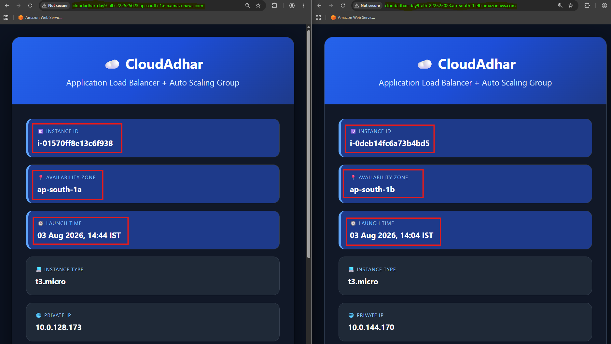

---

### 12. Scale-In Activity

Stopped the CPU workload and verified that the Target Tracking scaling policy automatically reduced the Auto Scaling Group's `desired capacity from 2 back to 1 instance` after the `average CPU utilization dropped below the 50% target`.

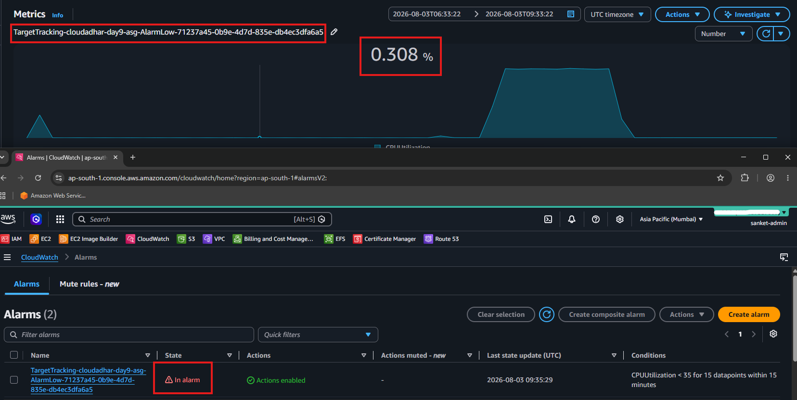

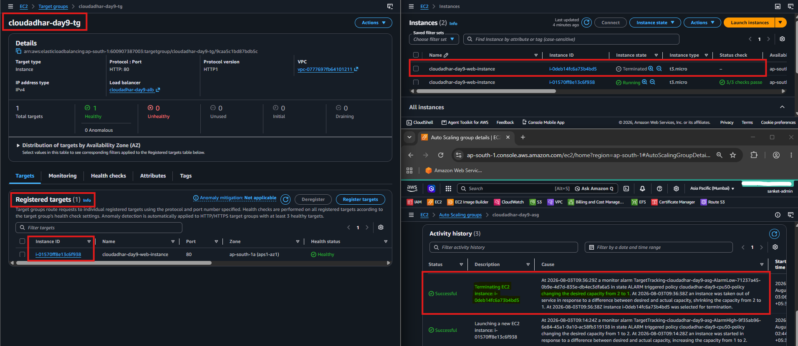
---

### 13. Unhealthy Target Detected

Simulated an application failure by stopping the NGINX service and verified that the Target Group marked the EC2 instance as Unhealthy after the configured health check failures.

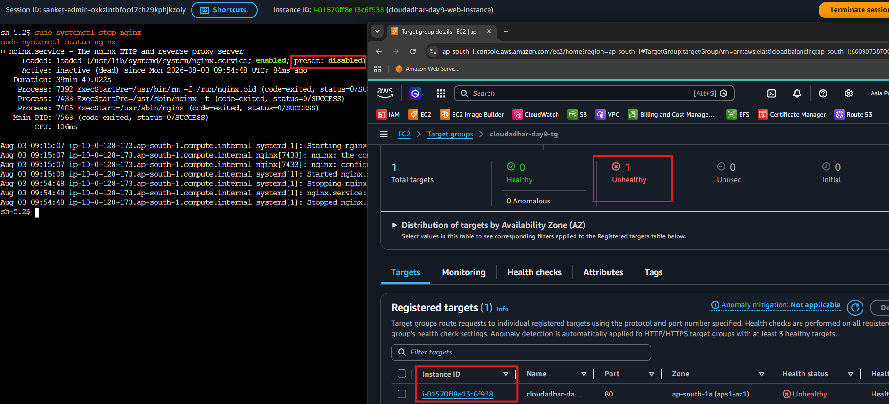

---

### 14. Auto Scaling Replacement

Verified that the Auto Scaling Group automatically terminated the unhealthy EC2 instance and launched a replacement instance to maintain the `desired capacity of 1`.

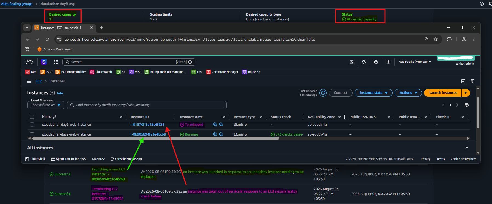

---

### 15. Replacement Instance Healthy

Confirmed that the replacement EC2 instance successfully passed the Application Load Balancer health checks, was registered with the Target Group, and resumed serving application traffic through the Application Load Balancer

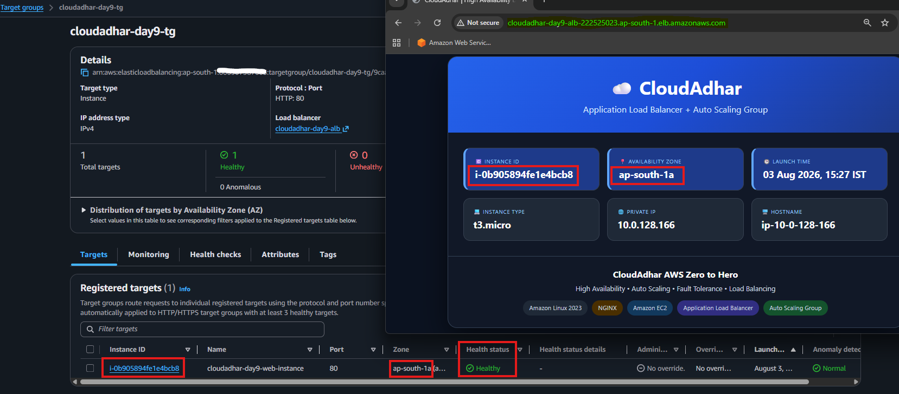

---

## Where I Got Stuck

`No blocker`

---

## Cleanup

**Auto Scaling and Load Balancer cleanup (in order):**
1. Deleted Auto Scaling Group `cloudadhar-day9-asg` after setting the desired capacity to **0** and waiting for all EC2 instances to terminate
2. Deleted Application Load Balancer `cloudadhar-day9-alb`
3. Deleted Target Group `cloudadhar-day9-tg`
4. Deleted Launch Template `cloudadhar-day9-lt`
5. Deleted CloudWatch alarms created for the Target Tracking scaling policy
6. Deleted NAT Gateway and released its associated Elastic IP
7. Deleted project-specific Security Groups
8. Detached and deleted the Internet Gateway
9. Deleted Route Tables and Subnets
10. Deleted VPC `cloudadhar-day9-vpc`

---

## LinkedIn Post

[LinkedIn Link](https://lnkd.in/p/dtBFbgpV)