# Day 12 Lab - S3 Replication, Transfer, and Hybrid Storage

## Name
Sanket Dangat

## Tasks Completed
- [x] Watched/read the weekly content
- [x] Completed hands-on labs
- [x] Added screenshots or proof
- [ ] Posted on LinkedIn
- [x] Cleaned up AWS resources

## Result

Successfully completed and validated the Day 12 Amazon S3 lab covering private S3 buckets, Same-Region Replication (SRR), Cross-Region Replication (CRR), versioning, prefix-based replication, Transfer Acceleration, multipart upload cleanup, and AWS storage service reviews.

**Resources created:**

- Source Bucket `cloudadhar-day12-rep-source-<unique-suffix>` — Mumbai, `ap-south-1`
- SRR Destination Bucket `cloudadhar-day12-srr-dest-<unique-suffix>` — Mumbai, `ap-south-1`
- CRR Destination Bucket `cloudadhar-day12-crr-dest-<unique-suffix>` — Tokyo, `ap-northeast-1`
- Static Website Bucket `cloudadhar-day12-static-website-<unique-suffix>` — Mumbai, `ap-south-1`
- Object Lock Bucket `cloudadhar-day12-lock-sankted-<unique-suffix>` — Mumbai, `ap-south-1`
- SRR Rule `srr-prefix-rule`
- CRR Rule `crr-prefix-rule`
- Lifecycle Rule `abort-incomplete-multipart-uploads`

**Validation:** Verified that all three replication buckets remained private with ACLs disabled, Block Public Access enabled, Versioning enabled, and SSE-S3 encryption. Verified that objects uploaded after rule creation replicated according to the configured prefixes, while pre-rule and unmatched objects remained source-only. Verified SRR and CRR Version 1 and Version 2 replication, reviewed Transfer Acceleration, configured seven-day incomplete multipart-upload cleanup, and reviewed FSx and hybrid-storage options without deploying additional paid resources.

---

### 1. Three Private Versioned Buckets

Created the source, SRR destination, and CRR destination buckets with the standard S3 regional namespace, Bucket owner enforced / ACLs disabled, all four Block Public Access settings enabled, Versioning enabled, SSE-S3 default encryption, and Object Lock disabled.

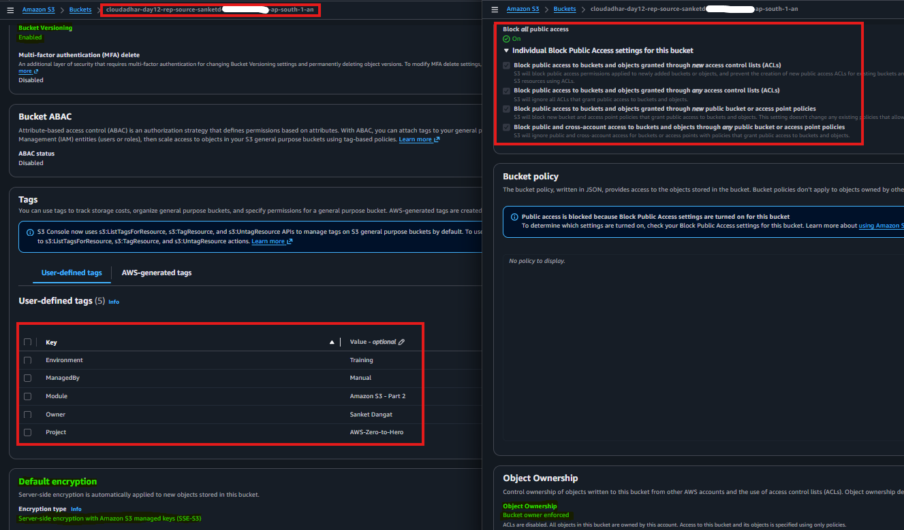

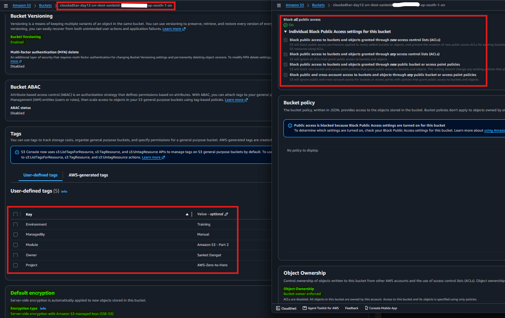

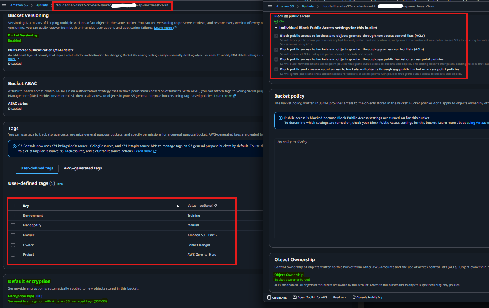

---

### 2. Bucket Regions

Verified the source bucket in Mumbai (`ap-south-1`), SRR destination bucket in Mumbai (`ap-south-1`), and CRR destination bucket in Tokyo (`ap-northeast-1`).

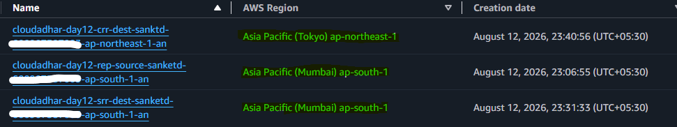

---

### 3. Upload Objects Before Replication Rules

Created the `srr/` and `crr/` prefixes in the source bucket and uploaded:

- `srr/before-rule.txt`
- `crr/before-rule.txt`

Verified that both objects existed before the replication rules were created.

These objects were intentionally uploaded before the rules to demonstrate that live replication is not retroactive.

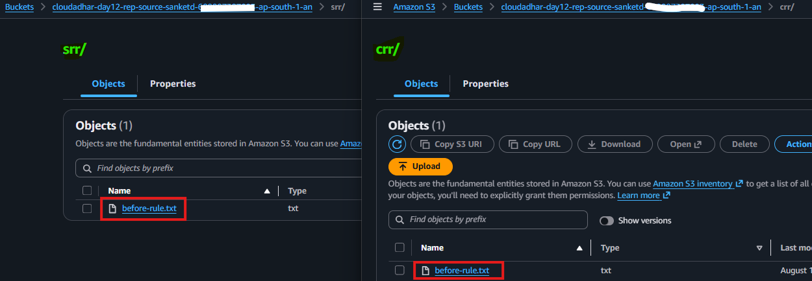

---

### 4. Same-Region Replication Rule

Created the SRR rule:

- Rule name `srr-prefix-rule`
- Status Enabled
- Prefix `srr/`
- Destination: Mumbai SRR bucket
- New IAM service role
- Existing-object replication disabled
- SSE-KMS/DSSE-KMS replication disabled
- Replication Time Control disabled
- Replication metrics disabled
- Delete-marker replication disabled
- Replica modification sync disabled

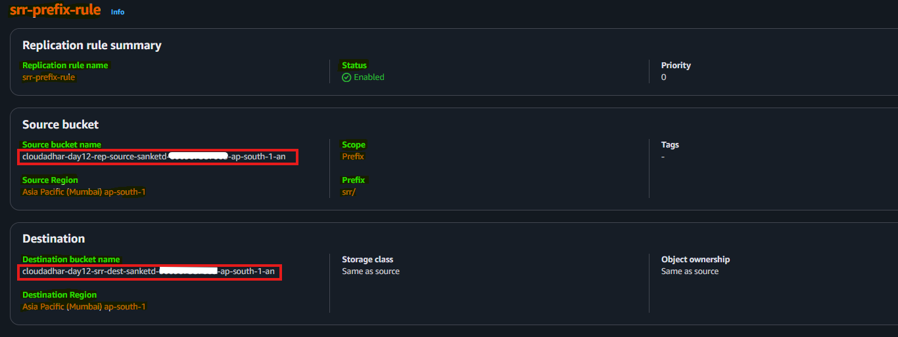

---

### 5. Cross-Region Replication Rule

Created the CRR rule:

- Rule name `crr-prefix-rule`
- Status Enabled
- Prefix `crr/`
- Destination: Tokyo CRR bucket
- New IAM service role
- Existing-object replication disabled
- SSE-KMS/DSSE-KMS replication disabled
- Replication Time Control disabled
- Replication metrics disabled
- Delete-marker replication disabled
- Replica modification sync disabled

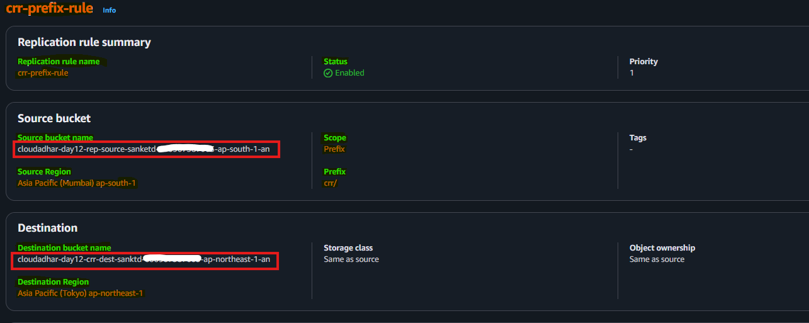

---

### 6. SRR Version 1 Replication

Uploaded `cloudadhar-srr-demo.txt` to:

` srr/cloudadhar-srr-demo.txt `

Verified the source object's replication status progressed from `PENDING` to `COMPLETED`.

Confirmed that Version 1 appeared in the Mumbai SRR destination.

Also verified that the pre-rule object `srr/before-rule.txt` was absent from the destination.

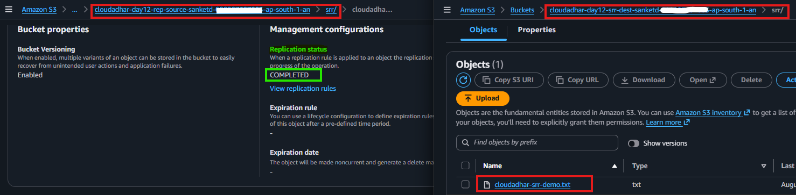

---

### 7. CRR Version 1 Replication

Uploaded `cloudadhar-crr-demo.txt` to:

`crr/cloudadhar-crr-demo.txt`

Verified the source object's replication status progressed from `PENDING` to `COMPLETED`.

Confirmed that Version 1 appeared in the Tokyo CRR destination.

Also verified that the pre-rule object `crr/before-rule.txt` was absent from the destination.

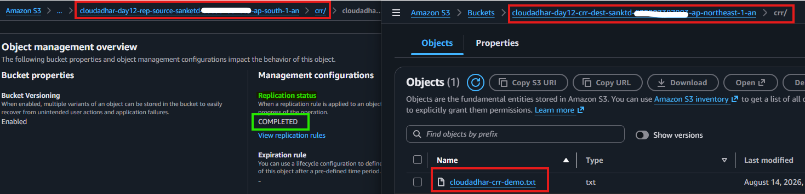

---

### 8. SRR Version 2 Replication

Uploaded Version 2 using the same source key:

`srr/cloudadhar-srr-demo.txt`

Waited for replication to complete and enabled **Show versions**.

Verified that both Version 1 and Version 2 existed in:

- Source bucket
- Mumbai SRR destination

Verified that the pre-rule object remained source-only.

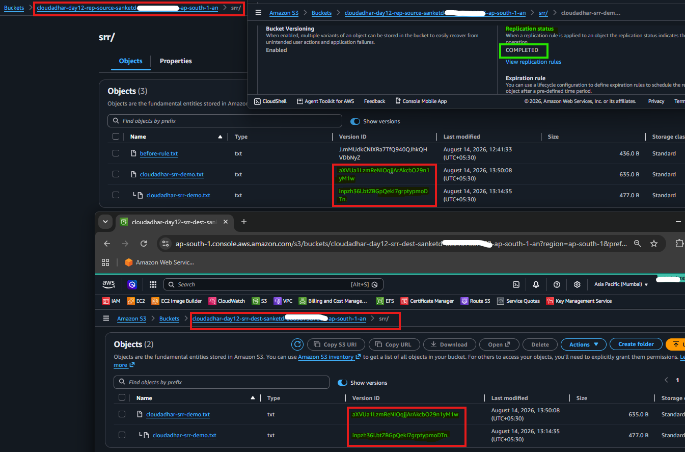

---

### 9. CRR Version 2 Replication

Uploaded Version 2 using the same source key:

`crr/cloudadhar-crr-demo.txt`

Waited for replication to complete and enabled **Show versions**.

Verified that both Version 1 and Version 2 existed in:

- Source bucket
- Tokyo CRR destination

Verified that the pre-rule object remained source-only.

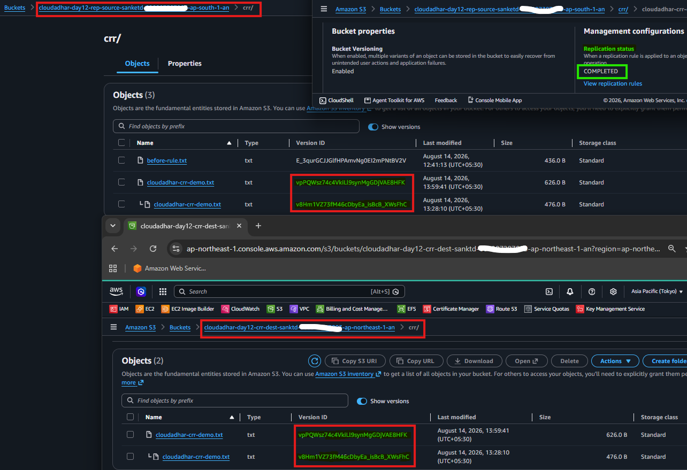

---

### 10. Prefix Filtering Validation

Created the `other/` prefix and uploaded in the source bucket:

`other/no-replication-demo.txt`

Verified that the object did not match either replication rule.

Confirmed that:

- No replication status was shown for the unmatched object.
- The object remained in the source bucket.
- The object did not appear in either destination bucket.

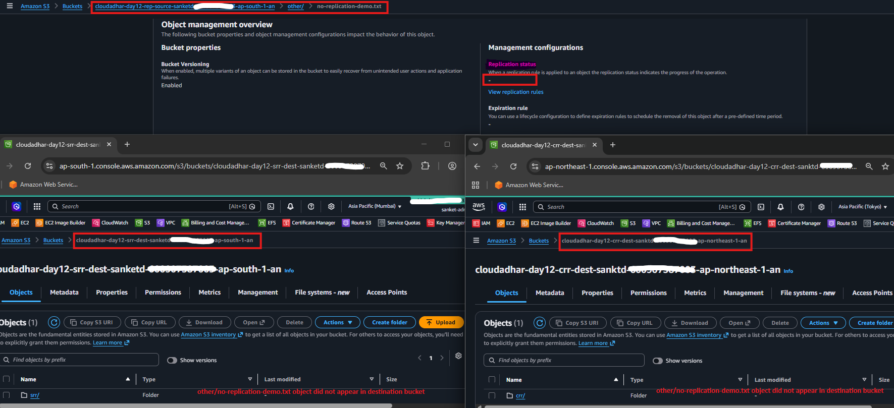

---

### 11. Transfer Acceleration Review

Opened:

**Source Bucket → Properties → Transfer acceleration**

Verified that **Transfer Acceleration** was enabled for the source bucket.

Observed the accelerated endpoint generated in the format:

`<bucket-name>.s3-accelerate.amazonaws.com`

Confirmed that the bucket name does not contain periods (`.`), which is a requirement for Transfer Acceleration compatibility.

This step was performed as a configuration review only. No performance benchmark or accelerated upload test was conducted, so the screenshot serves as evidence that the feature was successfully enabled.

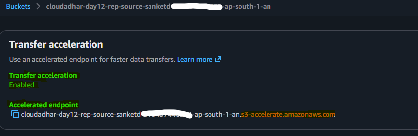

---

### 12. Incomplete Multipart Upload Lifecycle Rule

Created the lifecycle rule:

`abort-incomplete-multipart-uploads`

Configuration:

- Scope: All objects
- Action: Delete incomplete multipart uploads
- Age: 7 days
- No object transitions
- No completed-object expiration
- No noncurrent-version deletion
- No expired delete-marker cleanup

Verified that the rule was active on the source bucket.

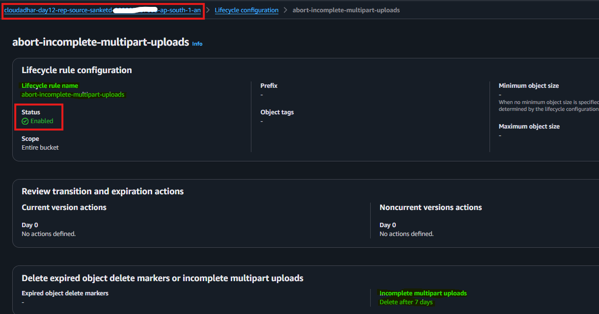

---

## 13. Object Lock Compliance

Created a dedicated Object Lock bucket in Mumbai with:

- Bucket owner enforced
- ACLs disabled
- Block Public Access enabled
- Versioning enabled
- SSE-S3 encryption
- Object Lock enabled
- No long default retention period

Uploaded `retention-demo.txt`, recorded its Version ID, and applied a short instructor-approved Compliance retention period.

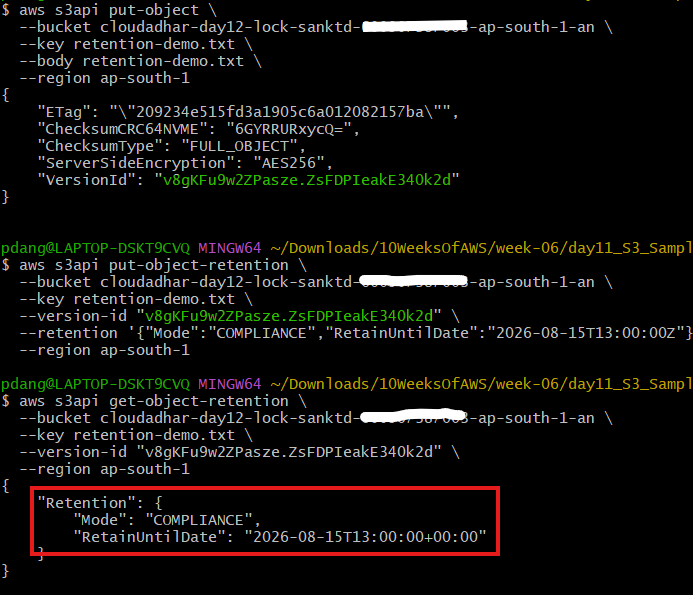

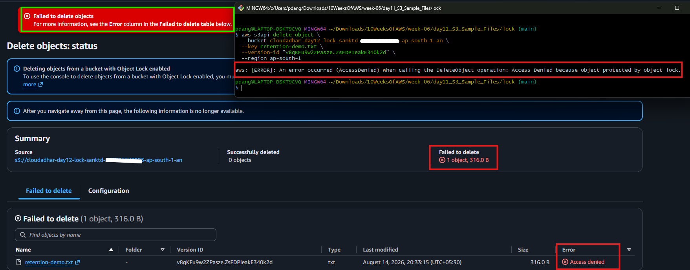

Verified that permanent deletion of the protected data version returned `AccessDenied`.

A normal delete without selecting a Version ID may still create a delete marker; the protected data version remains retained until the Compliance period expires.

---

## 14. Native S3 Static Website

Created a separate disposable website bucket and temporarily configured native S3 static website hosting.

Uploaded:

- `index.html`
- `error.html`

Verified:

- Native HTTP website endpoint rendered `index.html`.
- Missing pages returned the configured custom error page.
- Only public `s3:GetObject` access was temporarily allowed.
- The public policy was removed immediately after evidence.
- All Block Public Access controls were restored.
- Website hosting was disabled after the demonstration.

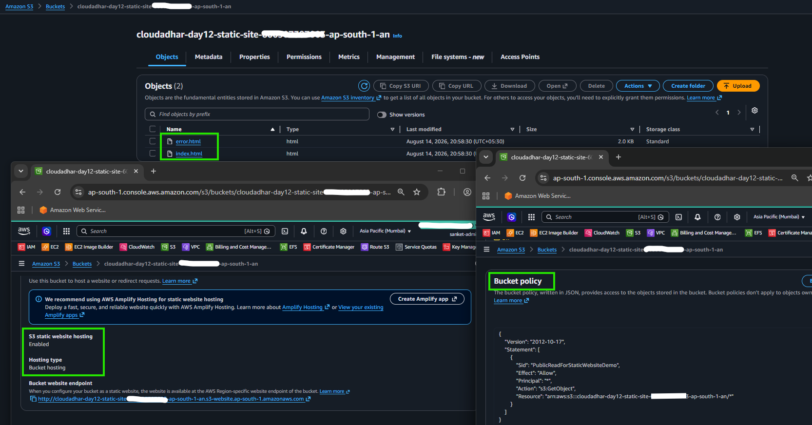

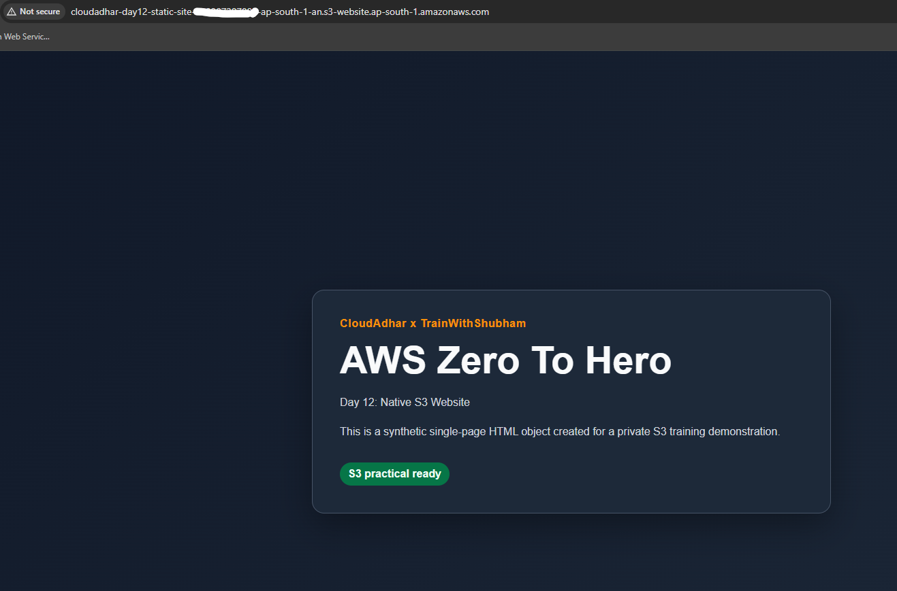

---

### 15. Review the FSx Family

Reviewed the Amazon FSx filesystem options without creating a filesystem.

- Windows File Server — SMB, Windows, Active Directory
- Lustre — HPC, ML, parallel processing
- NetApp ONTAP — Enterprise NAS and NetApp compatibility
- OpenZFS — Managed ZFS for Linux workloads

---

### 16. Hybrid Storage Decisions

Reviewed AWS hybrid storage services based on their use cases without deploying paid resources.

- S3 File Gateway — Cached NFS/SMB access to S3
- Volume Gateway — Cloud-backed iSCSI volumes
- Tape Gateway — Virtual backup tapes
- DataSync — Automated online data movement
- Snow Family — Offline migration or edge compute
- Transfer Family — Managed SFTP/FTPS/FTP/AS2 into S3/EFS

No hybrid storage resources were deployed.

---

## Cleanup

**S3 resource cleanup**

1. Remove the lifecycle rule `abort-incomplete-multipart-uploads`.
2. Remove all demonstration objects and object versions from the source bucket, including the `srr/`, `crr/`, and `other/` objects.
3. Remove all demonstration objects and object versions from the SRR destination bucket.
4. Remove all demonstration objects and object versions from the CRR destination bucket.
5. Disable Transfer Acceleration if it is no longer required.
6. Delete the SRR rule `srr-prefix-rule`.
7. Delete the CRR rule `crr-prefix-rule`.
8. Delete the SRR destination bucket.
9. Delete the CRR destination bucket.
10. Delete the source bucket.
11. Remove the `index.html` and `error.html` objects from the Static Website bucket.
12. Disable Static Website Hosting and restore Block Public Access on the Static Website bucket.
13. Delete the Static Website bucket.
14. Remove `retention-demo.txt` and its object version from the Object Lock bucket after the Compliance retention period expires.
15. Delete the Object Lock bucket after all retained object versions have been removed.
16. Verify that no Day 12 S3 buckets, replication rules, lifecycle rules, or temporary website configuration remain.

---