# Week 7 - Day 14: DynamoDB Orders Application, Queries, TTL, Streams, Lambda and Temporary UI

## Name
Sanket Dangat

## Tasks Completed
- [x] Watched/read the weekly content
- [x] Completed hands-on labs
- [x] Added screenshots or proof
- [ ] Posted on LinkedIn
- [x] Cleaned up AWS resources

---

## Result

Successfully completed the Day 14 database lab covering DynamoDB access-pattern-first table design, GSI/LSI queries, on-demand and provisioned capacity, TTL, DynamoDB Streams with a Lambda consumer, and a temporary UI Lambda demonstrating the full update → Stream → Lambda flow.

---

## Resources Created

- DynamoDB Table `cloudadhar-orders-day14` (GSI1, LSI1, Streams enabled)
- Optional Provisioned-Capacity Table `cloudadhar-capacity-demo-day14`
- TTL Attribute `ExpiresAt`
- Stream Consumer Lambda `cloudadhar-day14-stream-consumer`
- UI/API Lambda `cloudadhar-day14-ui` (with temporary Function URL)
- IAM execution roles created for the Day 14 Lambda functions
- Customer profile and order items (`C101`, `O9001`, `O9002`)

---

## Screenshots

### 1. Table, Indexes and Streams

Table created with GSI1, LSI1, on-demand capacity and Streams.

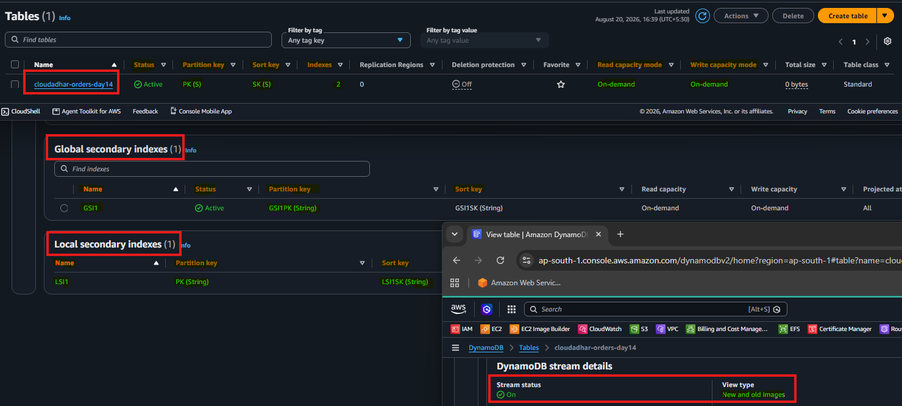

---

### 2. Customer and Order Data

Customer profile and order items inserted.

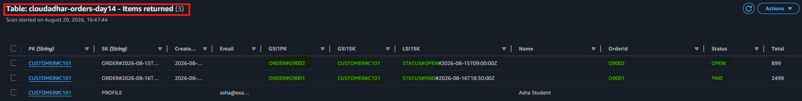

---

### 3. Customer GetItem

Retrieved customer `C101` profile using the base table primary key (`PK=Customer#C101`, `SK=PROFILE`).

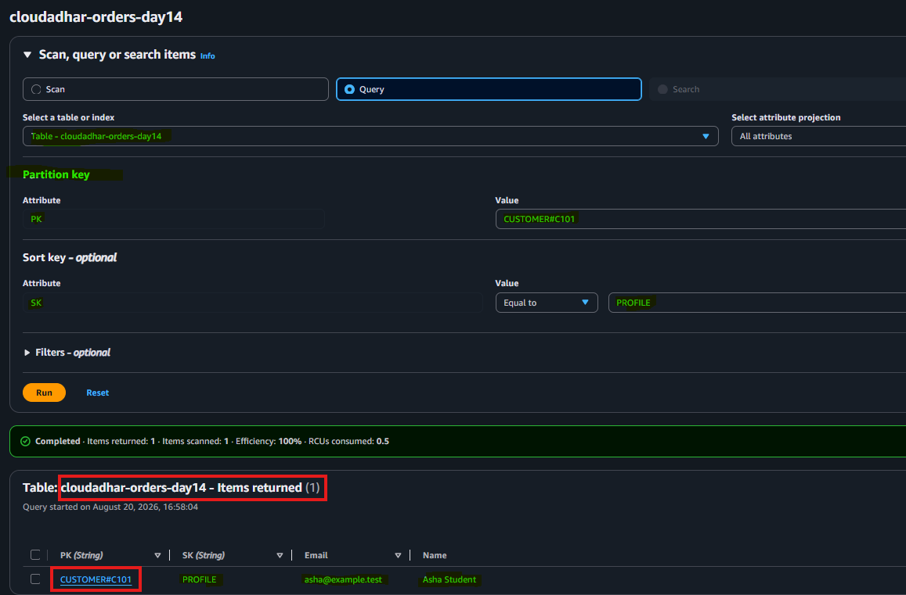

---

### 4. Customer Orders Query

Queried `C101` orders from the base table using `PK=CUSTOMER#C101` and `begins_with(SK, "ORDER#")`, returning the newest order first.

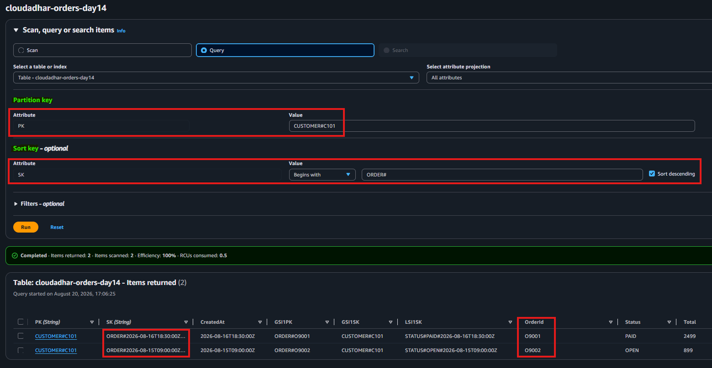

---

### 5. GSI Query

Looked up order `O9001` through `GSI1` using `GSI1PK=ORDER#O9001`, allowing the order to be located without first knowing the customer partition key.

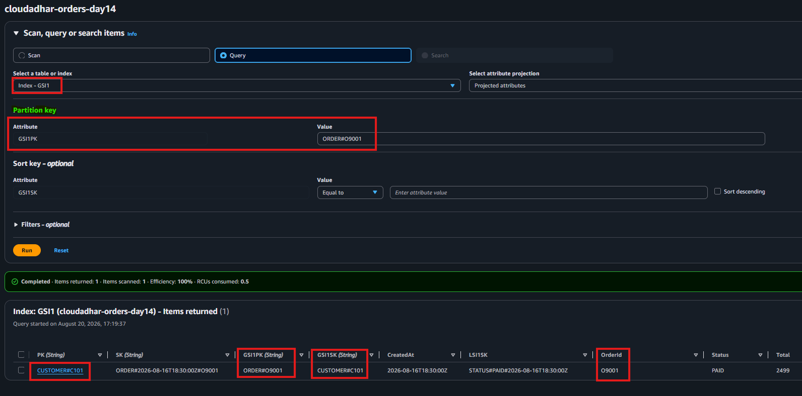

---

### 6. LSI Query

Queried `C101` orders by status using `LSI1` with `begins_with(LSI1SK, "STATUS#OPEN#")`, returning the `OPEN` order `O9002`.

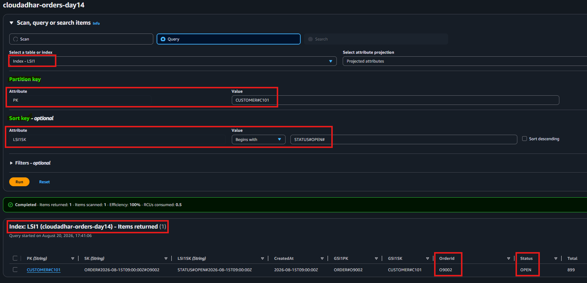

---

### 7. Query vs Scan

Compared targeted `Query` and full-table `Scan`, showing lower read capacity for `Query` (`0.5 RCU`) than `Scan` (`2.0 RCUs`). This demonstrates why access-pattern-driven DynamoDB designs favor targeted `Query` operations over full-table `Scan` operations.

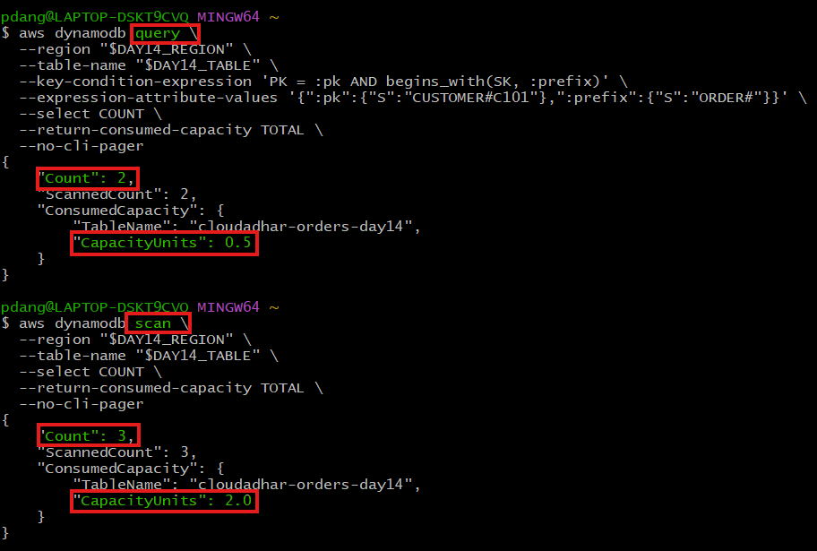

---

### 8. TTL / Session Demonstration

Enabled DynamoDB TTL using the `ExpiresAt` attribute and created a session item with a future expiration timestamp.

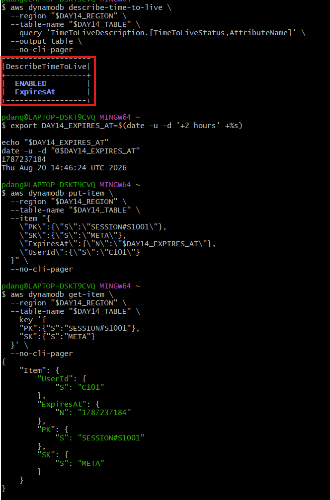

---

### 9. Stream Lambda + Trigger

Created the DynamoDB Stream consumer Lambda and attached it to the `cloudadhar-orders-day14` table stream. Verified that the event-source mapping is enabled.

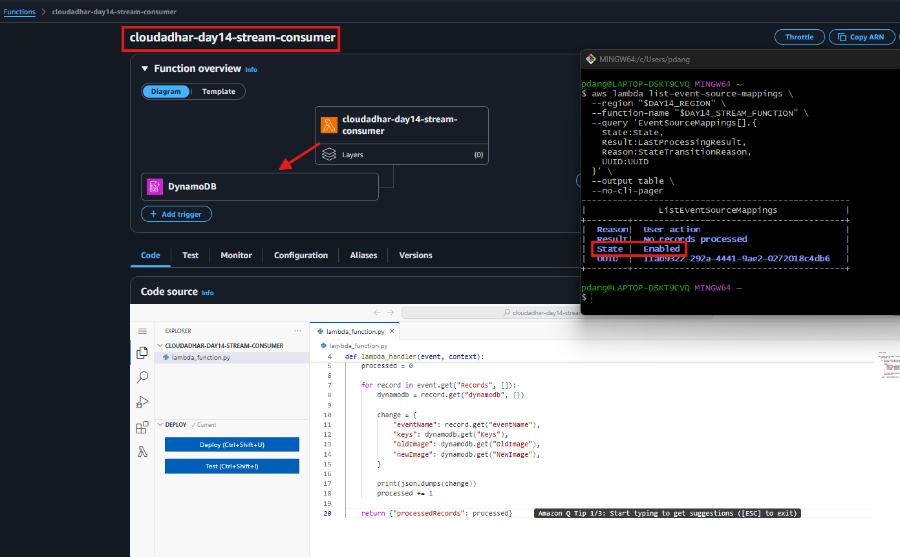

---

### 10. CloudWatch Old/New Image

Updated order `O9001` from `PAID` to `SHIPPED` and verified the DynamoDB Stream Lambda received the `MODIFY` event with both the old and new images.

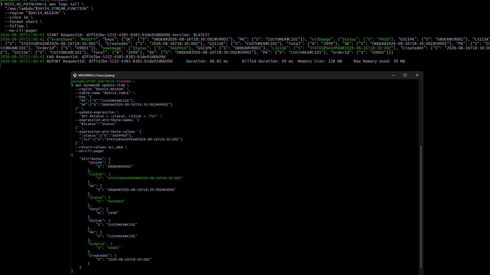

---

### 11. UI Base Query

UI performing a base-table query.

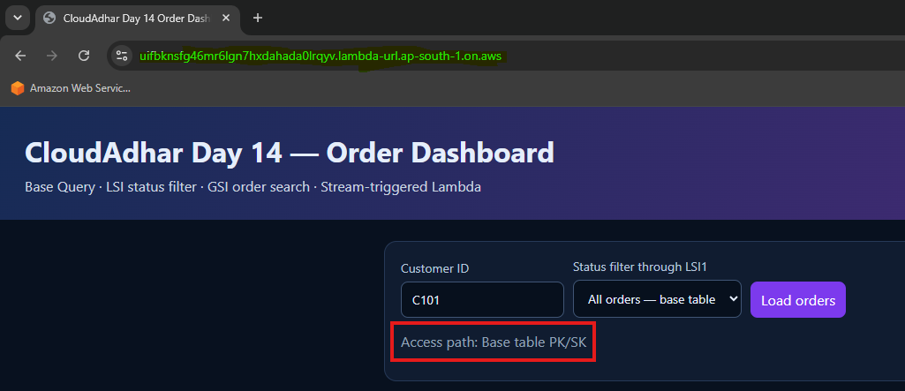

---

### 12. UI LSI Query

UI performing a status filter query via LSI1.

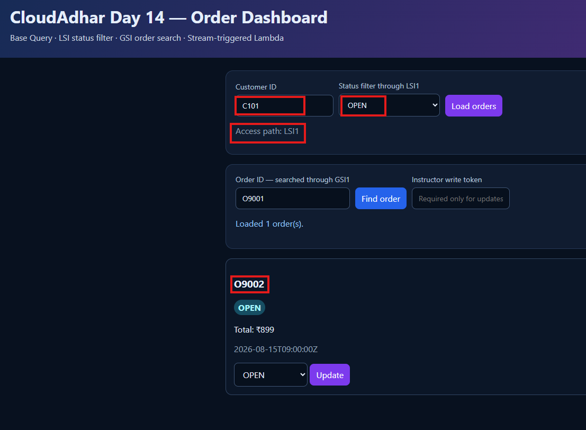

---

### 13. UI GSI Query

UI performing an order-ID search via GSI1.

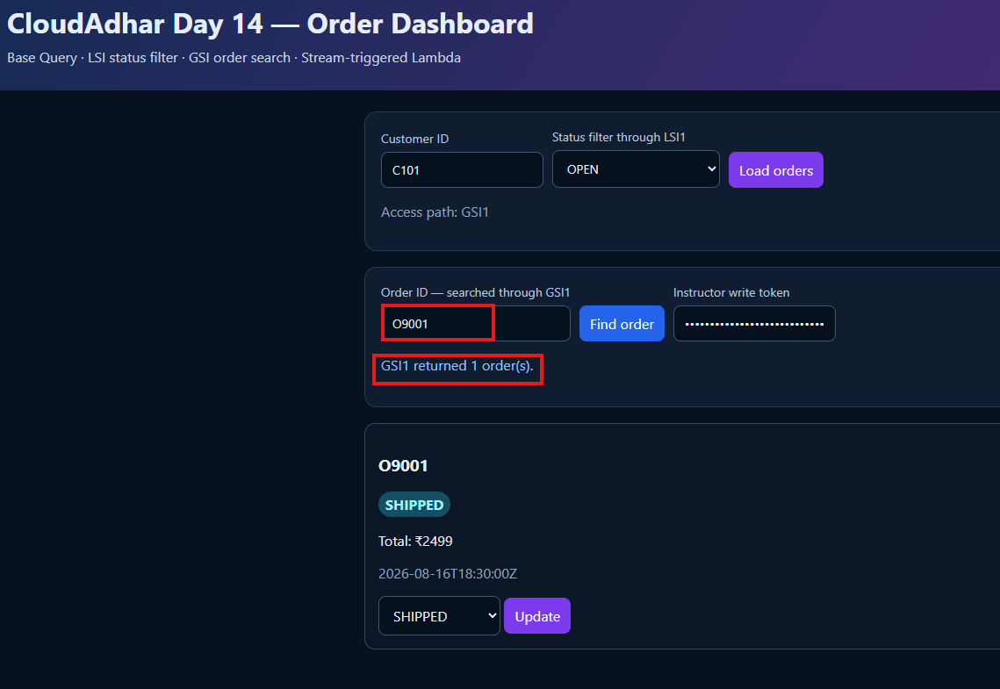

---

### 14. UI Status Update

UI performing a status update via the API.

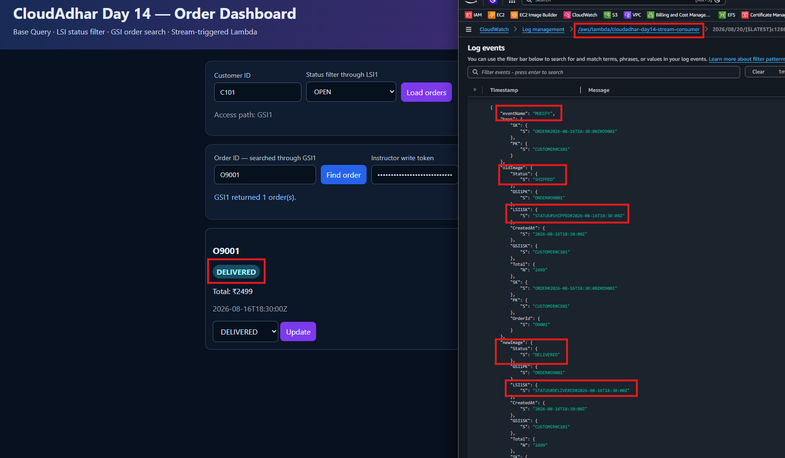

---

### 15. Complete UI → DynamoDB → Stream → Lambda Flow

End-to-end flow from UI update through DynamoDB, Stream and Lambda log.

### 15a. Initial State — UI Dashboard + DynamoDB O9001

Shows O9001 in the UI with status `PAID` and the corresponding DynamoDB item with `Status=PAID` and `LSI1SK=STATUS#PAID#...` before the status update.

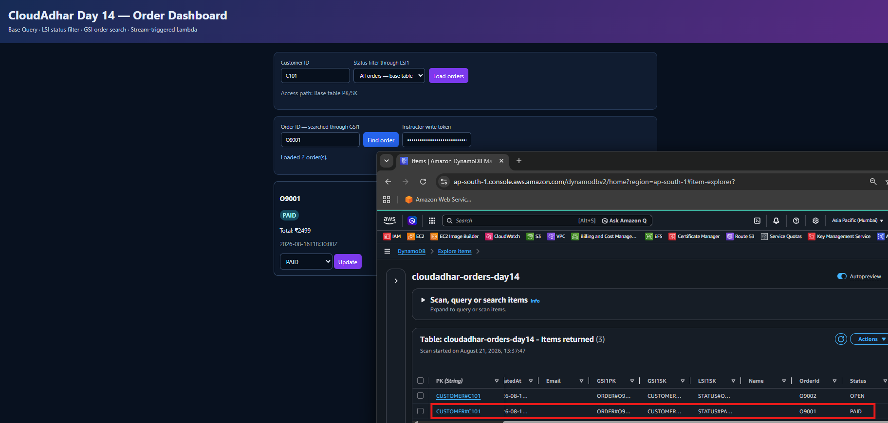

---

### 15b. Event Source Mapping

Shows the DynamoDB Stream event source mapping for `cloudadhar-day14-stream-consumer` with the mapping **Enabled** and the last processing result **OK**, confirming that the Stream-to-Lambda integration is active and processing events successfully.

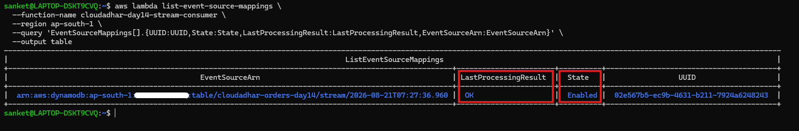

---

### 15c. UI — O9001 Status Update

Shows `O9001` being updated from `PAID` to `SHIPPED` through the application UI.

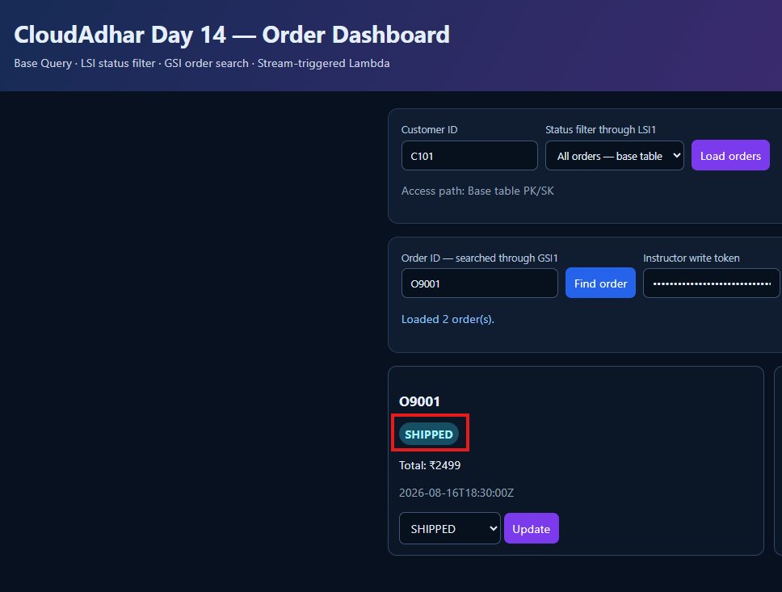

---

### 15d. DynamoDB — O9001 After Update

Shows the updated `O9001` item in DynamoDB with `Status=SHIPPED` and `LSI1SK=STATUS#SHIPPED#...`.

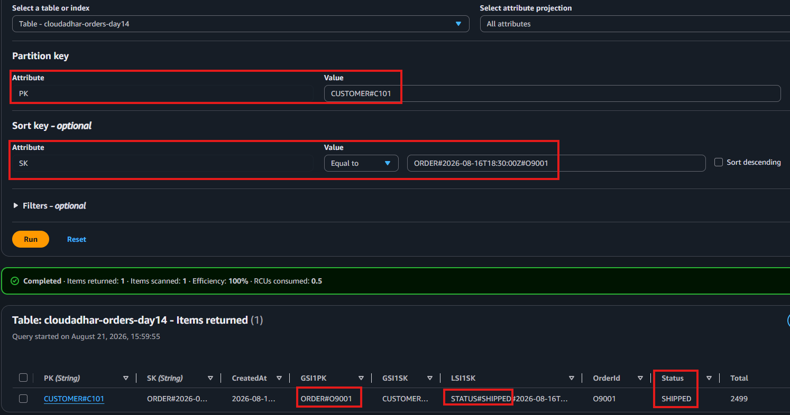

---

### 15e. CloudWatch — Stream Event

Shows the DynamoDB Stream MODIFY event processed by the consumer Lambda, with `oldImage.Status=PAID` changing to `newImage.Status=SHIPPED` for `order O9001`.

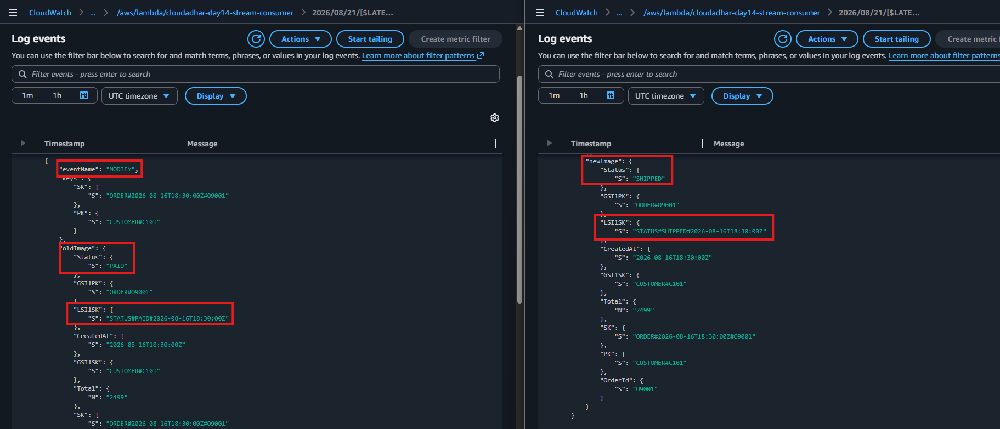

---

### 15f. UI — LSI1 and GSI1 Validation

Shows `LSI1` being used with a status-prefix query to filter `SHIPPED` orders and `GSI1` being used to search for order `O9001`.

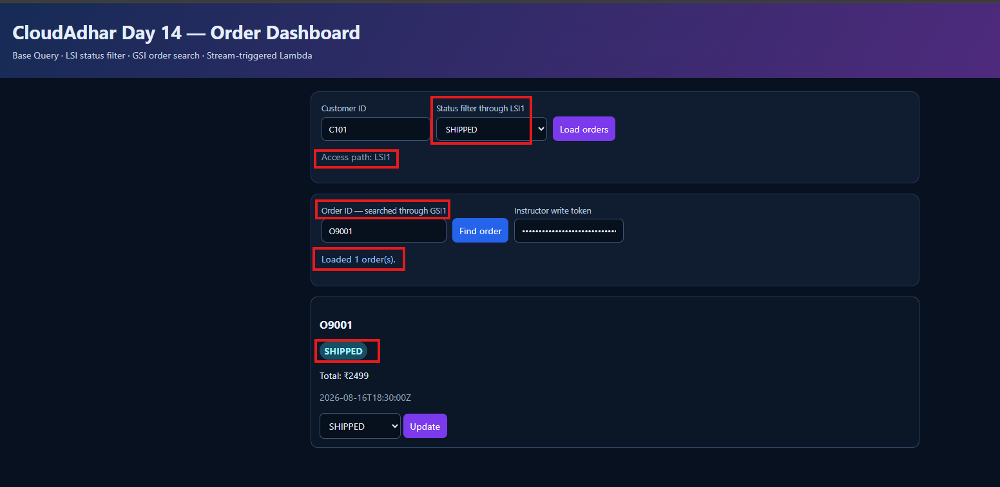

---

## Where I Got Stuck

`No blocker`

---

## Additional Documentation

- [Week 7 Design Decisions](../design-decisions.md)

---

## Cleanup

**Day 14 cleanup should be performed only after all required evidence has been captured.**

1. Remove the temporary Function URL from `cloudadhar-day14-ui`
2. Remove the DynamoDB Stream event-source mapping
3. Delete the Stream Consumer Lambda `cloudadhar-day14-stream-consumer`
4. Delete the UI/API Lambda `cloudadhar-day14-ui`
5. Delete IAM roles and policies created specifically for the Day 14 Lambda functions and Stream trigger
6. Delete the DynamoDB table `cloudadhar-orders-day14`
7. Delete the optional provisioned-capacity table `cloudadhar-capacity-demo-day14`
8. Verify that the DynamoDB TTL configuration and Streams are removed with the table
9. Verify that no Day 14 Lambda, IAM, DynamoDB, or Function URL resources remain

---