# Day 15 Lab - Route 53, CloudFront, ACM, and Edge Security

## Name

Sanket Dangat

## Tasks Completed
- [x] Watched/read the weekly content
- [x] Completed hands-on labs
- [x] Added screenshots or proof
- [x] Posted on LinkedIn
- [x] Cleaned up AWS resources


## Architecture

## AWS Global CDN Edge Protection Private S3

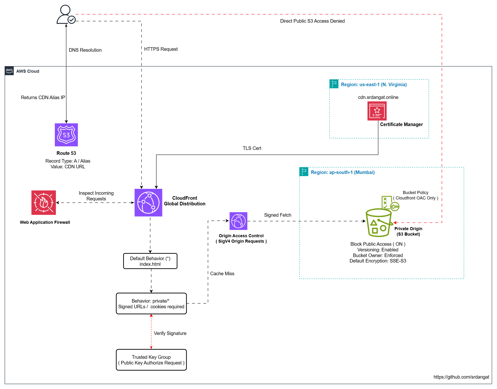

## Architecture Description

This infrastructure deployment represents a **highly secure, optimized Global Content Delivery Network (CDN) with Edge Protection** designed for asset caching and private content delivery.

### 1. DNS Management Tier
**Amazon Route 53** serves as the public hosted zone for `srdangat.online`. It resolves client domain queries and points an **A/ALIAS record** directly to the **Amazon CloudFront** delivery network for `cdn.srdangat.online`.

### 2. Edge Security Inspection
Incoming client HTTPS traffic (**Port 443**) passes through **AWS WAF** at the global ingress plane. WAF performs request evaluation using custom **IP Block rules** before allowing traffic deeper into the CDN.

### 3. Global Edge Handshake & SSL Binding
An **AWS Certificate Manager (ACM)** public certificate is provisioned specifically in the **N. Virginia (`us-east-1`)** region. This certificate is attached to CloudFront and terminates the viewer TLS handshake globally across CloudFront edge locations.

### 4. Granular Cache Behavior Split

Delivery paths are segregated based on request paths:

- **Default Behavior (`*`)** – Uses the `CachingOptimized` cache policy to serve static assets such as `index.html` from the edge cache.
- **Private Behavior (`private/*`)** – Intercepts private-content requests and uses a **Trusted Key Group** to validate RSA-2048 cryptographic signatures before allowing access.

### 5. Origin Access Control (OAC) Shielding
When a requested object is not available in the CloudFront cache, **Origin Access Control (OAC)** enforces mandatory **AWS Signature Version 4 (SigV4)** request signing.

The signed request is securely forwarded to the private S3 origin located in the **Mumbai (`ap-south-1`)** region.

### 6. Hardened Storage Tier
The **Amazon S3 bucket** is configured with:

- **Block Public Access** enabled
- **Default encryption** enabled
- **S3 static website hosting disabled**
- Bucket policy restricted to the authorized **CloudFront OAC** pathway

Direct public object access is denied and returns **HTTP 403 Access Denied**.

### 7. Overall Data Flow

**Viewer Client → Route 53 → HTTPS / ACM (`us-east-1`) → AWS WAF → CloudFront → Trusted Key Group Validation → Origin Access Control → SigV4 Origin Fetch → Private S3 Bucket (`ap-south-1`)**


---

## AWS Multi Region Active Passive Failover

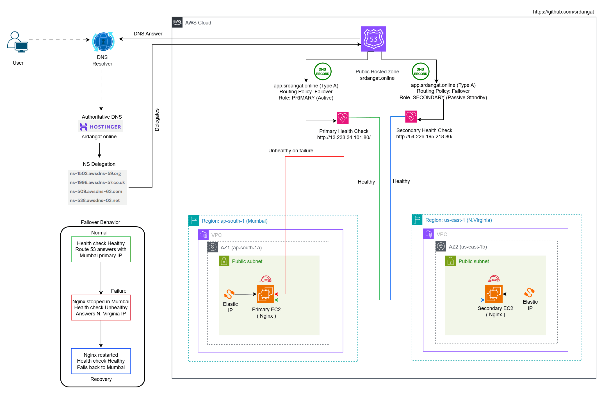

## Architecture Description

This infrastructure deployment represents a **highly resilient Multi-Region Web Server with Active-Passive Failover** designed for automated disaster recovery and high availability.

### 1. DNS Management Tier
**Amazon Route 53** serves as the public hosted zone for `srdangat.online`. The domain uses **Hostinger name server delegation**, while Route 53 manages client traffic routing for `app.srdangat.online`.

### 2. Monitoring Engine
Two **Route 53 Health Checks** continuously monitor the regional web servers using HTTP requests over **Port 80**.

These health checks determine whether the active endpoint is available and whether failover is required.

### 3. Ingress Protection
**AWS Elastic IPs (EIPs)** provide persistent static public IP addresses for both regional EC2 instances.

This ensures that the endpoints maintain stable public IP addresses even if the EC2 instances are rebooted.

### 4. Failover Policy
Route 53 uses a **Failover Routing Policy** to separate the two regional endpoints:

- **Primary / Active:** Mumbai (`ap-south-1`)
- **Secondary / Passive:** N. Virginia (`us-east-1`)

Under normal conditions, traffic is routed to the Mumbai endpoint.

If the primary health check fails, Route 53 automatically directs traffic to the secondary N. Virginia endpoint.

### 5. Compute Tier
Each region contains a dedicated VPC with EC2 instances deployed in **public subnets**.

The EC2 instances run **Nginx web servers** that process incoming web requests.

- **Mumbai (`ap-south-1`)** – Primary Nginx server
- **N. Virginia (`us-east-1`)** – Secondary Nginx server

### 6. Self-Healing & Automatic Failback
When the primary Mumbai Nginx server becomes unavailable, Route 53 detects the failure through its health check and automatically shifts traffic to the secondary N. Virginia endpoint.

Once the Mumbai endpoint recovers and successfully passes its health check, Route 53 automatically restores traffic to the **Primary** endpoint.

This provides automatic **failover and failback** without requiring manual DNS changes.

### 7. Overall Data Flow

**Normal Operation:**

**Client → Route 53 → Primary Health Check → Mumbai EIP → Public Subnet → Nginx EC2 (`ap-south-1`)**

**Failure Scenario:**

**Client → Route 53 → Primary Health Check Fails → Secondary EIP → Public Subnet → Nginx EC2 (`us-east-1`)**

**Recovery / Failback:**

**Mumbai Nginx Recovers → Health Check Passes → Route 53 Detects Primary Recovery → Traffic Automatically Returns to Mumbai**

---

## Result

Successfully implemented an AWS edge delivery and DNS architecture using Amazon Route 53, Amazon CloudFront, AWS Certificate Manager (ACM), Amazon S3, Amazon EC2, and AWS WAF.

Verified ACM DNS validation, private S3 origin access through CloudFront Origin Access Control (OAC), CloudFront caching and invalidation, signed URL protection, custom HTTPS domain configuration, Route 53 health checks, weighted routing, active-passive failover, failback, and WAF Count and Block actions.

---

## Screenshots

### 1. Route 53 Public Hosted Zone

- Created the public hosted zone `srdangat.online` in Amazon Route 53.

- Copied the four Route 53 authoritative name servers and configured the domain registrar to use the Route 53 nameservers.

- Verified the authoritative name servers using `dig NS`


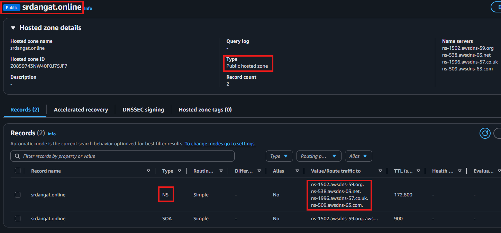

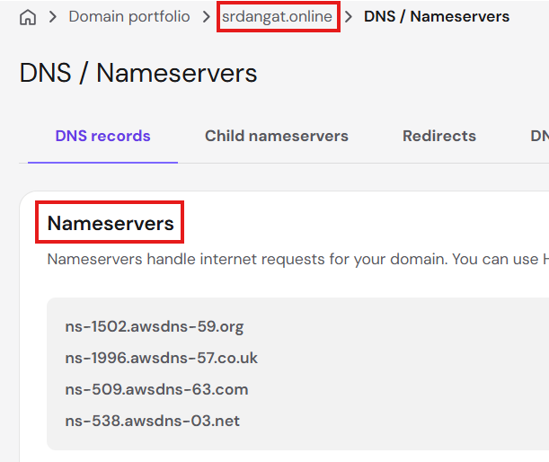

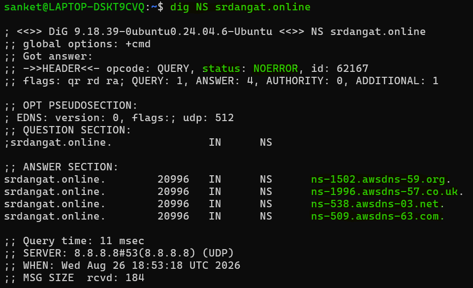

---

### 2. ACM Certificate and DNS Validation

- Requested a public ACM certificate in **`us-east-1`** for `cdn.srdangat.online`.

- Selected DNS validation with RSA 2048, created the ACM validation CNAME in Route 53, and verified the certificate status changed to **Issued** for CloudFront use.

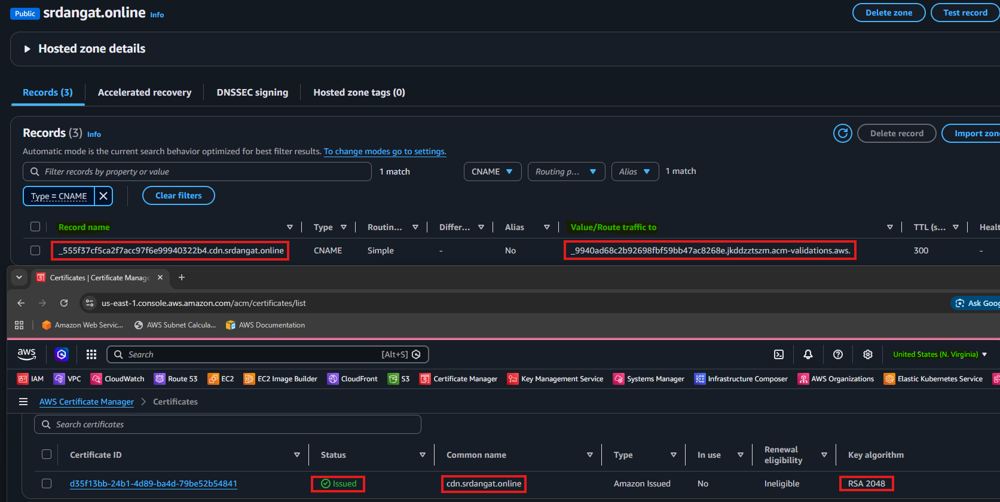

---

### 3. Primary Mumbai EC2 Endpoint

- Created the primary HTTP endpoint in **Mumbai (`ap-south-1`)** with Amazon Linux 2023 and Nginx.

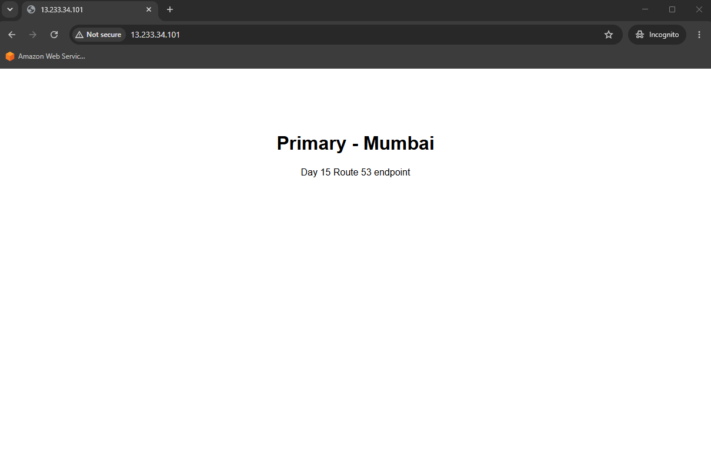

---

### 4. Secondary N. Virginia EC2 Endpoint

- Created the secondary HTTP endpoint in **N. Virginia (`us-east-1`)** with Amazon Linux 2023 and Nginx.

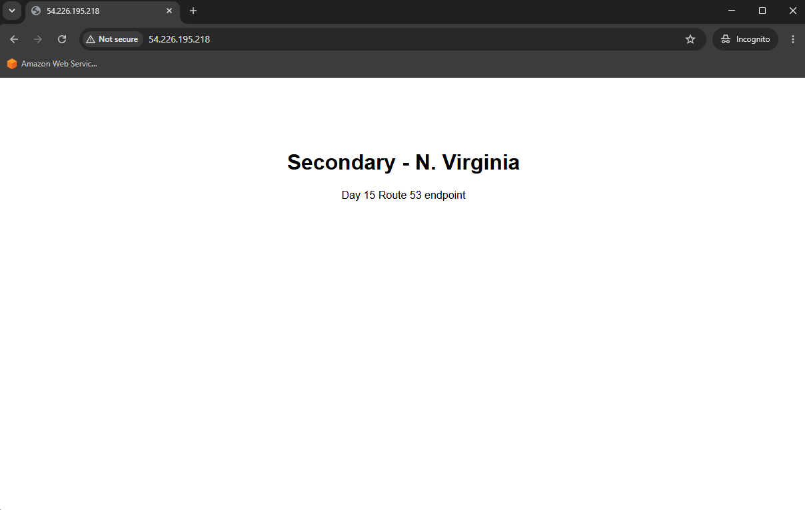


---

### 5. Route 53 Health Checks

- Created public Route 53 health checks for the two regional HTTP endpoints.

- Configured HTTP health checks on port 80 with path `/`, a 30-second interval, and failure threshold of 3.

- Verified that both health checks were **Healthy**.

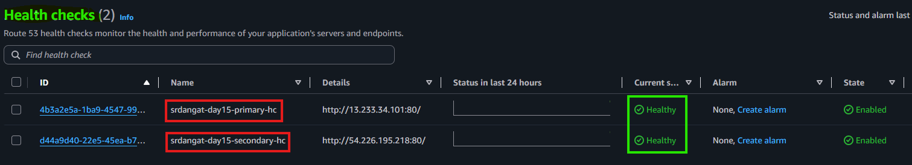

---

### 6. Simple Routing

- Created two Route 53 simple A records for:

```bash
primary.srdangat.online
secondary.srdangat.online
```

Configured:

| Endpoint  | Region      | Record Type | TTL |
| --------- | ----------- | ----------- | --: |
| Primary   | Mumbai      | A           |  30 |
| Secondary | N. Virginia | A           |  30 |

- Verified DNS resolution using `dig` and confirmed `HTTP responses` from `both endpoints` using curl.

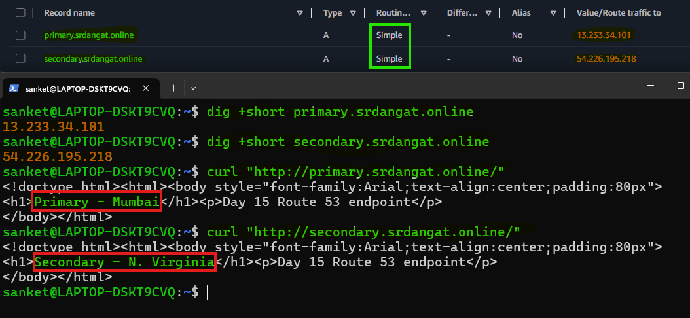

### 7. Weighted Routing

- Created two Route 53 weighted A records for:

```bash
weighted.srdangat.online
```

Configured:

| Endpoint  | Region      | Weight |
| --------- | ----------- | -----: |
| Primary   | Mumbai      |     80 |
| Secondary | N. Virginia |     20 |

- Queried the Route 53 authoritative nameserver repeatedly and observed responses from both endpoint IPs.

- Changed the weights to `50/50` and repeated the test.

- Verified that DNS weights influence the distribution of answers but do not guarantee an exact request ratio because recursive DNS caching affects client observations.

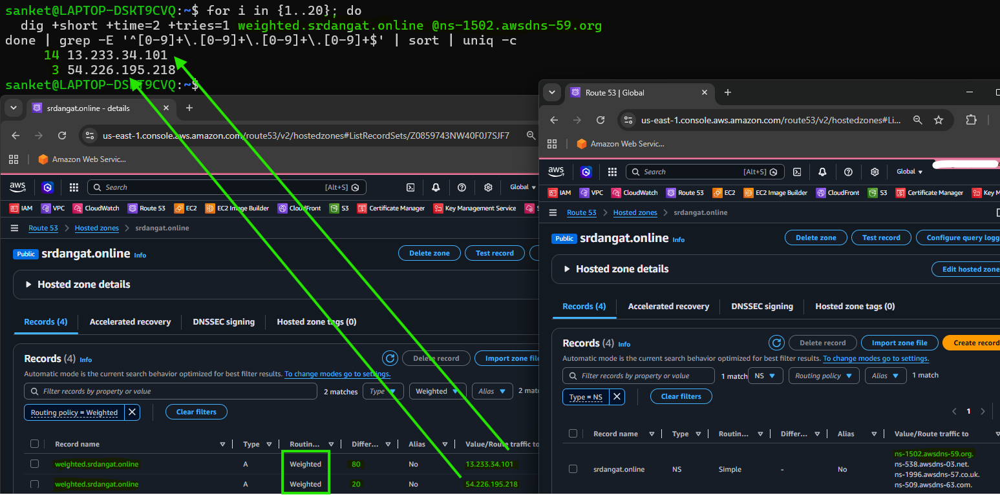

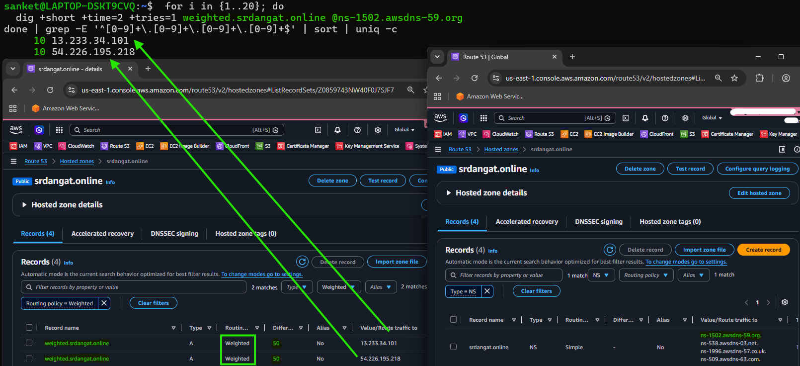

---

### 8. Route 53 Failover Baseline

- Created two Route 53 failover A records for:

```text
app.srdangat.online
```

Configured:

* Mumbai as the Primary record
* N. Virginia as the Secondary record
* Primary and Secondary health checks
* TTL of 30 seconds

Verified the healthy baseline returned the Mumbai endpoint.

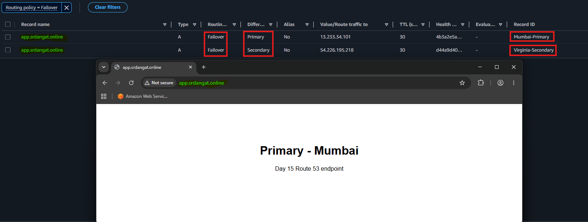

---

### 9. Route 53 Application Failover

- Stopped Nginx on the Mumbai EC2 instance, causing the Primary health check to become **Unhealthy**.

- Route 53 automatically failed over to the **N. Virginia Secondary** endpoint.

- Verified that the application page displayed the N. Virginia endpoint.

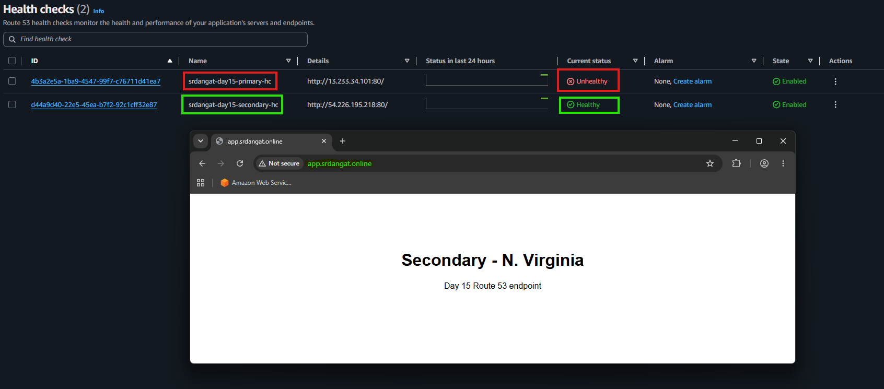

---

### 10. Route 53 Failback

- Started Nginx again on the Mumbai instance.

- Waited for the Mumbai health check to return to **Healthy**.

- Route 53 automatically failed back to the **Mumbai Primary** endpoint.

- Verified that the application page again displayed the Mumbai endpoint.

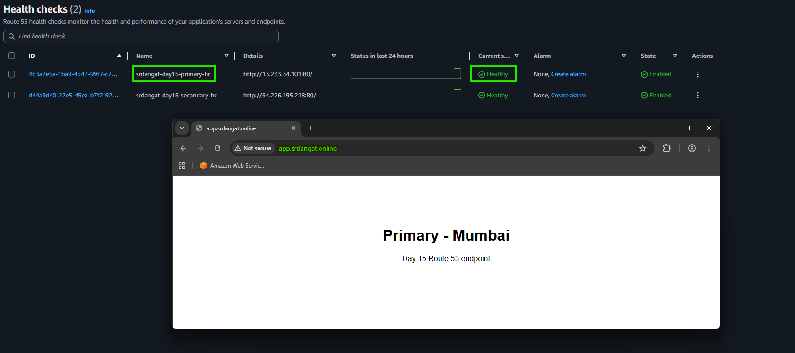

---

### 11. Private S3 Origin Bucket

- Created the private S3 origin bucket in **Mumbai (`ap-south-1`)** and uploaded the objects.

- Configured:

- Block Public Access enabled
- Bucket owner enforced
- Versioning enabled
- Default encryption enabled
- S3 static website hosting disabled

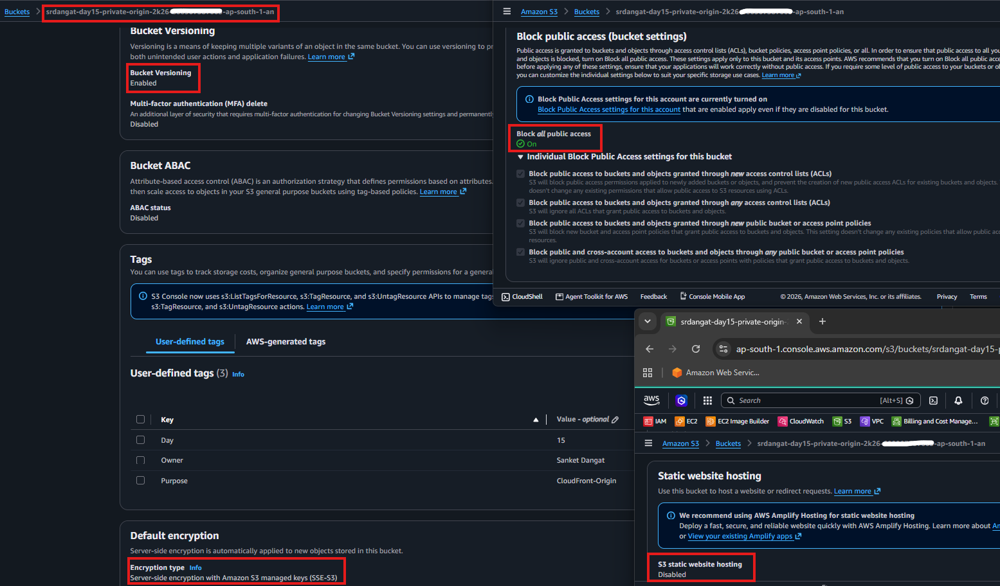

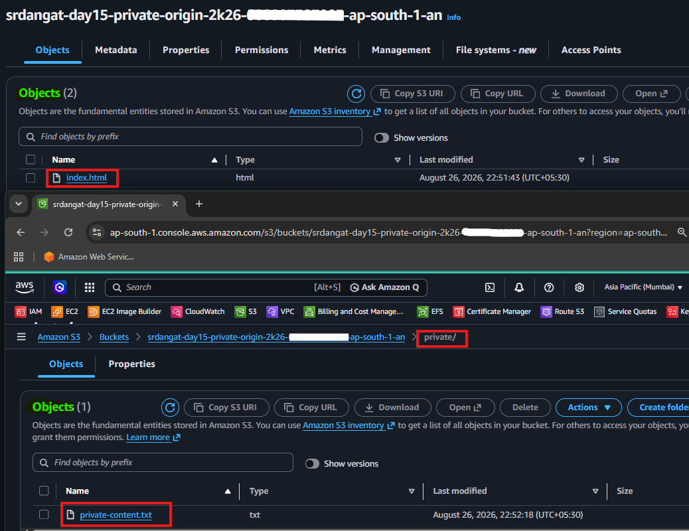

---

### 12. Direct S3 Access Denied

- Created `private/private-content.txt` and verified that its direct S3 object URL returns **`AccessDenied`**, confirming that the bucket is not publicly accessible.

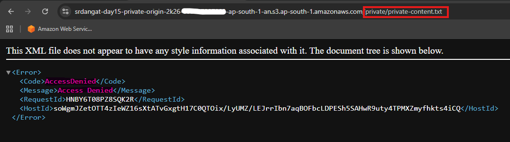

---

### 13. CloudFront Distribution and OAC

- Created and configured the CloudFront distribution.
- Configured the S3 REST endpoint as the origin and enabled Origin Access Control (OAC).
- Configured:
  - HTTP → HTTPS redirect
  - GET and HEAD methods
  - Managed `CachingOptimized` cache policy
  - Compression enabled
  - Default root object `index.html`

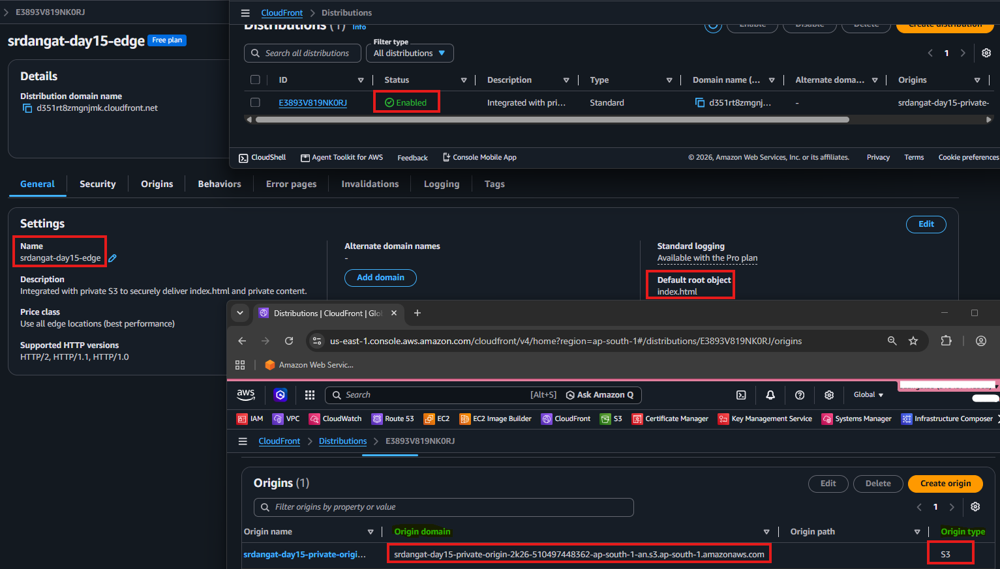

---

### 14. CloudFront Default Domain Validation

- Opened the generated CloudFront distribution domain and verified that CloudFront successfully served the private S3 origin content.

Validated:

```bash
https://<DISTRIBUTION-DOMAIN>/
https://<DISTRIBUTION-DOMAIN>/index.html
```

- Both returned the expected `Page Version: 1` content.


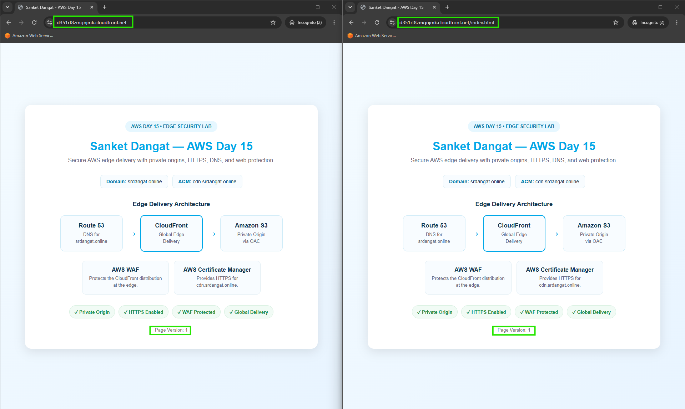

---

### 15. CloudFront Cache Behavior

- Requested the same CloudFront object multiple times and inspected the response headers.

- Recorded response headers:

* `X-Cache`
* `Age`
* `Via`
* `X-Amz-Cf-Pop`

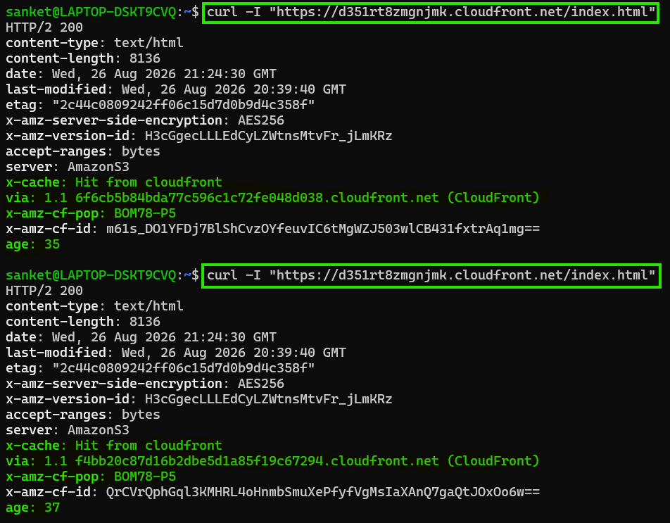

---

### 16. CloudFront Invalidation

- Updated the S3 origin page from:

```bash
Page Version: 1
```

to:

```bash
Page Version: 2
```

- Uploaded the updated object using the same S3 key and Observed `old version` remain `cached`

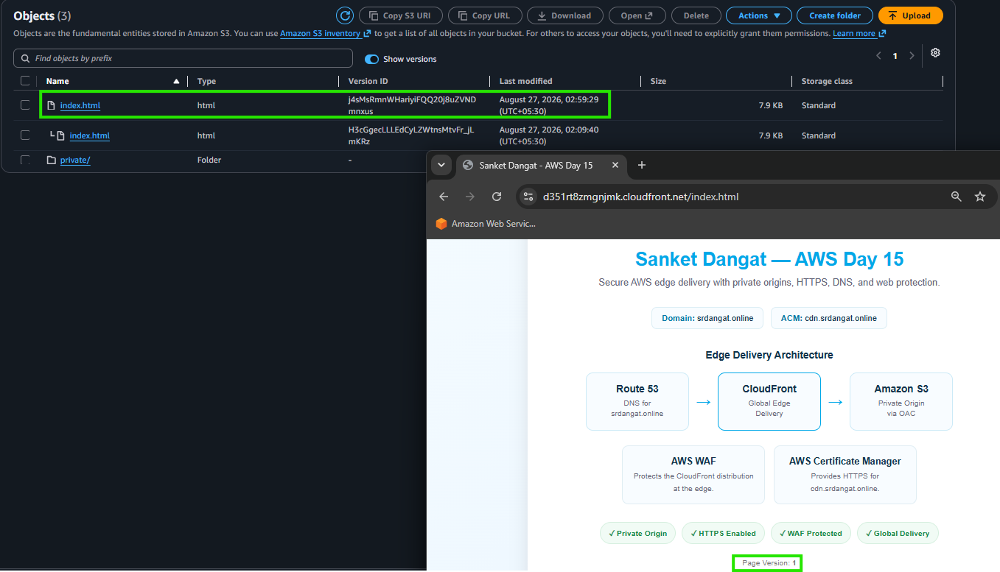


- Created a CloudFront invalidation for:

```bash
/index.html
```

- Waited for the invalidation to complete and verified that CloudFront served `Page Version: 2`.

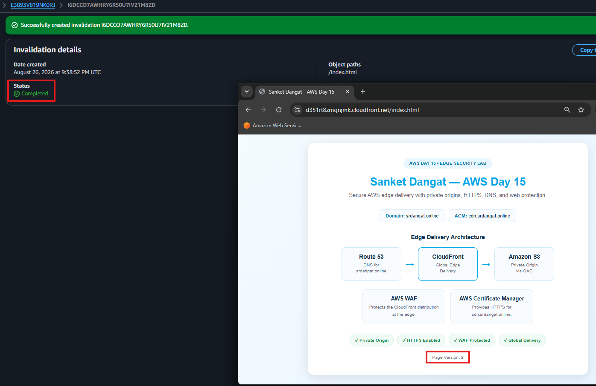

---

### 17. CloudFront Public Key and Key Group

- Generated a CloudFront signing key pair in AWS CloudShell.

- Created a CloudFront public key using the public portion of the key pair.

- Created a CloudFront key group containing the public key.

- The private key remained under local control in CloudShell and was not uploaded to CloudFront, published, committed to source control, or exposed publicly.


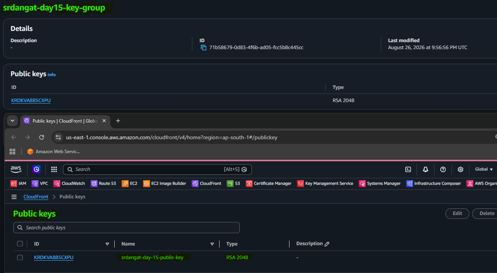

---

### 18. Unsigned Private Path Denied

- Created a CloudFront behavior for: `private/*`

- Configured the behavior with:
    - HTTPS redirect
    - GET and HEAD
    - CachingOptimized
    - Restrict viewer access: Yes
    - Trusted key group

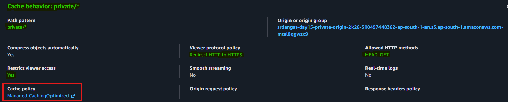

- Attempted to access: `https://<DISTRIBUTION-DOMAIN>/private/private-content.txt` without a signed URL.

- Verified that the request was denied.


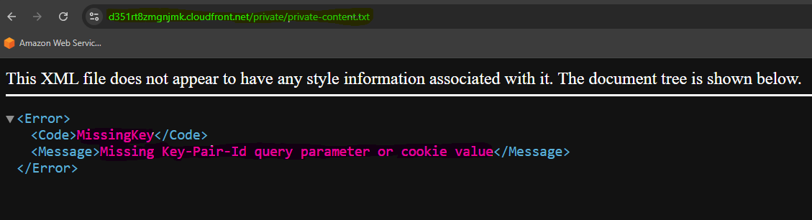

---

### 19. Signed URL Validation

- Generated a short-lived CloudFront signed URL using the CloudFront public-key ID and private signing key.

- Configured the signed URL to expire within 15 minutes.

- Opened the complete signed URL and verified that the protected object returned HTTP 200.

- After the configured expiry time, attempted to reuse the same signed URL and verified that access was rejected, confirming that the URL was time-limited.

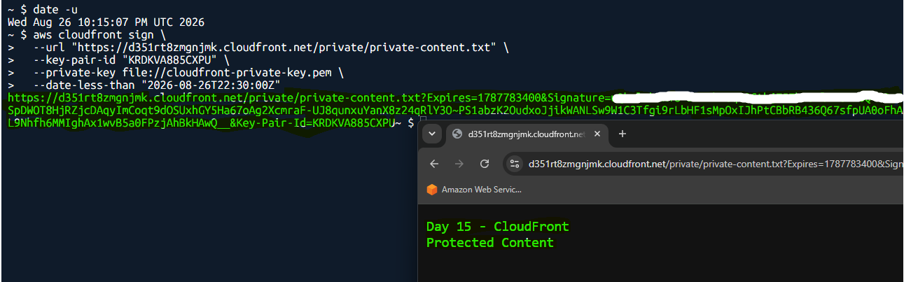

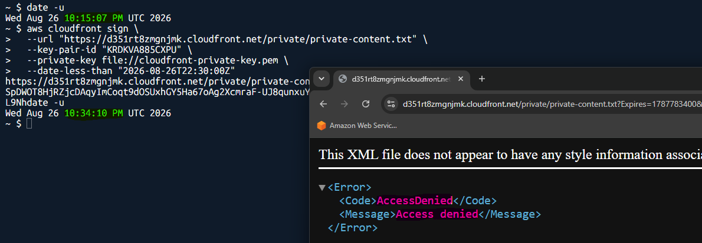

---

### 20. Custom HTTPS Domain

- Attached the issued ACM certificate from `us-east-1` to the `CloudFront distribution`.

- The certificate was created in us-east-1 because CloudFront requires the ACM viewer certificate to be in US East (N. Virginia).

- Added the alternate domain: `cdn.srdangat.online`

- Created a Route 53 A/ALIAS record pointing cdn.srdangat.online to the CloudFront distribution.

- Verified that `https://cdn.srdangat.online/` successfully served the `CloudFront content over HTTPS`.
 
- Confirmed that the custom domain presented a valid SSL/TLS certificate.

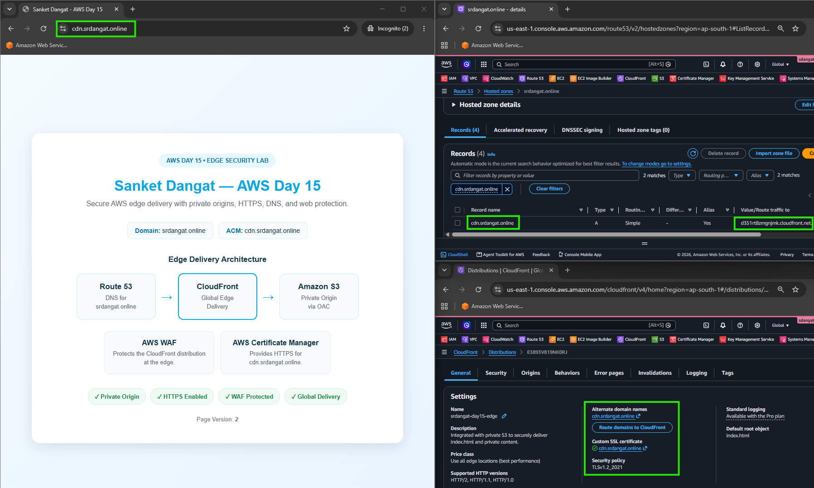

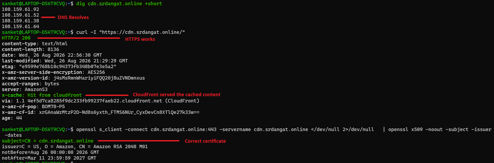

---

### 21. AWS WAF Count Testing

- Created a CloudFront-scope WAF IP set containing my public IPv4 address as a `/32`.

- Created the rule: `Block-IP`

- Initially configured the rule action as **Count**.

- Requested the CloudFront root page several times and verified that the page remained accessible while WAF recorded the rule match.

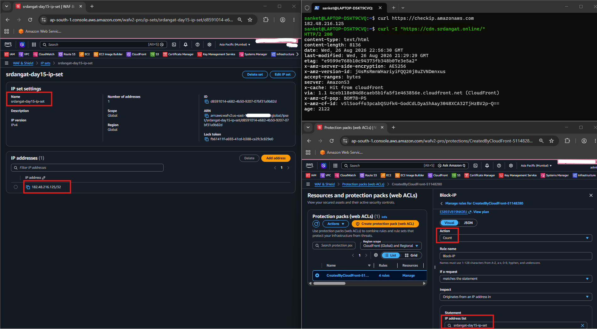

---

### 22. AWS WAF Block Testing

- Changed the WAF rule action from **Count** to **Block**.

- Requested the public CloudFront root page again and verified that access returned `403`.

- Immediately restored the rule to Count, verified that normal access returned, and removed the temporary IP set after testing.

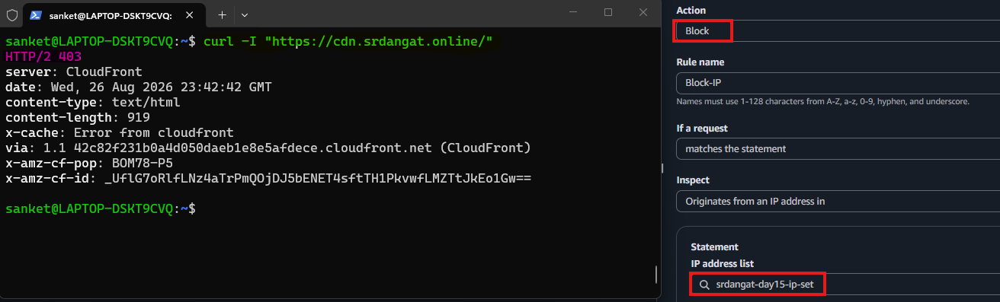

---

## Cleanup

**Day 15 cleanup should be performed only after all required evidence has been captured.**

1. Remove the temporary AWS WAF IP set and delete the Day 15 WAF Web ACL/rules
2. Remove the Route 53 `cdn.srdangat.online` A/ALIAS record pointing to CloudFront
3. Remove `cdn.srdangat.online` as the CloudFront alternate domain and detach the ACM certificate
4. Delete the CloudFront distribution after disabling it
5. Delete the CloudFront key group and public key used for signed URL testing
6. Remove the CloudFront Origin Access Control (OAC) associated with the distribution
7. Delete all objects from the private S3 bucket, then delete the Day 15 S3 bucket
8. Delete the Route 53 failover records for `app.srdangat.online`
9. Delete the Route 53 weighted records for `weighted.srdangat.online`
10. Delete the Route 53 simple records for `primary.srdangat.online` and `secondary.srdangat.online`
11. Delete the Route 53 health checks for the Mumbai and N. Virginia endpoints
12. Terminate the secondary N. Virginia EC2 instance
13. Terminate the primary Mumbai EC2 instance
14. Delete the ACM certificate for `cdn.srdangat.online` from `us-east-1`
15. Remove the ACM DNS validation CNAME record from Route 53, if no longer required
16. Verify that no Day 15 CloudFront, WAF, S3, EC2, Route 53, ACM, or CloudFront signing resources remain

---

## LinkedIn Post

[LinkedIn Link](https://lnkd.in/p/dPRkV-3H)