# Day 16 Lab – Cross-Region EC2 Backup and Disaster Recovery

## Name
Sanket Dangat


## Tasks Completed
- [x] Watched/read the weekly content
- [x] Completed hands-on labs
- [x] Added screenshots or proof
- [ ] Posted on LinkedIn
- [x] Cleaned up AWS resources


## Result

Successfully implemented a **Cross-Region EC2 Backup and Disaster Recovery architecture** using **Amazon EC2, Amazon EBS, AWS Backup, AWS KMS, IAM, Amazon VPC, and AWS Security Groups**.

Created a disposable Mumbai workload with an encrypted EBS root volume, protected the EC2 instance using AWS Backup, created a dedicated source backup vault, copied the completed recovery point to a dedicated backup vault in **N. Virginia (`us-east-1`)**, and restored the workload as a new EC2 instance.

Validated the recovered application using **HTTP 200**, `/health`, IMDSv2 metadata, the synthetic `DAY16` recovery marker, the restored instance ID, Region metadata, EBS encryption, and application readiness.

Verified that the source and restored EC2 instances had different instance IDs and that the recovered workload successfully operated in **N. Virginia (`us-east-1`)**.

---

## Resources Created

| Resource | Region | Name / Purpose |
|---|---|---|
| EC2 Instance | Mumbai (`ap-south-1`) | `srdangat-day16-primary` |
| EC2 Instance | N. Virginia (`us-east-1`) | `srdangat-day16-dr-restored` |
| EBS Root Volume | Mumbai (`ap-south-1`) | Encrypted 8 GiB `gp3` |
| EBS Root Volume | N. Virginia (`us-east-1`) | Restored encrypted volume |
| Security Group | Mumbai (`ap-south-1`) | `srdangat-day16-primary-sg` |
| Security Group | N. Virginia (`us-east-1`) | `srdangat-day16-dr-sg` |
| VPC | Mumbai (`ap-south-1`) | `srdangat-day16-primary-vpc` |
| Public Subnet | Mumbai (`ap-south-1`) | `srdangat-day16-primary-subnet-public` |
| Route Table | Mumbai (`ap-south-1`) | `srdangat-day16-primary-rtb-public` |
| Internet Gateway | Mumbai (`ap-south-1`) | `srdangat-day16-primary-igw` |
| VPC | N. Virginia (`us-east-1`) | `srdangat-day16-dr-vpc` |
| Public Subnet | N. Virginia (`us-east-1`) | `srdangat-day16-dr-subnet-public` |
| Route Table | N. Virginia (`us-east-1`) | `srdangat-day16-dr-rtb-public` |
| Internet Gateway | N. Virginia (`us-east-1`) | `srdangat-day16-dr-igw` |
| AWS Backup Vault | Mumbai (`ap-south-1`) | `srdangat-day16-primary-vault` |
| AWS Backup Vault | N. Virginia (`us-east-1`) | `srdangat-day16-dr-vault` |
| AWS KMS Key | N. Virginia (`us-east-1`) | `alias/srdangat-day16-dr-backup-key` |
| AWS Backup Recovery Point | Mumbai → N. Virginia | Cross-Region EC2 recovery point |

---

## Part A – Record the Recovery Design

**Chosen workload RTO:** 30 minutes

**Chosen workload RPO:** 4 hours

**DR strategy:** Backup and Restore

### Reason this strategy fits

Backup and Restore is a suitable DR strategy for this workload because it is simple, cost-effective, and sufficient when some downtime and data loss are acceptable. The workload can be restored as a small EC2 instance (`t3.micro`) from an AWS Backup recovery point in the N. Virginia recovery Region.

**Target-Region quotas checked:** Yes

### Dependencies required after restore

- `t3.micro` EC2 instance
- Encrypted EBS volume
- Target VPC and subnet
- Route table and Internet Gateway
- Security group
- KMS key
- IAM permissions/role
- Nginx service
- Systemd render service
- Approved administration/management method

### Why a completed backup alone does not prove the RTO

A completed backup only proves that a recovery point was successfully created. It does not prove how quickly the workload can be restored and made operational.

The RTO also includes recovery declaration, orchestration, restore, configuration, dependency setup, application startup, validation, and traffic cutover where applicable.

Therefore, the RTO must be demonstrated through an actual recovery and validation test.

---

# Part B – Lab Procedure and Evidence

## 1. Primary Mumbai EC2 Instance

- Created the disposable primary EC2 workload in **Mumbai (`ap-south-1`)**.
- Used Amazon Linux 2023 with a t3.micro instance type.
- Enabled public IPv4.
- Attached the dedicated Security Group `srdangat-day16-primary-sg`.
- Tagged the instance with `Backup=Day16`.

### Screenshot

<!-- SCREENSHOT 01: Primary Mumbai EC2 -->
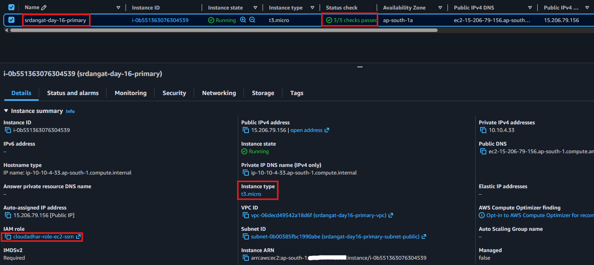

---

## 2. Primary Security Group

- Created `srdangat-day16-primary-sg` in the Mumbai VPC.
- Allowed HTTP TCP port `80` only from the current public IP using a `/32` rule.
- Kept outbound access enabled for package installation.
- Did not expose SSH globally.

### Screenshot

<!-- SCREENSHOT 02: Primary Security Group -->
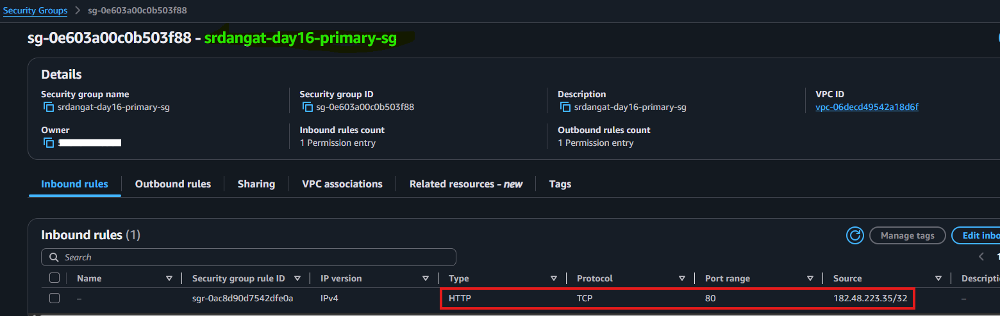

---

## 3. Encrypted EBS Root Volume

- Configured the primary EC2 root volume as an **8 GiB `gp3` encrypted EBS volume**.
- Verified that the root volume encryption status was **Enabled** before creating the backup.
- The application files, Nginx configuration, render script, and systemd unit were stored on the protected EBS volume.

### Screenshot

<!-- SCREENSHOT 03: Primary Encrypted EBS -->
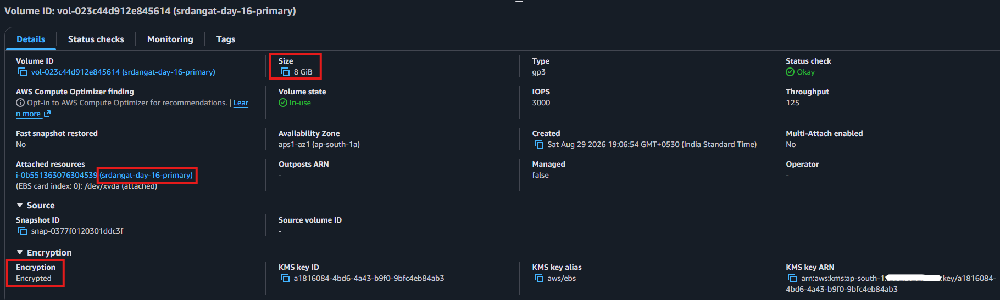

---

## 4. Primary Mumbai Application Validation

- Installed and configured Nginx on the primary EC2 instance.
- Created the synthetic Day 16 recovery page and `/health` endpoint.
- Verified the application was reachable through the Mumbai public endpoint.

### Validation commands

```bash
curl -I http://<SOURCE-PUBLIC-IP>/
curl http://<SOURCE-PUBLIC-IP>/health
```

- Confirmed HTTP `200` and the expected `healthy` response.

### Screenshot

<!-- SCREENSHOT 04: Primary Mumbai Webpage -->
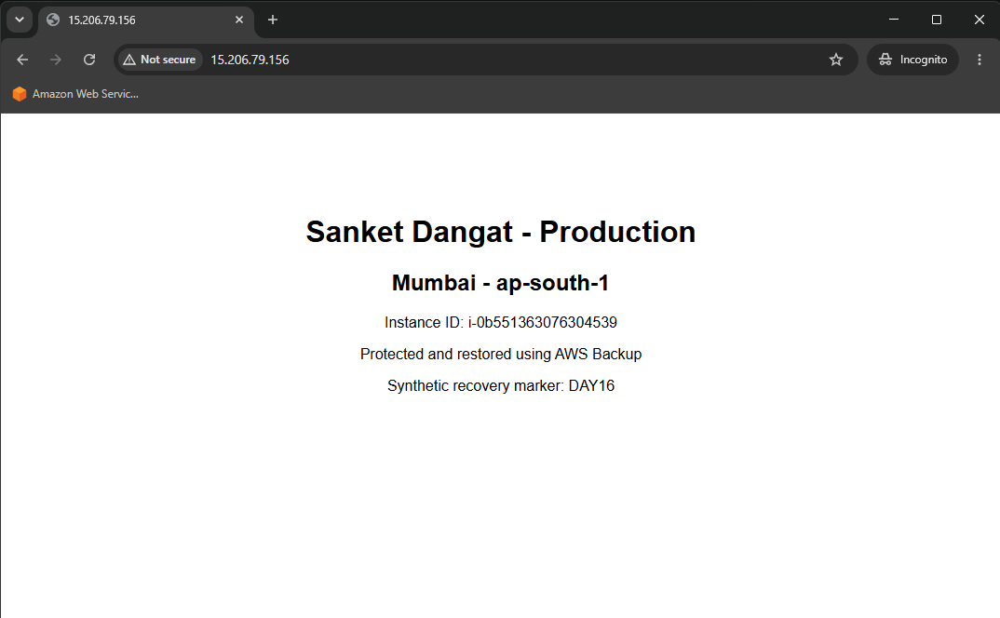

---

## 5. Primary Application and IMDSv2 Validation

- Verified Nginx was running.
- Confirmed TCP port `80` was listening.
- Validated the application locally from the EC2 instance.
- Used IMDSv2 to retrieve the current Region and instance ID.

### Validation commands

```bash
sudo systemctl status nginx --no-pager
sudo ss -ltnp | grep ':80'
curl -I http://localhost
curl http://localhost/health
curl http://localhost | grep 'Synthetic recovery marker: DAY16'
curl http://localhost | grep -E 'Mumbai|ap-south-1|Instance ID'
```

### Screenshot

<!-- SCREENSHOT 05: Primary IMDSv2 Validation -->
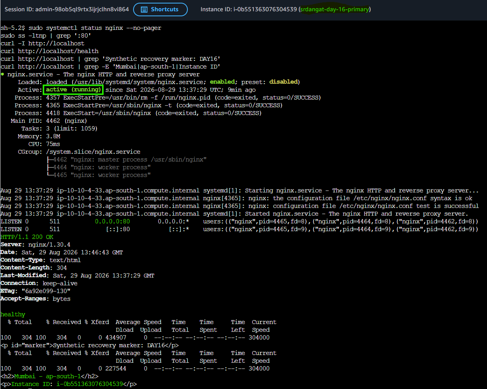

---

## 6. N. Virginia Recovery Region Readiness & Target Region EC2 Quota Validation

- Switched to **N. Virginia (`us-east-1`)**.
- Confirmed that a suitable VPC and public subnet were available for recovery.
- Reviewed subnet routing, Internet Gateway connectivity, available CIDR addresses, and Network ACL behavior.
- Reviewed the **Amazon EC2 On-Demand vCPU quota** in `us-east-1`.
- Confirmed sufficient capacity for the planned small recovery instance.
- Reviewed the target-region requirements before starting the restore.

### Screenshot

<!-- SCREENSHOT 06: DR Region Readiness -->
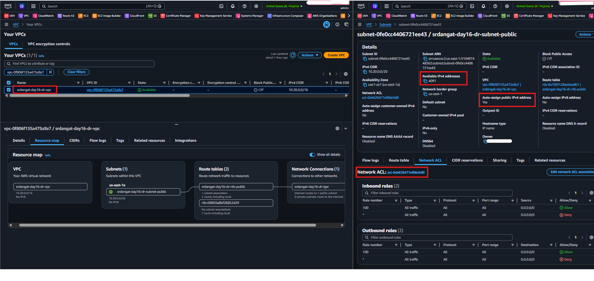

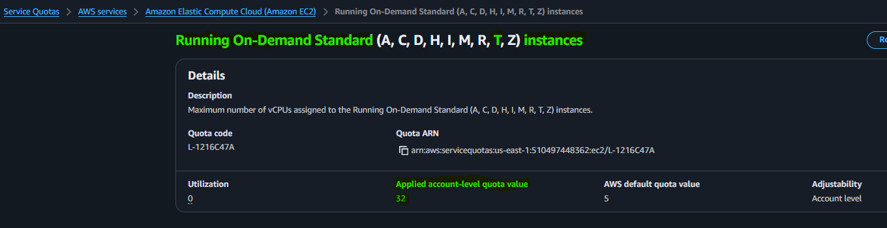

---

## 7. Destination KMS Key

- Created a customer-managed symmetric KMS key in **N. Virginia (`us-east-1`)**.
- Configured the key for encryption and decryption.
- Created the alias:

```text
alias/srdangat-day16-dr-backup-key
```

- Preserved the KMS key because the destination recovery point depends on it.

### Screenshot

<!-- SCREENSHOT 07: Destination KMS Key -->
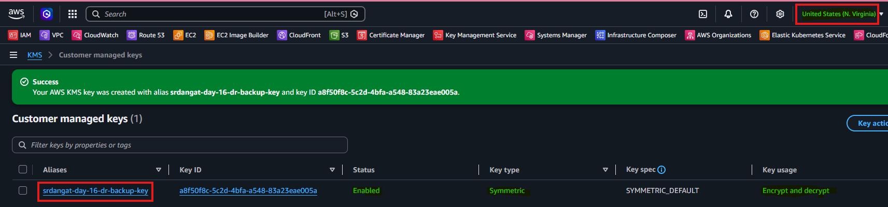

---

## 8. Destination Backup Vault

- Created the destination AWS Backup vault:

```text
srdangat-day16-dr-vault
```

- Created the vault in **N. Virginia (`us-east-1`)**.
- Configured the vault to use the customer-managed KMS key.
- Verified the vault encryption configuration.
- Vault Lock was intentionally not enabled because this was a disposable lab.

### Screenshot

<!-- SCREENSHOT 08: Destination Backup Vault -->
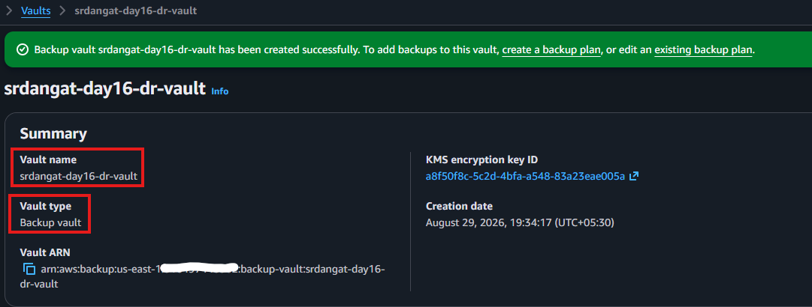

---

## 9. Destination Network Access

- Created and configured the target security/network access required for the restored workload.
- Used a dedicated target Security Group for the DR instance.
- Allowed HTTP TCP port `80` only from the current public IP using a narrowly scoped `/32` rule.
- Kept the recovery environment restricted rather than opening HTTP globally.

### Screenshot

<!-- SCREENSHOT 09: Network Access -->
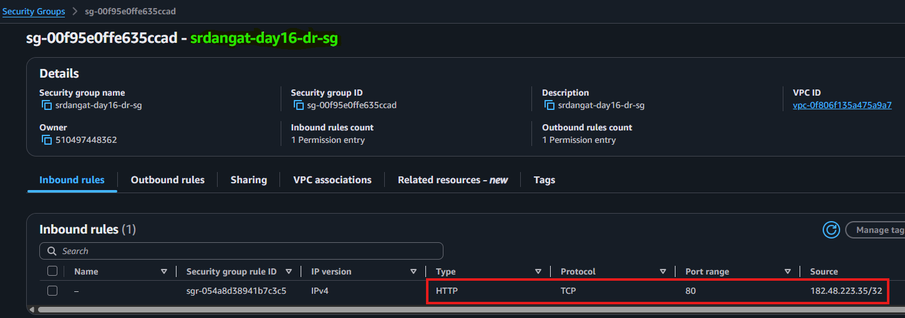

---

## 10. Source Backup Vault

- Created the source backup vault:

```text
srdangat-day16-primary-vault
```

- Created the vault in **Mumbai (`ap-south-1`)**.
- Used the default or approved encryption configuration.
- Did not enable Vault Lock for the disposable lab.

### Screenshot

<!-- SCREENSHOT 10: Primary Backup Vault -->
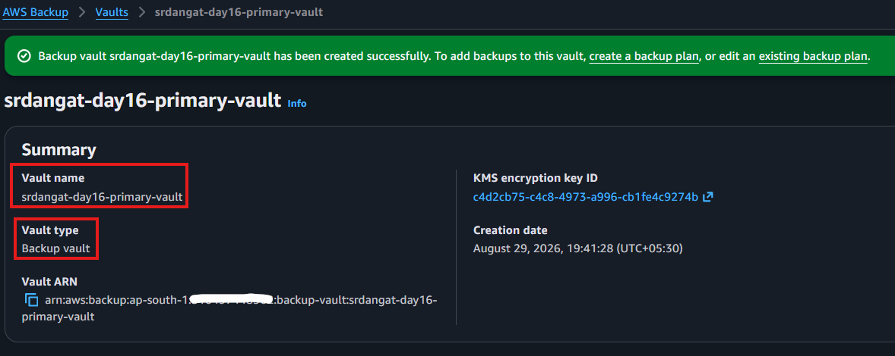

---

## 11. On-Demand EC2 Backup Job

- Created an on-demand backup for the exact primary EC2 instance.
- Configured:

```text
Resource Type: EC2
Resource:      srdangat-day16-primary
Backup Vault:  srdangat-day16-primary-vault
Backup Window: Create backup now
```

- Started the backup job once.
- Monitored the job until its status changed to **Completed**.

### Screenshot

<!-- SCREENSHOT 11: Backup Job Completed -->
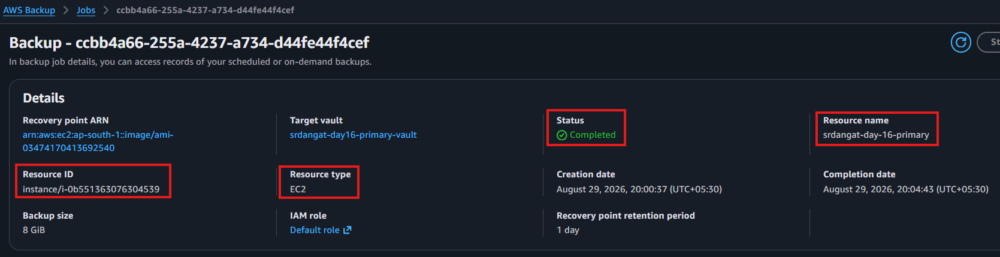

---

## 12. Source Recovery Point

- Opened the source backup vault after the backup job completed.
- Confirmed that the EC2 recovery point was available.
- Verified that the recovery point was associated with the intended source EC2 instance.

### Recorded

```text
Backup Job ID: ccbb4a66-255a-4237-a734-d44fe44f4cef
Recovery Point: arn:aws:ec2:ap-south-1::image/ami-03474170413692540
Source Instance ID: i-0b551363076304539
Source Vault: srdangat-day16-primary-vault
Completion Time: 2026-08-29T14:34:43Z
Expiry: 2026-08-30T14:34:43Z
```

### Screenshot

<!-- SCREENSHOT 12: Source Recovery Point -->
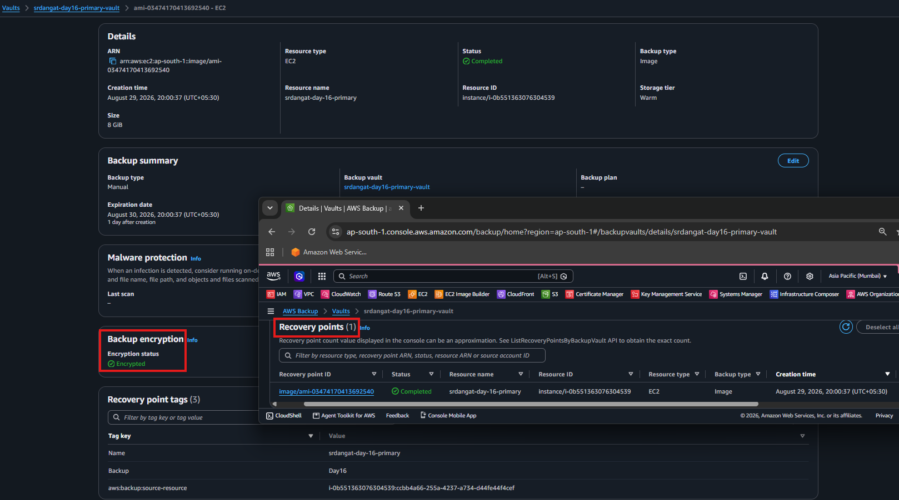

---

## 13. Cross-Region Recovery Point Copy

- Selected the completed Mumbai EC2 recovery point.
- Started a cross-Region copy to **N. Virginia (`us-east-1`)**.
- Configured the destination:

```text
Destination Region: US East (N. Virginia)
Destination Vault:  srdangat-day16-dr-vault
```

- Monitored the copy job until the status changed to **Completed**.

### Screenshot

<!-- SCREENSHOT 13: Cross-Region Copy Job -->
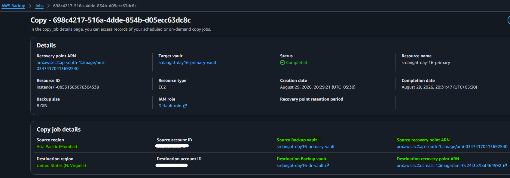

---

## 14. Destination Recovery Point

- Switched to **N. Virginia (`us-east-1`)**.
- Opened `srdangat-day16-dr-vault`.
- Confirmed that the copied EC2 recovery point was available.
- Verified the destination recovery point was encrypted using the intended destination KMS configuration.

### Screenshot

<!-- SCREENSHOT 14: Destination Recovery Point -->
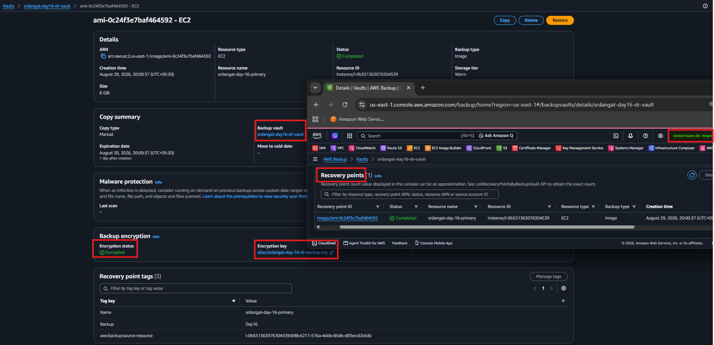

---

## 15. Application Failure Simulation

For safety, the source EC2 instance was **not terminated** before recovery validation.

Instead, application failure was simulated by stopping Nginx through an approved management path.

### Commands

```bash
sudo systemctl stop nginx
curl --max-time 5 http://localhost/health || true
```

- Confirmed that the application was no longer serving the health endpoint.
- Recorded the incident and recovery-declaration timestamps in UTC.

```text
Incident Time:             2026-08-29T15:17:15Z
Detection Time:            2026-08-29T15:17:48Z
Recovery Declaration Time: 2026-08-29T15:18:01Z
```

### Screenshot

<!-- SCREENSHOT 15: Failure Simulation -->
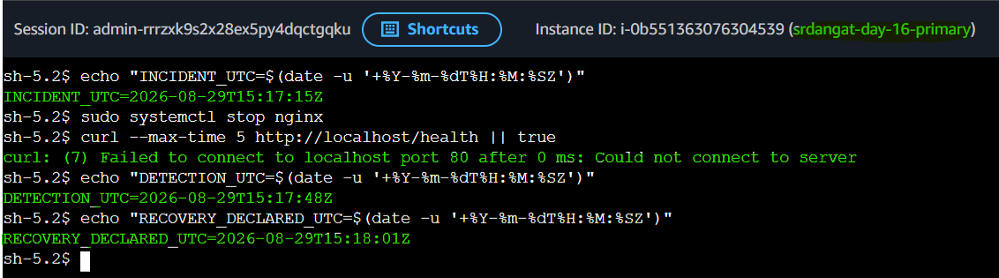

---

## 16. Recovery Point Restore Configuration & Restore Job Completed

- Selected the completed cross-Region recovery point in the N. Virginia backup vault.
- Started an EC2 restore operation.
- Explicitly selected the target recovery environment rather than relying on unknown source defaults.

### Restore configuration

```text
Region:         us-east-1
Instance Type:  t3.micro
VPC:            vpc-0f806f135a475a9a7
Subnet:         subnet-0fe0cc4406721ee43
Security Group: srdangat-day16-dr-sg
IAM Profile:    Approved profile or none
Restore Role:   Default AWS Backup role / approved equivalent
```
### Restore Job Completed

- Started the restore operation once.
- Monitored **AWS Backup → Restore jobs**.
- Waited until the restore job status changed to **Completed**.
- Confirmed that the restore created a new EC2 instance rather than overwriting the original Mumbai instance.

### Screenshot

<!-- SCREENSHOT 16: Restore Job Completed -->
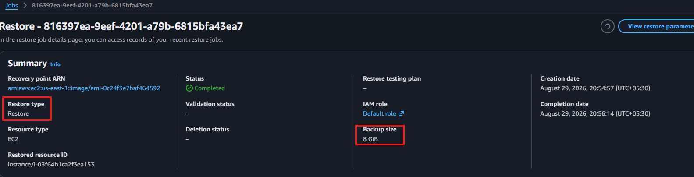

---

## 17. Restored N. Virginia EC2 Instance

- Located the new EC2 instance created by the AWS Backup restore operation.
- Tagged the recovered instance:

```text
Name=srdangat-day16-dr-restored
```

- Confirmed the restored instance was running in **N. Virginia (`us-east-1`)**.
- Verified that the restored instance ID differed from the original Mumbai instance ID.

### Screenshot

<!-- SCREENSHOT 17: Restored EC2 Instance -->
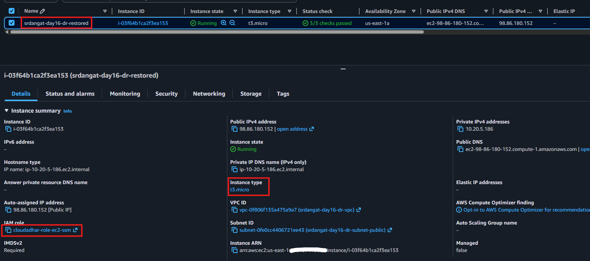

---

## 18. Restored EBS Encryption

- Opened the restored EC2 volume details.
- Confirmed that the recovered EBS volume remained encrypted.
- Verified the restored workload was backed by the recovered encrypted storage.

### Screenshot

<!-- SCREENSHOT 18: Restored Encrypted EBS -->
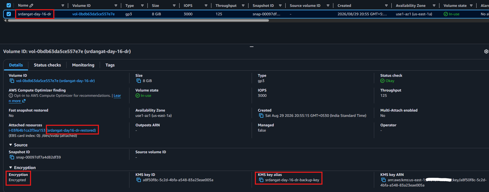

---

## 19. Restored Application Validation

- Connected to the restored N. Virginia instance through the approved management path.
- Verified the restored systemd unit and Nginx configuration.
- Confirmed that the application successfully started after recovery.

### Validation commands

```bash
sudo systemctl status render-day16-page.service --no-pager
sudo systemctl status nginx --no-pager
curl -I http://localhost
curl http://localhost/health
```

- Confirmed HTTP `200`.
- Confirmed `/health` returned:

```text
healthy
```

### Screenshot

<!-- SCREENSHOT 19: Restored Application Validation -->
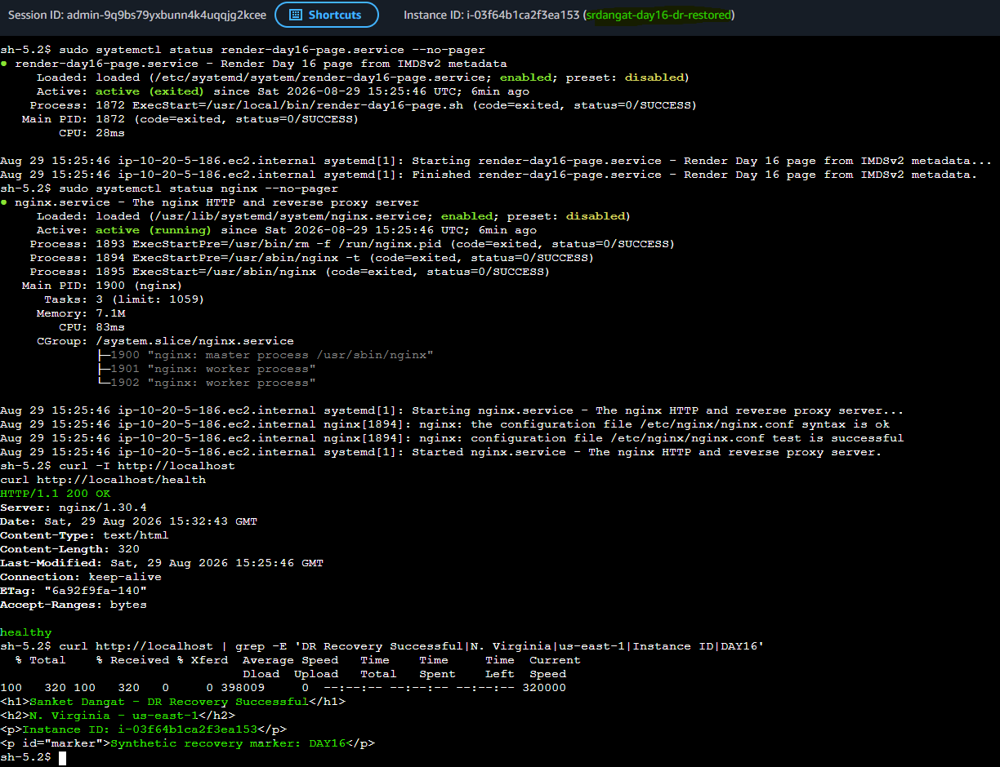

---

## 20. Restored Application Page

- Opened the restored application endpoint.
- Verified that the page displayed:

```text
DR Recovery Successful
N. Virginia
us-east-1
Instance ID
Synthetic recovery marker: DAY16
```

- Confirmed that the recovered application was running in the target Region.

### Screenshot

<!-- SCREENSHOT 20: Restored Virginia Webpage -->
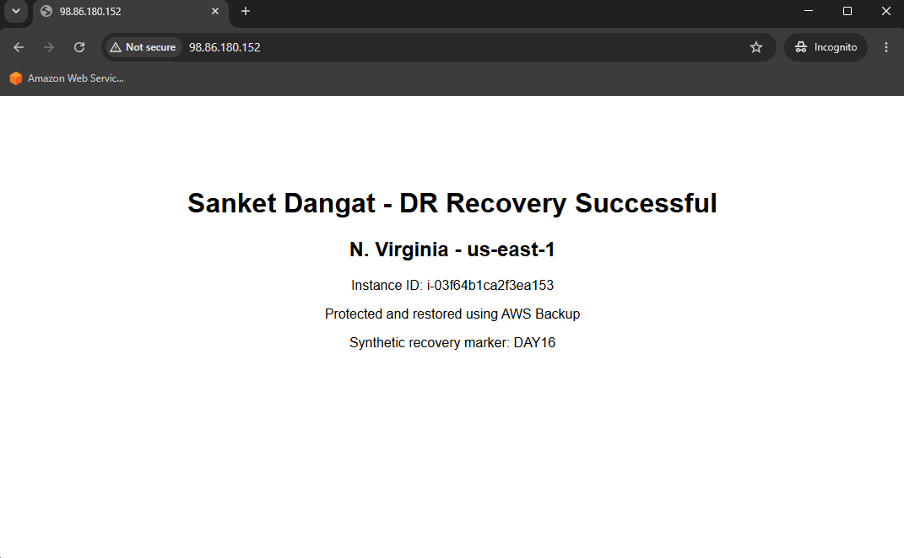

---

## 21. Restored IMDSv2 Validation

- Used IMDSv2 on the restored instance to independently verify the recovery environment.

### Validation Commands

```bash
TOKEN=$(curl -fsS -X PUT \
  -H 'X-aws-ec2-metadata-token-ttl-seconds: 21600' \
  http://169.254.169.254/latest/api/token)

curl -fsS \
  -H "X-aws-ec2-metadata-token: ${TOKEN}" \
  http://169.254.169.254/latest/meta-data/placement/region

curl -fsS \
  -H "X-aws-ec2-metadata-token: ${TOKEN}" \
  http://169.254.169.254/latest/meta-data/instance-id
```

- Confirmed the metadata reported: `Region: us-east-1` `Restored Instance ID: i-03f64b1ca2f3ea153`

- Confirmed that the reported Region was us-east-1.
- Confirmed that the reported instance ID matched the restored EC2 instance.
- This independently verified that the recovered workload was running in the intended DR Region.

### Screenshot

<!-- SCREENSHOT 21: Restored IMDSv2 Validation -->
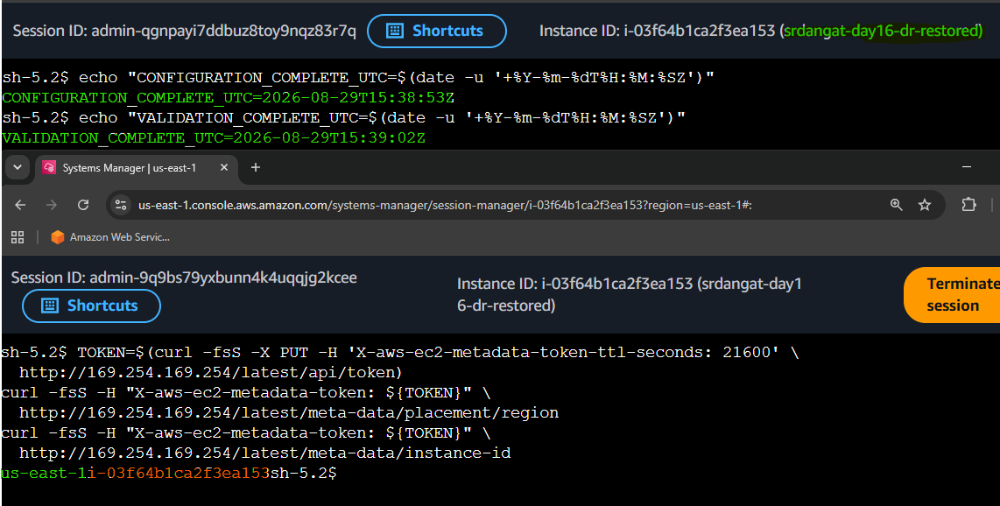

---

# Part C – Recovery Validation

## 22. Source and Restored Instance Comparison

- Compared the source Mumbai EC2 instance with the restored N. Virginia EC2 instance.
- Confirmed that the two workloads have different EC2 instance IDs.
- Verified that the recovered workload was created as a new EC2 resource.

| Attribute | Primary | Restored |
|---|---|---|
| Region | Mumbai (`ap-south-1`) | N. Virginia (`us-east-1`) |
| Instance | `srdangat-day16-primary` | `srdangat-day16-dr-restored` |
| Instance ID | `i-0b551363076304539` | `i-03f64b1ca2f3ea153` |
| Application | Nginx | Nginx |
| EBS | Encrypted | Encrypted |
| Recovery | Original | AWS Backup Restore |

---

## 23. Calculate Achieved RTO

The **Recovery Time Objective (RTO)** is the maximum acceptable time within which the workload should be recovered after an incident.


### RTO Calculation Method

For this lab, the **Achieved RTO** is the measured duration from the simulated incident until the recovered application successfully passes validation.

```text
Achieved RTO = Detection
             + Recovery Declaration
             + Orchestration
             + Restore
             + Configuration
             + Validation
```

Each recovery phase duration is calculated from the recorded UTC timestamps for the corresponding recovery milestones.

---

### Recorded Timestamps

All RTO calculations are performed using **UTC** to avoid time-zone confusion.

```text
INCIDENT_UTC:               2026-08-29T15:17:15Z

DETECTION_UTC:              2026-08-29T15:17:48Z

RECOVERY_DECLARED_UTC:      2026-08-29T15:18:01Z

ORCHESTRATION_START_UTC:    2026-08-29T15:24:57Z

RESTORE_COMPLETE_UTC:       2026-08-29T15:26:14Z

CONFIGURATION_COMPLETE_UTC: 2026-08-29T15:38:53Z

VALIDATION_COMPLETE_UTC:    2026-08-29T15:39:02Z
```

---

### RTO Phase Calculation

| Recovery Phase         | Calculation           |   Duration |
| ---------------------- | --------------------- | ---------: |
| Detection              | `15:17:48 - 15:17:15` | `00:00:33` |
| Recovery Declaration   | `15:18:01 - 15:17:48` | `00:00:13` |
| Orchestration          | `15:24:57 - 15:18:01` | `00:06:56` |
| Restore                | `15:26:14 - 15:24:57` | `00:01:17` |
| Configuration          | `15:38:53 - 15:26:14` | `00:12:39` |
| Application Validation | `15:39:02 - 15:38:53` | `00:00:09` |

### Phase-by-Phase Explanation

**1. Detection**

The simulated incident occurred at `15:17:15` and the failure was detected at `15:17:48`.

```text
15:17:48 - 15:17:15 = 00:00:33
```

**Detection duration = 33 seconds**

---

**2. Recovery Declaration**

The failure was detected at `15:17:48` and the recovery was formally declared at `15:18:01`.

```text
15:18:01 - 15:17:48 = 00:00:13
```

**Recovery declaration duration = 13 seconds**

---

**3. Orchestration**

Recovery was declared at `15:18:01` and the restore orchestration started at `15:24:57`.

```text
15:24:57 - 15:18:01 = 00:06:56
```

**Orchestration duration = 6 minutes 56 seconds**

---

**4. Restore**

The restore orchestration started at `15:24:57` and the AWS Backup restore completed at `15:26:14`.

```text
15:26:14 - 15:24:57 = 00:01:17
```

**Restore duration = 1 minute 17 seconds**

---

**5. Configuration**

The restore completed at `15:26:14` and the recovered environment finished configuration at `15:38:53`.

```text
15:38:53 - 15:26:14 = 00:12:39
```

**Configuration duration = 12 minutes 39 seconds**

---

**6. Application Validation**

Configuration completed at `15:38:53` and the recovered application passed validation at `15:39:02`.

```text
15:39:02 - 15:38:53 = 00:00:09
```

**Application validation duration = 9 seconds**

---

### Total RTO Calculation

```text
Detection                00:00:33
Recovery Declaration     00:00:13
Orchestration            00:06:56
Restore                  00:01:17
Configuration            00:12:39
Application Validation   00:00:09
                         ----------
Total                    00:21:47
```

Therefore:

```text
Achieved RTO = 21 minutes 47 seconds
```

**Measured RTO: 21 minutes 47 seconds**

The measured RTO is the result of this specific recovery test and is not a guaranteed SLA for future recoveries.

---

## 24. RPO Calculation

The **Recovery Point Objective (RPO)** represents the maximum acceptable amount of data loss, measured in time.

For this DR test, the achieved RPO is calculated using the time difference between the simulated incident and the **latest usable copied recovery point available in the destination Region**.

```text
Achieved RPO = Incident time - Latest usable copied recovery-point time
```

### Recorded Timestamps

All RPO calculations are performed using **UTC** to avoid time-zone confusion.

```text
Incident Time:
2026-08-29T15:17:15Z

Latest Usable Copied Recovery-Point Time:
2026-08-29T15:01:47Z
```

### RPO Calculation

```text
15:17:15 UTC
-15:01:47 UTC
----------------
00:15:28
```

**Measured RPO for this specific DR test: 15 minutes 28 seconds**

---

### RPO Measurement Note

- The **15 minutes 28 seconds** represents the measured recovery-point gap for this specific DR test.

- The timestamp used for the calculation is **15:01:47 UTC**, which is the recorded **latest usable copied recovery-point time** in the destination N. Virginia (`us-east-1`) Backup vault.

- The destination recovery point displayed a creation time of **20:00:37 IST**. This timestamp is not used in the RPO calculation because the RPO is measured using the **latest usable copied recovery-point time**, which was recorded as **15:01:47 UTC**.

- The cross-Region copy completion time was **15:01:47 UTC (20:31:47 IST)**, while the simulated incident occurred at **15:17:15 UTC (20:47:15 IST)**. These represent the same moments expressed in different time zones.

- This measured RPO is **not a guaranteed ongoing RPO** because the recovery point was created and copied on demand rather than through a continuously running backup schedule.

---

## RTO/RPO Objective Result

| Objective |     Target |              Achieved |  Result  |
| --------- | ---------: | --------------------: | :------: |
| RTO       | 30 minutes | 21 minutes 47 seconds | **PASS** |
| RPO       |    4 hours | 15 minutes 28 seconds | **PASS** |

---

## Important RTO/RPO Measurement Note

**Detection is not recovery.**

A completed restore is not application validation.

Application validation is not traffic cutover.

Each milestone was recorded separately so that the measured RTO represents the **complete recovery workflow used in this lab**.

The achieved RTO of **21 minutes 47 seconds** is the result of this specific recovery test. It is **not a guaranteed SLA** for all future recoveries.

The achieved RPO of **15 minutes 28 seconds** is the measured data-loss window for this specific DR test. It is **not a guaranteed ongoing RPO** because the recovery point was created and copied on demand rather than through a continuously running backup schedule.


---

# Part D – DR Design Decisions

## 25. DR Strategy Decision

Selected:

```text
DR Strategy: Backup and Restore
```

### Reason

- Appropriate for a disposable workload where cost optimization is important.
- The secondary environment does not need to remain continuously running.
- AWS Backup provides encrypted recovery points that can be copied across Regions.
- The target EC2 environment is created only when recovery is required.

### Trade-off

- Recovery takes longer than Pilot Light, Warm Standby, or Active-Active because infrastructure and application readiness must be restored and validated during the recovery event.

---

## 26. Hybrid Connectivity Decision Notes

Documented the following connectivity decisions without creating billable connectivity resources.

| Scenario | Decision |
|---|---|
| Rapid encrypted hybrid connection | Site-to-Site VPN |
| Predictable high bandwidth | Direct Connect |
| Many VPC and VPN attachments | Transit Gateway |
| On-premises resolves AWS private names | Route 53 Resolver inbound endpoint |
| VPC forwards domains to on-premises DNS | Route 53 Resolver outbound endpoint |
| Private S3 access | Gateway endpoint |
| Private AWS API access | Interface endpoint / PrivateLink |

- Site-to-Site VPN was selected when rapid encrypted connectivity is required.
- Direct Connect was identified for predictable private high-bandwidth connectivity.
- Transit Gateway was identified for centralized connectivity across many VPCs and VPN/DX attachments.
- Route 53 Resolver inbound/outbound endpoints were documented for hybrid DNS flows.
- Gateway endpoints were identified as the preferred private-routing option for supported services such as S3.

---

## 27. DR Strategy Comparison

| Strategy | Description |
|---|---|
| Backup and Restore | Lowest-cost relaxed DR; infrastructure restored during recovery |
| Pilot Light | Core services remain running while the rest is recovered |
| Warm Standby | Reduced but operational environment is continuously available |
| Active-Active | Both Regions continuously serve production traffic |

For this lab, **Backup and Restore** was selected because the workload is disposable and the objective is to demonstrate encrypted cross-Region recovery without maintaining an always-on secondary environment.

---

## 28. Service Quota Readiness

Recorded a sanitized readiness assessment for both Regions.

| Dependency | Mumbai | N. Virginia | Remediation |
|---|---|---|---|
| EC2 On-Demand vCPUs | Checked | Checked | As required |
| EBS capacity / IOPS / throughput | Checked | Checked | As required |
| VPC / subnet / routes / SGs | Checked | Checked | As required |
| ENIs / subnet IP availability | Checked | Checked | As required |
| Public IPv4 / EIP requirement | Checked | Checked | As required |
| AWS Backup copy / restore capacity | Checked | Checked | As required |
| KMS key and permissions | Checked | Checked | As required |
| TGW / VPN / DX quotas | Design-only | Design-only | Not created |
| Resolver endpoints / rules | Design-only | Design-only | Not created |

---

## Cleanup

**Day 16 cleanup should be performed only after all required evidence has been captured.**

1. Terminate the restored N. Virginia EC2 instance `srdangat-day16-dr-restored`
2. Terminate the primary Mumbai EC2 instance `srdangat-day16-primary`
3. Delete the restored EC2 Security Group `srdangat-day16-dr-sg`
4. Delete the primary EC2 Security Group `srdangat-day16-primary-sg`
5. Delete the recovery point from `srdangat-day16-dr-vault`
6. Delete the recovery point from `srdangat-day16-primary-vault`
7. Delete the destination AWS Backup vault `srdangat-day16-dr-vault`
8. Delete the source AWS Backup vault `srdangat-day16-primary-vault`
9. Schedule deletion of the customer-managed KMS key used by `srdangat-day16-dr-vault`
10. Delete the N. Virginia Day 16 VPC `srdangat-day16-dr-vpc` and its associated public subnet, route table, and Internet Gateway
11. Delete the Mumbai Day 16 VPC `srdangat-day16-primary-vpc` and its associated public subnet, route table, and Internet Gateway
12. Remove IAM roles or permissions created specifically for the Day
13. Verify that no Day 16 EC2 instances, EBS volumes, Security Groups, AWS Backup recovery points, Backup vaults, KMS resources, or temporary IAM resources remain
14. Verify that no billable Day 16 resources remain in Mumbai (`ap-south-1`) or N. Virginia (`us-east-1`)