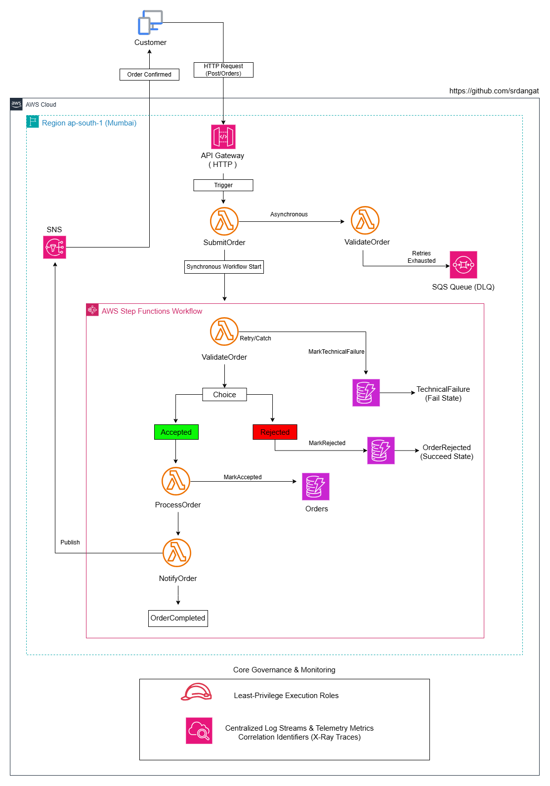
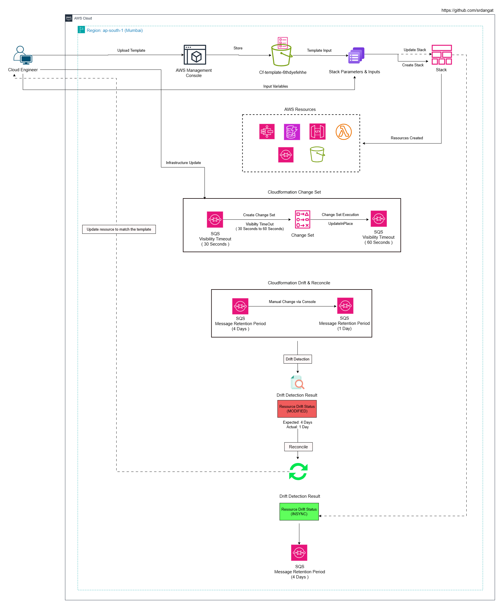

# Week 10 - Day 18 Serverless and CloudFormation

## Name
Sanket Dangat

## Tasks Completed
- [x] Watched/read the weekly content
- [x] Completed hands-on labs
- [x] Added screenshots or proof
- [ ] Posted on LinkedIn
- [x] Cleaned up AWS resources

## Architecture

##  Serverless Order Processing



---

## Cloudformation Lifecycle



---

# Result

- Completed all hands-on labs for serverless order processing and infrastructure-as-code using AWS Lambda, SQS, API Gateway, Step Functions, and CloudFormation
- Built a Lambda function (`cloudadhar-order-handler-day18`) and validated accepted, rejected, and technical-failure invocation paths
- Configured asynchronous Lambda retries (1 retry attempt) with an SQS failure destination (`cloudadhar-lambda-failure-day18`) and confirmed the failed event landed in the queue
- Created an HTTP API (`cloudadhar-orders-http-api-day18`) with a `POST /orders` route and verified HTTP 200 (accepted) and HTTP 400 (rejected) responses
- Built a Standard Step Functions workflow (`cloudadhar-order-workflow-day18`) with Retry/Catch/Choice/Succeed/Fail states and verified all three executions: Succeeded (accepted), Failed at OrderRejected (business rejection), and Failed at TechnicalFailure (Lambda failed after retries exhausted)
- Deployed the CloudAdhar infrastructure as a CloudFormation stack (`cloudadhar-infrastructure-day18`), reviewed stack events, and confirmed successful resource creation and update activity
- Created a Change Set to modify the SQS `VisibilityTimeout` (30 → 60 seconds) and executed it, confirming the queue was updated in place with no resource replacement
- Manually changed the queue's message retention period (4 Days → 1 Day) outside CloudFormation to create drift, ran drift detection, and confirmed it was flagged `MODIFIED`
- Reconciled the drifted property back to the template-defined value and confirmed the resource returned to `IN_SYNC`
- Reviewed the parameters and security requirements of the end-to-end order application template, then deployed it (EC2-hosted UI, HTTP API, 5 Lambda functions, a CloudFormation-managed Step Functions workflow, and DynamoDB — 22 resources total) and confirmed the Order Portal UI loaded successfully
- Submitted an accepted order (`O-UI-1801`, amount 4500) through the UI and verified it completed successfully end-to-end, with `status: COMPLETED` in DynamoDB and a Succeeded Step Functions execution
- Submitted a business-rejected order (`O-UI-1802`, amount 0) and verified it was rejected by business validation, with `status: REJECTED` in DynamoDB and a Failed execution at the `OrderRejected` state
- Submitted a technical-failure order (`O-UI-1803`, amount 500, simulated failure) and verified the workflow retried and then failed as expected, with `status: FAILED` in DynamoDB and a Failed execution at the `TechnicalFailure` state (via the `MarkTechnicalFailure` catch path)
- Deleted the end-to-end stack and confirmed the retained S3 archive bucket (`cloudadhar-archive-dev-day18-<account-id>`) survived deletion due to `DeletionPolicy: Retain` and `UpdateReplacePolicy: Retain`

## Resources Created

### Manually created
- Lambda function: `cloudadhar-order-handler-day18`
  - Asynchronous invocation configured: 1 retry attempt, failure destination → SQS
- SQS queue: `cloudadhar-lambda-failure-day18` (Lambda async failure destination)
- HTTP API: `cloudadhar-orders-http-api-day18`
  - Route: `POST /orders` → Lambda integration
  - Stage: `$default` (auto-deploy enabled)
- Step Functions Standard workflow: `cloudadhar-order-workflow-day18`

### CloudFormation — drift & change-set (template:`1.cloudadhar-day18-CloudFormation.yaml` ,stack: `cloudadhar-infrastructure-day18`, Environment: `dev`)
- SQS queue: `cloudadhar-lambda-failure-dev-day18`
  - Visibility timeout changed via Change Set: 30 → 60 seconds (no replacement)
  - Message retention period drifted (4 Days → 1 Day) and reconciled back to 4 Days (345600s)
- S3 bucket: `cloudadhar-archive-dev-day18-<account-id>` (`DeletionPolicy`/`UpdateReplacePolicy: Retain`)

### CloudFormation — end-to-end order application (template:`2.cloudadhar-day18-CloudFormation.yaml`, stack: `cloudadhar-infrastructure-day18` , Environment: `test`)
- DynamoDB table: `cloudadhar-orders-test-iac-day18`
- Lambda functions: `cloudadhar-validate-order-test-iac-day18`, `cloudadhar-process-order-test-iac-day18`, `cloudadhar-notify-order-test-iac-day18`, `cloudadhar-submit-order-test-iac-day18`, `cloudadhar-get-order-test-iac-day18`
- IAM roles: ValidateOrderRole, OrderWorkerRole, GetOrderStatusRole, SubmitOrderRole, StepFunctionsExecutionRole
- Step Functions Standard workflow: `cloudadhar-order-workflow-test-iac-day18`
  - States: `ValidateOrder` → `CheckOrderStatus` → `ProcessOrder` → `NotifyCustomer` → `OrderCompleted`, with `MarkRejected` / `MarkTechnicalFailure` DynamoDB update steps on the rejection/failure paths
- API Gateway HTTP API (`OrdersHttpApi`) with `POST /orders` and `GET /orders/{orderId}` routes
- EC2 instance hosting the CloudAdhar Order Portal UI + associated Security Group (HTTP/port 80)

---

# Screenshots

## Part A — AWS Lambda

### 1. Lambda Function Configuration

- Created `cloudadhar-order-handler-day18` and verified its basic configuration.


---

### 2. Lambda Accepted Event

- Invoked the Lambda with an accepted order event and verified the successful result.

**Event name:** `test-accepted`

**Event JSON:**
```json
{
  "orderId": "O-1801",
  "amount": 2500
}
```


---

### 3. Lambda Rejected Event

- Invoked the Lambda with a rejected order event and verified the rejection result.

**Event name:** `test-rejected`

**Event JSON:**
```json
{
  "orderId": "O-1802",
  "amount": 0
}
```


---

### 4. Lambda Technical Failure Event

- Invoked the Lambda with a deliberate technical-failure event and verified the failure behavior.

**Event name:** `test-failure`

**Event JSON:**
```json
{
  "orderId": "O-1803",
  "amount": 5000,
  "simulateFailure": true
}
```


---

## Part B — Lambda Asynchronous Retry and SQS

### 5. Async Retry Configuration

- Configured asynchronous Lambda retries and verified the configured retry behavior.

**Event name:** `test-async-failure`

**Event JSON:**
```json
{
  "orderId": "O-1804",
  "amount": 7500,
  "simulateFailure": true
}
```


---

### 6. SQS Failure Destination

- Configured `cloudadhar-lambda-failure-day18` as the Lambda asynchronous failure destination and verified the failed event record.


---

## Part C — API Gateway HTTP API

### 7. POST /orders Route

- Created the HTTP API `POST /orders` route and configured the Lambda integration.


---

### 8. HTTP 200 Test

- Invoked `POST /orders` with a valid request (`amount: 3500`) and verified HTTP 200, `status: ACCEPTED`.


---

### 9. HTTP 400 Test

- Invoked `POST /orders` with an invalid request (`amount: 0`) and verified HTTP 400, `status: REJECTED, reason: "Amount must be greater than zero"`.


---

## Part D — AWS Step Functions

### 10. Standard Workflow Definition

- Created the Standard Step Functions order workflow (`cloudadhar-order-workflow-day18`) using Task, Retry, Catch, Choice, Succeed, and Fail states.


---

### 11. Accepted Workflow Execution

- Executed an accepted order and verified the successful workflow path.

```json
{
  "orderId": "O-SFN-1801",
  "amount": 4500
}
```


---

### 12. Business Rejection Workflow Execution

- Executed a business-rejection order and verified the expected rejection path.

```json
{
  "orderId": "O-SFN-1802",
  "amount": 0
}
```


---

### 13. Technical Failure Workflow Execution

- Executed a technical-failure order and verified Retry/Catch behavior and the failure path.

```json
{
  "orderId": "O-SFN-1803",
  "simulateFailure": true
}
```


---

### 14. Step Functions Execution History

- Reviewed execution histories for the accepted, business-rejection, and technical-failure workflow executions.


---

## Part E — AWS CloudFormation

### 15. CloudFormation Stack

- Created `cloudadhar-infrastructure-day18` using the CloudFormation template. (`1.cloudadhar-day18-CloudFormation.yaml`)


---

### 16. CloudFormation Stack Events

- Reviewed CloudFormation stack events and verified successful resource creation and update activity.


---

### 17. CloudFormation Stack Outputs

- Reviewed the CloudFormation stack outputs after successful stack creation.


---

## Part F — CloudFormation Change Set

### 18. Visibility Timeout Change Set

- Created a Change Set to modify the SQS visibility timeout (30 → 60 seconds) and reviewed the proposed change before execution.


---

### 19. Change Set Execution & No-Replacement Verification

- Executed the Change Set and confirmed the SQS visibility timeout update completed successfully with the resource modified in place (no replacement).


---

## Part G — CloudFormation Drift Detection

### 20. Safe SQS Drift

- Made a safe SQS configuration change outside CloudFormation (message retention period 4 Days → 1 Day) to intentionally create drift.


---

### 21. Drift Detection — MODIFIED

- Ran CloudFormation drift detection and verified that the modified resource was detected as `MODIFIED` (MessageRetentionPeriod: 345600 expected vs. 86400 actual).


---

### 22. Drift Reconciliation and Final IN_SYNC

- Reconciled the SQS configuration with the CloudFormation template and verified that the resource returned to `IN_SYNC`.


---

## Part H — Retained S3 Archive Bucket

### 23. S3 Retention and Replacement Behavior

- Reviewed the deletion and replacement behavior of the retained S3 archive bucket managed through the CloudFormation lifecycle template.

- Deleted the stack and verified the bucket (`cloudadhar-archive-dev-day18-<account-id>`) survived deletion due to `DeletionPolicy: Retain` and `UpdateReplacePolicy: Retain`.


---

## Part I — End-to-End Order Application

### 24. Template Review and Deployment

- Reviewed the parameters and security requirements of the end-to-end order application template before deploying, then created the stack successfully (22 resources, Environment: `test`). (`2.cloudadhar-day18-CloudFormation.yaml`)


---

### 25. Order Portal UI

- Opened the `WebsiteUrl` stack output in a browser and confirmed the CloudAdhar Order Portal loaded successfully.


---

### 26. Accepted Order

- Submitted an order (`O-UI-1801`, amount 4500) with no simulated failure, and verified it completed successfully end-to-end.


---

### 27. Accepted Order DynamoDB Record

- Reviewed the DynamoDB orders table (`cloudadhar-orders-test-iac-day18`) and verified the accepted order was persisted with status `COMPLETED`.


---

### 28. Accepted Order Step Functions Execution

- Reviewed the Step Functions execution for the accepted order and verified it followed the expected success path (`ValidateOrder → CheckOrderStatus → ProcessOrder → NotifyCustomer → OrderCompleted`).


---

### 29. Business-Rejected Order

- Submitted an order (`O-UI-1802`, amount 0) and verified it was rejected by business validation.


---

### 30. Business-Rejected Order DynamoDB Record

- Reviewed the DynamoDB orders table and verified the rejected order was persisted with status `REJECTED`.


---

### 31. Business-Rejected Order Step Functions Execution

- Reviewed the Step Functions execution for the rejected order and verified it followed the expected business-rejection path (`ValidateOrder → CheckOrderStatus → MarkRejected → OrderRejected`).


---

### 32. Technical-Failure Order

- Submitted an order (`O-UI-1803`, amount 500) with **"Simulate a technical failure"** enabled and verified the workflow retried and then failed as expected (`status: FAILED, reason: "Lambda processing failed after retries"`).


---

### 33. Technical-Failure Order DynamoDB Record

- Reviewed the DynamoDB orders table and verified the technically failed order was persisted with status `FAILED`.


---

### 34. Technical-Failure Order Step Functions Execution

- Reviewed the Step Functions execution for the technical-failure order and verified it followed the expected retry-and-catch path (`ValidateOrder → Catch → MarkTechnicalFailure → TechnicalFailure`).


---

## Where I Got Stuck

`No blocker`

---

## Cleanup
**Day 18 cleanup should be performed only after all required evidence has been captured.**

1. Delete the Lambda function `cloudadhar-order-handler-day18`.
2. Delete the created SQS failure-destination queue `cloudadhar-lambda-failure-day18`.
3. Delete the created HTTP API `cloudadhar-orders-http-api-day18`.
4. Delete the created Standard Step Functions workflow `cloudadhar-order-workflow-day18`.
5. Delete the CloudFormation stack `cloudadhar-infrastructure-day18`.
6. Verify the retained S3 archive bucket `cloudadhar-archive-dev-day18-<ACCOUNT-ID>` survived stack deletion, then empty and delete it manually, since `DeletionPolicy`/`UpdateReplacePolicy: Retain` does not delete it automatically.
7. Verify that no billable Day 18 resources remain in Mumbai (`ap-south-1`).